## Load Packages


```r
library(psychTools)
library(tidyverse)
```

```
## ── Attaching packages ───────────────────────────────────────── tidyverse 1.3.0 ──
```

```
## ✓ ggplot2 3.3.0.9000     ✓ purrr   0.3.3     
## ✓ tibble  2.1.3          ✓ dplyr   0.8.4     
## ✓ tidyr   1.0.2          ✓ stringr 1.4.0     
## ✓ readr   1.3.1          ✓ forcats 0.4.0
```

```
## ── Conflicts ──────────────────────────────────────────── tidyverse_conflicts() ──
## x dplyr::filter() masks stats::filter()
## x dplyr::lag()    masks stats::lag()
```

```r
library(gapminder)
library(broom)
library(dplyr)
```


```r
bfi <- psychTools::bfi
keys <- replace_na(psychTools::bfi.dictionary$Keying, 1)

bfi_mean <- bfi %>% mutate_at(names(bfi)[keys == -1], ~ 7 - .x) %>% 
  mutate(A = rowMeans(select(., A1:A5), na.rm = TRUE),
         C = rowMeans(select(., C1:C5), na.rm = TRUE),
         E = rowMeans(select(., E1:E5), na.rm = TRUE),
         N = rowMeans(select(., N1:N5), na.rm = TRUE),
         O = rowMeans(select(., O1:O5), na.rm = TRUE),
         gender = recode_factor(gender, `1` = "male", `2` = "female"),
         education = recode_factor(education, `1` = "some hs", 
                                              `2` = "hs", 
                                              `3` = "some college", 
                                              `4` = "college",
                                              `5` = "graduate degree")) %>% 
  select(gender:O)
```

## map() applies the requested function to each column or element

### “Take bfi_mean and select columns A through O. For each of these columns, predict the column using the lm() function with gender from the bfi_mean data frame as a predictor.”


```r
mods_gender <- 
  bfi_mean %>% 
  select(A:O) %>% 
  map(~ lm(.x ~ gender, data = bfi_mean))
```

## Produces a *list* of models (LM), one for each big 5 trait


```r
map(mods_gender, summary)
```

```
## $A
## 
## Call:
## lm(formula = .x ~ gender, data = bfi_mean)
## 
## Residuals:
##     Min      1Q  Median      3Q     Max 
## -3.7823 -0.5823  0.2145  0.6177  1.6145 
## 
## Coefficients:
##              Estimate Std. Error t value Pr(>|t|)    
## (Intercept)   4.38555    0.02900  151.25   <2e-16 ***
## genderfemale  0.39678    0.03538   11.22   <2e-16 ***
## ---
## Signif. codes:  0 '***' 0.001 '**' 0.01 '*' 0.05 '.' 0.1 ' ' 1
## 
## Residual standard error: 0.879 on 2798 degrees of freedom
## Multiple R-squared:  0.04302,	Adjusted R-squared:  0.04268 
## F-statistic: 125.8 on 1 and 2798 DF,  p-value: < 2.2e-16
## 
## 
## $C
## 
## Call:
## lm(formula = .x ~ gender, data = bfi_mean)
## 
## Residuals:
##    Min     1Q Median     3Q    Max 
## -3.328 -0.728  0.072  0.672  1.862 
## 
## Coefficients:
##              Estimate Std. Error t value Pr(>|t|)    
## (Intercept)   4.13828    0.03125 132.426  < 2e-16 ***
## genderfemale  0.18971    0.03813   4.976 6.89e-07 ***
## ---
## Signif. codes:  0 '***' 0.001 '**' 0.01 '*' 0.05 '.' 0.1 ' ' 1
## 
## Residual standard error: 0.9473 on 2798 degrees of freedom
## Multiple R-squared:  0.008771,	Adjusted R-squared:  0.008417 
## F-statistic: 24.76 on 1 and 2798 DF,  p-value: 6.888e-07
## 
## 
## $E
## 
## Call:
## lm(formula = .x ~ gender, data = bfi_mean)
## 
## Residuals:
##     Min      1Q  Median      3Q     Max 
## -3.2231 -0.6231  0.0269  0.7769  2.0146 
## 
## Coefficients:
##              Estimate Std. Error t value Pr(>|t|)    
## (Intercept)   3.98542    0.03481 114.497  < 2e-16 ***
## genderfemale  0.23767    0.04247   5.596  2.4e-08 ***
## ---
## Signif. codes:  0 '***' 0.001 '**' 0.01 '*' 0.05 '.' 0.1 ' ' 1
## 
## Residual standard error: 1.055 on 2798 degrees of freedom
## Multiple R-squared:  0.01107,	Adjusted R-squared:  0.01072 
## F-statistic: 31.32 on 1 and 2798 DF,  p-value: 2.4e-08
## 
## 
## $N
## 
## Call:
## lm(formula = .x ~ gender, data = bfi_mean)
## 
## Residuals:
##      Min       1Q   Median       3Q      Max 
## -3.04971 -0.84971  0.06583  0.95029  2.26583 
## 
## Coefficients:
##              Estimate Std. Error t value Pr(>|t|)    
## (Intercept)   4.04971    0.03917 103.398  < 2e-16 ***
## genderfemale -0.31554    0.04779  -6.603 4.79e-11 ***
## ---
## Signif. codes:  0 '***' 0.001 '**' 0.01 '*' 0.05 '.' 0.1 ' ' 1
## 
## Residual standard error: 1.187 on 2798 degrees of freedom
## Multiple R-squared:  0.01534,	Adjusted R-squared:  0.01499 
## F-statistic:  43.6 on 1 and 2798 DF,  p-value: 4.794e-11
## 
## 
## $O
## 
## Call:
## lm(formula = .x ~ gender, data = bfi_mean)
## 
## Residuals:
##     Min      1Q  Median      3Q     Max 
## -3.4545 -0.5535  0.0465  0.6465  1.4465 
## 
## Coefficients:
##              Estimate Std. Error t value Pr(>|t|)    
## (Intercept)   4.65452    0.02662  174.82  < 2e-16 ***
## genderfemale -0.10102    0.03248   -3.11  0.00189 ** 
## ---
## Signif. codes:  0 '***' 0.001 '**' 0.01 '*' 0.05 '.' 0.1 ' ' 1
## 
## Residual standard error: 0.8071 on 2798 degrees of freedom
## Multiple R-squared:  0.003445,	Adjusted R-squared:  0.003089 
## F-statistic: 9.672 on 1 and 2798 DF,  p-value: 0.00189
```

```r
map(mods_gender, glance)
```

```
## $A
## # A tibble: 1 x 11
##   r.squared adj.r.squared sigma statistic  p.value    df logLik   AIC   BIC
##       <dbl>         <dbl> <dbl>     <dbl>    <dbl> <int>  <dbl> <dbl> <dbl>
## 1    0.0430        0.0427 0.879      126. 1.38e-28     2 -3611. 7228. 7246.
## # … with 2 more variables: deviance <dbl>, df.residual <int>
## 
## $C
## # A tibble: 1 x 11
##   r.squared adj.r.squared sigma statistic p.value    df logLik   AIC   BIC
##       <dbl>         <dbl> <dbl>     <dbl>   <dbl> <int>  <dbl> <dbl> <dbl>
## 1   0.00877       0.00842 0.947      24.8 6.89e-7     2 -3821. 7647. 7665.
## # … with 2 more variables: deviance <dbl>, df.residual <int>
## 
## $E
## # A tibble: 1 x 11
##   r.squared adj.r.squared sigma statistic p.value    df logLik   AIC   BIC
##       <dbl>         <dbl> <dbl>     <dbl>   <dbl> <int>  <dbl> <dbl> <dbl>
## 1    0.0111        0.0107  1.06      31.3 2.40e-8     2 -4122. 8251. 8269.
## # … with 2 more variables: deviance <dbl>, df.residual <int>
## 
## $N
## # A tibble: 1 x 11
##   r.squared adj.r.squared sigma statistic  p.value    df logLik   AIC   BIC
##       <dbl>         <dbl> <dbl>     <dbl>    <dbl> <int>  <dbl> <dbl> <dbl>
## 1    0.0153        0.0150  1.19      43.6 4.79e-11     2 -4453. 8912. 8929.
## # … with 2 more variables: deviance <dbl>, df.residual <int>
## 
## $O
## # A tibble: 1 x 11
##   r.squared adj.r.squared sigma statistic p.value    df logLik   AIC   BIC
##       <dbl>         <dbl> <dbl>     <dbl>   <dbl> <int>  <dbl> <dbl> <dbl>
## 1   0.00344       0.00309 0.807      9.67 0.00189     2 -3372. 6750. 6768.
## # … with 2 more variables: deviance <dbl>, df.residual <int>
```

```r
map(mods_gender, tidy)
```

```
## $A
## # A tibble: 2 x 5
##   term         estimate std.error statistic  p.value
##   <chr>           <dbl>     <dbl>     <dbl>    <dbl>
## 1 (Intercept)     4.39     0.0290     151.  0.      
## 2 genderfemale    0.397    0.0354      11.2 1.38e-28
## 
## $C
## # A tibble: 2 x 5
##   term         estimate std.error statistic     p.value
##   <chr>           <dbl>     <dbl>     <dbl>       <dbl>
## 1 (Intercept)     4.14     0.0312    132.   0          
## 2 genderfemale    0.190    0.0381      4.98 0.000000689
## 
## $E
## # A tibble: 2 x 5
##   term         estimate std.error statistic      p.value
##   <chr>           <dbl>     <dbl>     <dbl>        <dbl>
## 1 (Intercept)     3.99     0.0348    114.   0           
## 2 genderfemale    0.238    0.0425      5.60 0.0000000240
## 
## $N
## # A tibble: 2 x 5
##   term         estimate std.error statistic  p.value
##   <chr>           <dbl>     <dbl>     <dbl>    <dbl>
## 1 (Intercept)     4.05     0.0392    103.   0.      
## 2 genderfemale   -0.316    0.0478     -6.60 4.79e-11
## 
## $O
## # A tibble: 2 x 5
##   term         estimate std.error statistic p.value
##   <chr>           <dbl>     <dbl>     <dbl>   <dbl>
## 1 (Intercept)     4.65     0.0266    175.   0      
## 2 genderfemale   -0.101    0.0325     -3.11 0.00189
```


```r
map(cars, mean)
```

```
## $speed
## [1] 15.4
## 
## $dist
## [1] 42.98
```

## If you want to specify additional arguments, use ~


```r
map(cars, ~ mean(.x, trim = .1))
```

```
## $speed
## [1] 15.475
## 
## $dist
## [1] 40.875
```

## When you use ~, in the function call, .x is a placeholder that means “whatever the current variable from the data frame is”

### So for above, that would be all the columns of car


```r
map_dbl() #returns numeric vector instead of list
```

```
## Error in as_mapper(.f, ...): argument ".f" is missing, with no default
```

```r
rsq_gender <- 
  bfi_mean %>% 
    select(A:O) %>% 
    map_dbl(~ lm(.x ~ gender, data = bfi_mean) %>% 
                summary() %>% .$r.squared)
rsq_gender
```

```
##           A           C           E           N           O 
## 0.043022517 0.008771392 0.011069953 0.015344727 0.003444881
```

```r
# Gives us the R^2 of each.
```


```r
map_dfc() #combines into columns
```

```
## Error in as_mapper(.f, ...): argument ".f" is missing, with no default
```

```r
map_dfr() #combines into rows
```

```
## Error in as_mapper(.f, ...): argument ".f" is missing, with no default
```

```r
coef_gender <- 
  bfi_mean %>% 
    select(A:O) %>% 
    map_dfr(~ lm(.x ~ gender, data = bfi_mean) %>% 
                coef(),
            .id = "Trait")
coef_gender
```

```
## # A tibble: 2 x 6
##   Trait     A     C     E      N      O
##   <chr> <dbl> <dbl> <dbl>  <dbl>  <dbl>
## 1 1     4.39  4.14  3.99   4.05   4.65 
## 2 1     0.397 0.190 0.238 -0.316 -0.101
```


```r
coef_summary_gender <- 
  bfi_mean %>% 
    select(A:O) %>% 
    map_dfr(~ lm(.x ~ gender, data = bfi_mean) %>% 
                tidy(conf.int = TRUE),
            .id = "Trait")
coef_summary_gender
```

```
## # A tibble: 10 x 8
##    Trait term         estimate std.error statistic  p.value conf.low conf.high
##    <chr> <chr>           <dbl>     <dbl>     <dbl>    <dbl>    <dbl>     <dbl>
##  1 A     (Intercept)     4.39     0.0290    151.   0.          4.33     4.44  
##  2 A     genderfemale    0.397    0.0354     11.2  1.38e-28    0.327    0.466 
##  3 C     (Intercept)     4.14     0.0312    132.   0.          4.08     4.20  
##  4 C     genderfemale    0.190    0.0381      4.98 6.89e- 7    0.115    0.264 
##  5 E     (Intercept)     3.99     0.0348    114.   0.          3.92     4.05  
##  6 E     genderfemale    0.238    0.0425      5.60 2.40e- 8    0.154    0.321 
##  7 N     (Intercept)     4.05     0.0392    103.   0.          3.97     4.13  
##  8 N     genderfemale   -0.316    0.0478     -6.60 4.79e-11   -0.409   -0.222 
##  9 O     (Intercept)     4.65     0.0266    175.   0.          4.60     4.71  
## 10 O     genderfemale   -0.101    0.0325     -3.11 1.89e- 3   -0.165   -0.0373
```

### There are other map functions, see ?map()

## To prevent functions from getting too long...


```r
#Write function
get_coef_summary_gender <- function(.x, data) {
  mod <- lm(.x ~ gender, data = bfi_mean)
  return(tidy(mod, conf.int = TRUE))
}

#Run map()
coef_summary_gender <- 
  bfi_mean %>% 
    select(A:O) %>% 
    map_dfr(get_coef_summary_gender, .id = "Trait")
coef_summary_gender
```

```
## # A tibble: 10 x 8
##    Trait term         estimate std.error statistic  p.value conf.low conf.high
##    <chr> <chr>           <dbl>     <dbl>     <dbl>    <dbl>    <dbl>     <dbl>
##  1 A     (Intercept)     4.39     0.0290    151.   0.          4.33     4.44  
##  2 A     genderfemale    0.397    0.0354     11.2  1.38e-28    0.327    0.466 
##  3 C     (Intercept)     4.14     0.0312    132.   0.          4.08     4.20  
##  4 C     genderfemale    0.190    0.0381      4.98 6.89e- 7    0.115    0.264 
##  5 E     (Intercept)     3.99     0.0348    114.   0.          3.92     4.05  
##  6 E     genderfemale    0.238    0.0425      5.60 2.40e- 8    0.154    0.321 
##  7 N     (Intercept)     4.05     0.0392    103.   0.          3.97     4.13  
##  8 N     genderfemale   -0.316    0.0478     -6.60 4.79e-11   -0.409   -0.222 
##  9 O     (Intercept)     4.65     0.0266    175.   0.          4.60     4.71  
## 10 O     genderfemale   -0.101    0.0325     -3.11 1.89e- 3   -0.165   -0.0373
```

## Advantages

### 1. Your code is often more readable. 
### 2. You can reuse the function multiple times throughout your analyses. 
### 3. Its easier to fix bugs or typos you might make because your code is only in one spot.

## Template


```r
function_name <- function(arguments) {
  # function code
  return(result) #optional
}
```

## Name
### How do we call it?

## Arguments
### What are its inputs?

## Function Code
### What do we do with inputs?


```r
# Can give default value with "="
# Example
plot_histogram <- function(data, color = "blue") {
  tbl <- tibble(data = data)
  ggplot(tbl, aes(x = data)) +
  geom_histogram(color = color, fill = color)
}

# If the user of this function doesn't specify, the histogram will be blue

simulated_data <- rnorm(100)
plot_histogram(simulated_data)
```

```
## `stat_bin()` using `bins = 30`. Pick better value with `binwidth`.
```

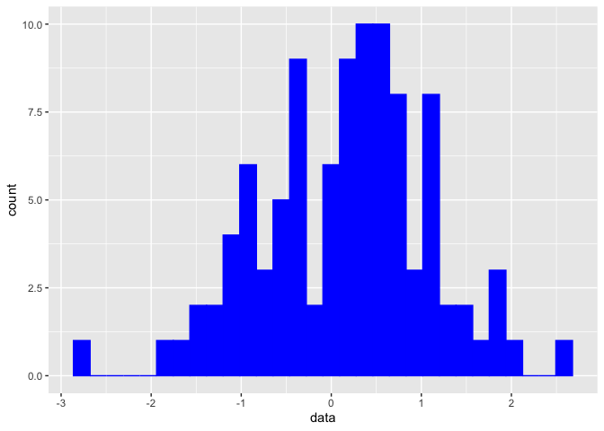<!-- -->

```r
# Or you can specify 
plot_histogram(simulated_data, color = "black")
```

```
## `stat_bin()` using `bins = 30`. Pick better value with `binwidth`.
```

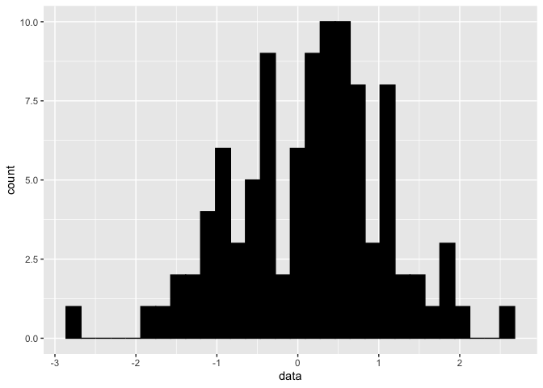<!-- -->

# 12.6 Activities

## Activity 1

### Do men and women differ on the Big Five traits? How big are the differences?

#### Yes, women are more agreeable (0.40), conscientious (0.19), and extraverted (0.24), and less neurotic (-0.32) and open (-0.10), than men.


```r
get_coef_summary_gender <- function(.x, data) {
  mod <- lm(.x ~ gender, data = bfi_mean)
  return(tidy(mod, conf.int = TRUE))
}

coef_summary_gender <- 
  bfi_mean %>% 
    select(A:O) %>% 
    map_dfr(get_coef_summary_gender, .id = "Trait")
coef_summary_gender
```

```
## # A tibble: 10 x 8
##    Trait term         estimate std.error statistic  p.value conf.low conf.high
##    <chr> <chr>           <dbl>     <dbl>     <dbl>    <dbl>    <dbl>     <dbl>
##  1 A     (Intercept)     4.39     0.0290    151.   0.          4.33     4.44  
##  2 A     genderfemale    0.397    0.0354     11.2  1.38e-28    0.327    0.466 
##  3 C     (Intercept)     4.14     0.0312    132.   0.          4.08     4.20  
##  4 C     genderfemale    0.190    0.0381      4.98 6.89e- 7    0.115    0.264 
##  5 E     (Intercept)     3.99     0.0348    114.   0.          3.92     4.05  
##  6 E     genderfemale    0.238    0.0425      5.60 2.40e- 8    0.154    0.321 
##  7 N     (Intercept)     4.05     0.0392    103.   0.          3.97     4.13  
##  8 N     genderfemale   -0.316    0.0478     -6.60 4.79e-11   -0.409   -0.222 
##  9 O     (Intercept)     4.65     0.0266    175.   0.          4.60     4.71  
## 10 O     genderfemale   -0.101    0.0325     -3.11 1.89e- 3   -0.165   -0.0373
```

#### Plotting


```r
bfi_mean %>%
    ggplot(aes(gender, A, col = gender)) +
    stat_summary(fun.data = mean_cl_normal) +
    theme_bw() +
    xlab("Gender")+
    ylab("Agreeableness")
```

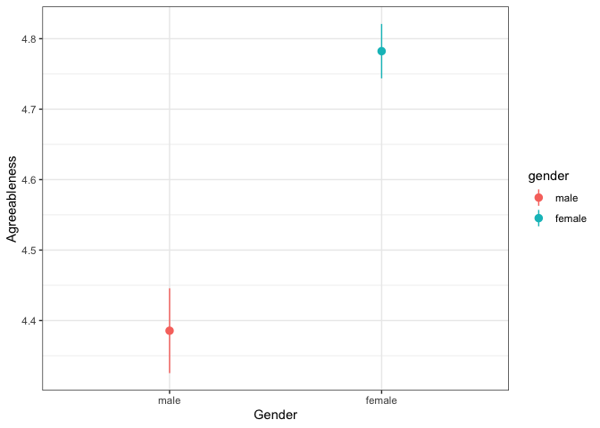<!-- -->

```r
bfi_mean %>%
    ggplot(aes(gender, C, col = gender)) +
    stat_summary(fun.data = mean_cl_normal) +
    theme_bw() +
    xlab("Gender")+
    ylab("Conscientiousness")
```

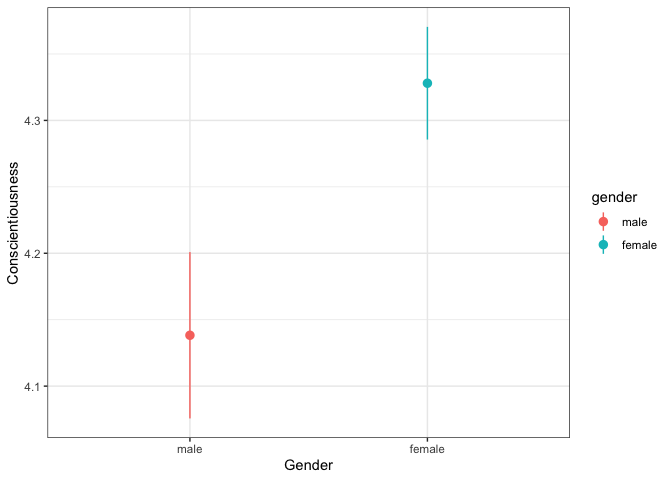<!-- -->

```r
bfi_mean %>%
    ggplot(aes(gender, E, col = gender)) +
    stat_summary(fun.data = mean_cl_normal) +
    theme_bw() +
    xlab("Gender")+
    ylab("Extraversion")
```

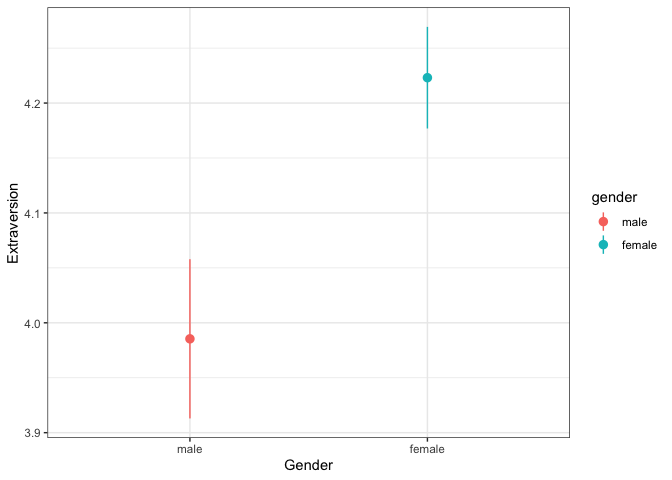<!-- -->

```r
bfi_mean %>%
    ggplot(aes(gender, O, col = gender)) +
    stat_summary(fun.data = mean_cl_normal) +
    theme_bw() +
    xlab("Gender")+
    ylab("Openness")
```

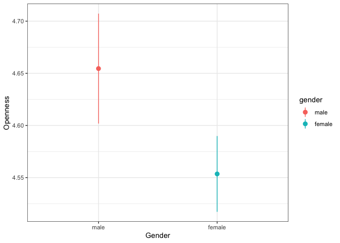<!-- -->

```r
bfi_mean %>%
    ggplot(aes(gender, N, col = gender)) +
    stat_summary(fun.data = mean_cl_normal) +
    theme_bw() +
    xlab("Gender")+
    ylab("Neuroticism")
```

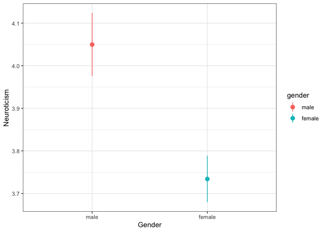<!-- -->

### Do the Big Five traits increase or decrease with Age? Is there a linear or squared trend?

#### Yes, all increase with age.Also appears to be support for a squared trend for all, except neuroticism and openness (when comparing models).

```r
#Linear
get_summary_age_lin <- function(.x, data) {
  mod1 <- lm(.x ~ age, data = bfi_mean)
  return(tidy(mod1, conf.int = TRUE))
}

coef_summ_age_lin <- 
  bfi_mean %>% 
    select(A:O) %>% 
     map_dfr(get_summary_age_lin, .id = "Trait")
coef_summ_age_lin
```

```
## # A tibble: 10 x 8
##    Trait term        estimate std.error statistic  p.value conf.low conf.high
##    <chr> <chr>          <dbl>     <dbl>     <dbl>    <dbl>    <dbl>     <dbl>
##  1 A     (Intercept)  4.22      0.0463      91.2  0.        4.13      4.31   
##  2 A     age          0.0150    0.00150      9.99 4.25e-23  0.0120    0.0179 
##  3 C     (Intercept)  3.98      0.0495      80.3  0.        3.88      4.07   
##  4 C     age          0.0101    0.00161      6.28 4.01e-10  0.00693   0.0132 
##  5 E     (Intercept)  3.97      0.0555      71.6  0.        3.86      4.08   
##  6 E     age          0.00599   0.00180      3.33 8.80e- 4  0.00246   0.00952
##  7 N     (Intercept)  3.48      0.0623      55.8  0.        3.35      3.60   
##  8 N     age          0.0126    0.00202      6.24 4.92e-10  0.00864   0.0166 
##  9 O     (Intercept)  4.42      0.0422     105.   0.        4.34      4.50   
## 10 O     age          0.00573   0.00137      4.19 2.89e- 5  0.00305   0.00842
```

```r
# Squared
get_summary_age <- function(.x, data) {
  mod <- lm(.x ~ age + I(age^2), data = bfi_mean)
   return(tidy(mod, conf.int = TRUE))
}

coef_summ_age <- 
  bfi_mean %>% 
    select(A:O) %>% 
     map_dfr(get_summary_age, .id = "Trait")
coef_summ_age
```

```
## # A tibble: 15 x 8
##    Trait term         estimate std.error statistic   p.value  conf.low conf.high
##    <chr> <chr>           <dbl>     <dbl>     <dbl>     <dbl>     <dbl>     <dbl>
##  1 A     (Intercep…  3.76      0.122        30.9   2.33e-180   3.52e+0   4.00e+0
##  2 A     age         0.0459    0.00767       5.98  2.48e-  9   3.08e-2   6.09e-2
##  3 A     I(age^2)   -0.000448  0.000109     -4.11  4.10e-  5  -6.62e-4  -2.34e-4
##  4 C     (Intercep…  3.33      0.130        25.6   3.35e-130   3.08e+0   3.58e+0
##  5 C     age         0.0532    0.00819       6.49  9.81e- 11   3.71e-2   6.93e-2
##  6 C     I(age^2)   -0.000625  0.000116     -5.37  8.62e-  8  -8.54e-4  -3.97e-4
##  7 E     (Intercep…  3.56      0.146        24.4   4.64e-119   3.28e+0   3.85e+0
##  8 E     age         0.0334    0.00921       3.63  2.91e-  4   1.54e-2   5.15e-2
##  9 E     I(age^2)   -0.000398  0.000131     -3.04  2.42e-  3  -6.55e-4  -1.41e-4
## 10 N     (Intercep…  3.73      0.164        22.7   1.10e-104   3.40e+0   4.05e+0
## 11 N     age        -0.00410   0.0103       -0.396 6.92e-  1  -2.44e-2   1.62e-2
## 12 N     I(age^2)    0.000242  0.000147      1.65  9.99e-  2  -4.64e-5   5.31e-4
## 13 O     (Intercep…  4.32      0.111        38.8   2.04e-263   4.10e+0   4.54e+0
## 14 O     age         0.0126    0.00702       1.79  7.32e-  2  -1.18e-3   2.63e-2
## 15 O     I(age^2)   -0.0000993 0.0000999    -0.994 3.20e-  1  -2.95e-4   9.65e-5
```

```r
# ANOVA
compare_models <- function(.x, data) {
  mod2 <- anova((lm(.x ~ age, data = bfi_mean)), (lm(.x ~ age + I(age^2), data = bfi_mean)))
  return(summary(mod2))
}

compare_models_out <- 
  bfi_mean %>% 
    select(A:O) %>% 
    map(compare_models)
compare_models_out
```

```
## $A
##      Res.Df          RSS             Df      Sum of Sq           F        
##  Min.   :2797   Min.   :2168   Min.   :1   Min.   :13.08   Min.   :16.88  
##  1st Qu.:2797   1st Qu.:2172   1st Qu.:1   1st Qu.:13.08   1st Qu.:16.88  
##  Median :2798   Median :2175   Median :1   Median :13.08   Median :16.88  
##  Mean   :2798   Mean   :2175   Mean   :1   Mean   :13.08   Mean   :16.88  
##  3rd Qu.:2798   3rd Qu.:2178   3rd Qu.:1   3rd Qu.:13.08   3rd Qu.:16.88  
##  Max.   :2798   Max.   :2181   Max.   :1   Max.   :13.08   Max.   :16.88  
##                                NA's   :1   NA's   :1       NA's   :1      
##      Pr(>F)       
##  Min.   :4.1e-05  
##  1st Qu.:4.1e-05  
##  Median :4.1e-05  
##  Mean   :4.1e-05  
##  3rd Qu.:4.1e-05  
##  Max.   :4.1e-05  
##  NA's   :1        
## 
## $C
##      Res.Df          RSS             Df      Sum of Sq           F        
##  Min.   :2797   Min.   :2473   Min.   :1   Min.   :25.47   Min.   :28.81  
##  1st Qu.:2797   1st Qu.:2479   1st Qu.:1   1st Qu.:25.47   1st Qu.:28.81  
##  Median :2798   Median :2485   Median :1   Median :25.47   Median :28.81  
##  Mean   :2798   Mean   :2485   Mean   :1   Mean   :25.47   Mean   :28.81  
##  3rd Qu.:2798   3rd Qu.:2492   3rd Qu.:1   3rd Qu.:25.47   3rd Qu.:28.81  
##  Max.   :2798   Max.   :2498   Max.   :1   Max.   :25.47   Max.   :28.81  
##                                NA's   :1   NA's   :1       NA's   :1      
##      Pr(>F)     
##  Min.   :1e-07  
##  1st Qu.:1e-07  
##  Median :1e-07  
##  Mean   :1e-07  
##  3rd Qu.:1e-07  
##  Max.   :1e-07  
##  NA's   :1      
## 
## $E
##      Res.Df          RSS             Df      Sum of Sq           F        
##  Min.   :2797   Min.   :3128   Min.   :1   Min.   :10.31   Min.   :9.218  
##  1st Qu.:2797   1st Qu.:3130   1st Qu.:1   1st Qu.:10.31   1st Qu.:9.218  
##  Median :2798   Median :3133   Median :1   Median :10.31   Median :9.218  
##  Mean   :2798   Mean   :3133   Mean   :1   Mean   :10.31   Mean   :9.218  
##  3rd Qu.:2798   3rd Qu.:3135   3rd Qu.:1   3rd Qu.:10.31   3rd Qu.:9.218  
##  Max.   :2798   Max.   :3138   Max.   :1   Max.   :10.31   Max.   :9.218  
##                                NA's   :1   NA's   :1       NA's   :1      
##      Pr(>F)        
##  Min.   :0.002418  
##  1st Qu.:0.002418  
##  Median :0.002418  
##  Mean   :0.002418  
##  3rd Qu.:0.002418  
##  Max.   :0.002418  
##  NA's   :1         
## 
## $N
##      Res.Df          RSS             Df      Sum of Sq           F        
##  Min.   :2797   Min.   :3947   Min.   :1   Min.   :3.822   Min.   :2.709  
##  1st Qu.:2797   1st Qu.:3948   1st Qu.:1   1st Qu.:3.822   1st Qu.:2.709  
##  Median :2798   Median :3949   Median :1   Median :3.822   Median :2.709  
##  Mean   :2798   Mean   :3949   Mean   :1   Mean   :3.822   Mean   :2.709  
##  3rd Qu.:2798   3rd Qu.:3950   3rd Qu.:1   3rd Qu.:3.822   3rd Qu.:2.709  
##  Max.   :2798   Max.   :3951   Max.   :1   Max.   :3.822   Max.   :2.709  
##                                NA's   :1   NA's   :1       NA's   :1      
##      Pr(>F)       
##  Min.   :0.09992  
##  1st Qu.:0.09992  
##  Median :0.09992  
##  Mean   :0.09992  
##  3rd Qu.:0.09992  
##  Max.   :0.09992  
##  NA's   :1        
## 
## $O
##      Res.Df          RSS             Df      Sum of Sq            F         
##  Min.   :2797   Min.   :1817   Min.   :1   Min.   :0.6424   Min.   :0.9889  
##  1st Qu.:2797   1st Qu.:1817   1st Qu.:1   1st Qu.:0.6424   1st Qu.:0.9889  
##  Median :2798   Median :1817   Median :1   Median :0.6424   Median :0.9889  
##  Mean   :2798   Mean   :1817   Mean   :1   Mean   :0.6424   Mean   :0.9889  
##  3rd Qu.:2798   3rd Qu.:1817   3rd Qu.:1   3rd Qu.:0.6424   3rd Qu.:0.9889  
##  Max.   :2798   Max.   :1818   Max.   :1   Max.   :0.6424   Max.   :0.9889  
##                                NA's   :1   NA's   :1        NA's   :1       
##      Pr(>F)      
##  Min.   :0.3201  
##  1st Qu.:0.3201  
##  Median :0.3201  
##  Mean   :0.3201  
##  3rd Qu.:0.3201  
##  Max.   :0.3201  
##  NA's   :1
```

#### Graphing


```r
bfi_mean %>%
    ggplot(aes(age, A)) +
    stat_summary(fun.data = mean_cl_normal, geom = "point") +
    theme_bw() +
    xlab("Age")+
    ylab("Agreeableness")+
    geom_smooth(method = "lm") 
```

```
## `geom_smooth()` using formula 'y ~ x'
```

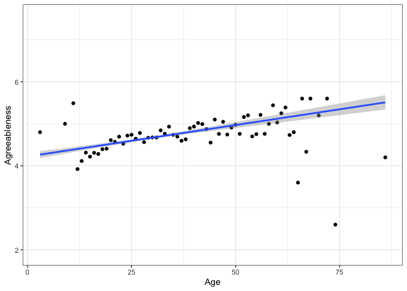<!-- -->

```r
bfi_mean %>%
    ggplot(aes(age, C)) +
    stat_summary(fun.data = mean_cl_normal, geom = "point") +
    theme_bw() +
    xlab("Age")+
    ylab("Conscientiousness")+
    geom_smooth(method = "lm") 
```

```
## `geom_smooth()` using formula 'y ~ x'
```

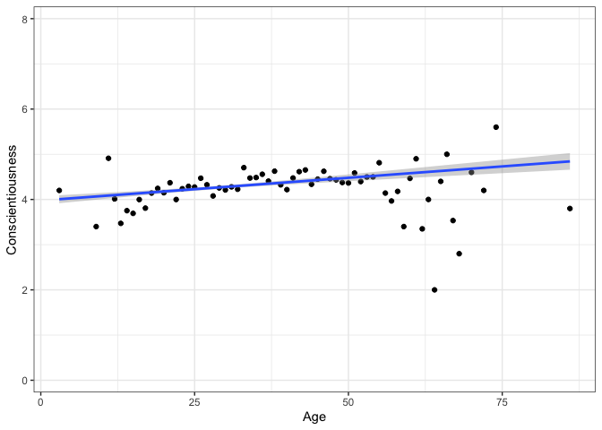<!-- -->

```r
bfi_mean %>%
    ggplot(aes(age, E)) +
    stat_summary(fun.data = mean_cl_normal, geom = "point") +
    theme_bw() +
    xlab("Age")+
    ylab("Extraversion")+
    geom_smooth(method = "lm") 
```

```
## `geom_smooth()` using formula 'y ~ x'
```

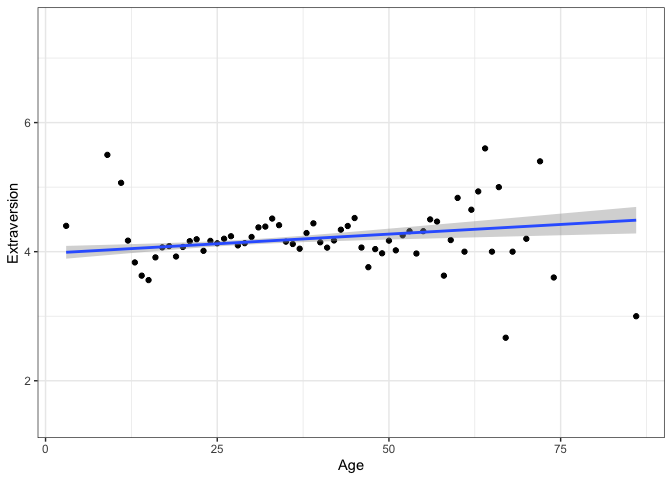<!-- -->

```r
bfi_mean %>%
    ggplot(aes(age, O)) +
    stat_summary(fun.data = mean_cl_normal, geom = "point") +
    theme_bw() +
    xlab("Age")+
    ylab("Openness")+
    geom_smooth(method = "lm") 
```

```
## `geom_smooth()` using formula 'y ~ x'
```

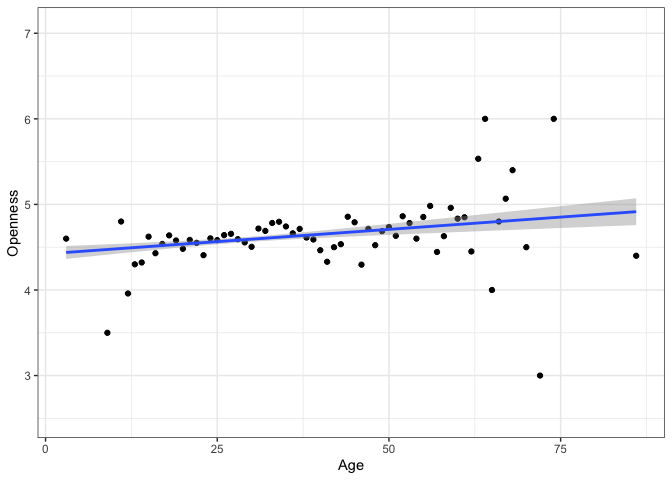<!-- -->

```r
bfi_mean %>%
    ggplot(aes(age, N)) +
    stat_summary(fun.data = mean_cl_normal, geom = "point") +
    theme_bw() +
    xlab("Age")+
    ylab("Neuroticism")+
    geom_smooth(method = "lm") 
```

```
## `geom_smooth()` using formula 'y ~ x'
```

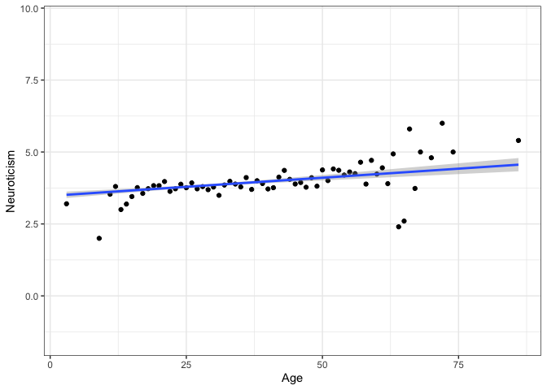<!-- -->

### Do the Big Five traits differ across educational levels? Treat education as a categorical variable.

#### Yes


```r
get_summary_edu <- function(.x, data) {
  mod <- lm(.x ~ education, data = bfi_mean)
  return(summary(mod))
}

coef_summ_edu <- 
  bfi_mean %>% 
    select(A:O) %>% 
     map(get_summary_edu)
coef_summ_edu
```

```
## $A
## 
## Call:
## lm(formula = .x ~ education, data = bfi_mean)
## 
## Residuals:
##     Min      1Q  Median      3Q     Max 
## -3.7591 -0.5591  0.0626  0.6409  1.4780 
## 
## Coefficients:
##                          Estimate Std. Error t value Pr(>|t|)    
## (Intercept)               4.52202    0.05826  77.622  < 2e-16 ***
## educationhs               0.06445    0.07744   0.832 0.405370    
## educationsome college     0.23710    0.06327   3.748 0.000182 ***
## educationcollege          0.09282    0.07296   1.272 0.203409    
## educationgraduate degree  0.21534    0.07220   2.983 0.002885 ** 
## ---
## Signif. codes:  0 '***' 0.001 '**' 0.01 '*' 0.05 '.' 0.1 ' ' 1
## 
## Residual standard error: 0.8719 on 2572 degrees of freedom
##   (223 observations deleted due to missingness)
## Multiple R-squared:  0.009399,	Adjusted R-squared:  0.007858 
## F-statistic: 6.101 on 4 and 2572 DF,  p-value: 6.962e-05
## 
## 
## $C
## 
## Call:
## lm(formula = .x ~ education, data = bfi_mean)
## 
## Residuals:
##     Min      1Q  Median      3Q     Max 
## -3.3874 -0.6203  0.0793  0.7161  1.8793 
## 
## Coefficients:
##                          Estimate Std. Error t value Pr(>|t|)    
## (Intercept)               4.12068    0.06260  65.826  < 2e-16 ***
## educationhs               0.10843    0.08322   1.303   0.1927    
## educationsome college     0.26676    0.06798   3.924 8.94e-05 ***
## educationcollege          0.09962    0.07840   1.271   0.2040    
## educationgraduate degree  0.16321    0.07758   2.104   0.0355 *  
## ---
## Signif. codes:  0 '***' 0.001 '**' 0.01 '*' 0.05 '.' 0.1 ' ' 1
## 
## Residual standard error: 0.9369 on 2572 degrees of freedom
##   (223 observations deleted due to missingness)
## Multiple R-squared:  0.009125,	Adjusted R-squared:  0.007584 
## F-statistic: 5.921 on 4 and 2572 DF,  p-value: 9.667e-05
## 
## 
## $E
## 
## Call:
## lm(formula = .x ~ education, data = bfi_mean)
## 
## Residuals:
##     Min      1Q  Median      3Q     Max 
## -3.2339 -0.6339  0.1435  0.7661  2.0243 
## 
## Coefficients:
##                          Estimate Std. Error t value Pr(>|t|)    
## (Intercept)               3.97567    0.07049  56.400  < 2e-16 ***
## educationhs               0.21919    0.09371   2.339 0.019403 *  
## educationsome college     0.25828    0.07655   3.374 0.000752 ***
## educationcollege          0.08080    0.08828   0.915 0.360142    
## educationgraduate degree  0.17828    0.08736   2.041 0.041381 *  
## ---
## Signif. codes:  0 '***' 0.001 '**' 0.01 '*' 0.05 '.' 0.1 ' ' 1
## 
## Residual standard error: 1.055 on 2572 degrees of freedom
##   (223 observations deleted due to missingness)
## Multiple R-squared:  0.006562,	Adjusted R-squared:  0.005017 
## F-statistic: 4.247 on 4 and 2572 DF,  p-value: 0.001986
## 
## 
## $N
## 
## Call:
## lm(formula = .x ~ education, data = bfi_mean)
## 
## Residuals:
##      Min       1Q   Median       3Q      Max 
## -2.93629 -0.86950  0.06471  0.93050  2.25580 
## 
## Coefficients:
##                          Estimate Std. Error t value Pr(>|t|)    
## (Intercept)               3.74420    0.07961  47.033   <2e-16 ***
## educationhs               0.02104    0.10582   0.199   0.8424    
## educationsome college     0.12530    0.08645   1.449   0.1474    
## educationcollege          0.19210    0.09970   1.927   0.0541 .  
## educationgraduate degree  0.19109    0.09866   1.937   0.0529 .  
## ---
## Signif. codes:  0 '***' 0.001 '**' 0.01 '*' 0.05 '.' 0.1 ' ' 1
## 
## Residual standard error: 1.191 on 2572 degrees of freedom
##   (223 observations deleted due to missingness)
## Multiple R-squared:  0.002799,	Adjusted R-squared:  0.001249 
## F-statistic: 1.805 on 4 and 2572 DF,  p-value: 0.1251
## 
## 
## $O
## 
## Call:
## lm(formula = .x ~ education, data = bfi_mean)
## 
## Residuals:
##     Min      1Q  Median      3Q     Max 
## -3.1469 -0.5069  0.0931  0.6531  1.4931 
## 
## Coefficients:
##                          Estimate Std. Error t value Pr(>|t|)    
## (Intercept)               4.54687    0.05320  85.470  < 2e-16 ***
## educationhs               0.06717    0.07072   0.950   0.3423    
## educationsome college    -0.03998    0.05777  -0.692   0.4890    
## educationcollege          0.13815    0.06663   2.074   0.0382 *  
## educationgraduate degree  0.27968    0.06593   4.242 2.29e-05 ***
## ---
## Signif. codes:  0 '***' 0.001 '**' 0.01 '*' 0.05 '.' 0.1 ' ' 1
## 
## Residual standard error: 0.7962 on 2572 degrees of freedom
##   (223 observations deleted due to missingness)
## Multiple R-squared:  0.02149,	Adjusted R-squared:  0.01997 
## F-statistic: 14.12 on 4 and 2572 DF,  p-value: 2.103e-11
```

#### Graphing


```r
bfi_mean %>%
    ggplot(aes(education, A, col = education)) +
    geom_point()+
    geom_boxplot()+
    theme_bw() +
    xlab("Education")+
    ylab("Agreeableness")
```

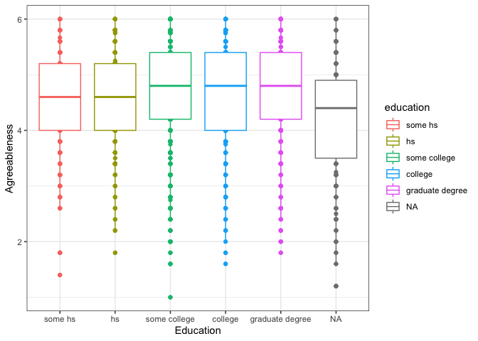<!-- -->

```r
bfi_mean %>%
    ggplot(aes(education, C, col = education)) +
     geom_point()+
    geom_boxplot()+    
    theme_bw() +
    xlab("Education")+
    ylab("Conscientiousness")
```

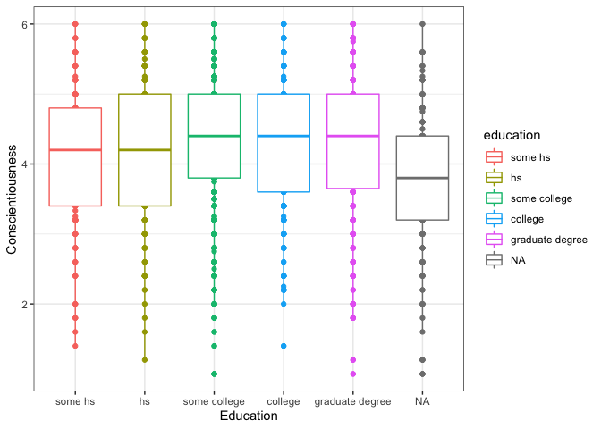<!-- -->

```r
bfi_mean %>%
    ggplot(aes(education, E, col = education)) +
    geom_point()+
    geom_boxplot()+
    theme_bw() +
    xlab("Education")+
    ylab("Extraversion")
```

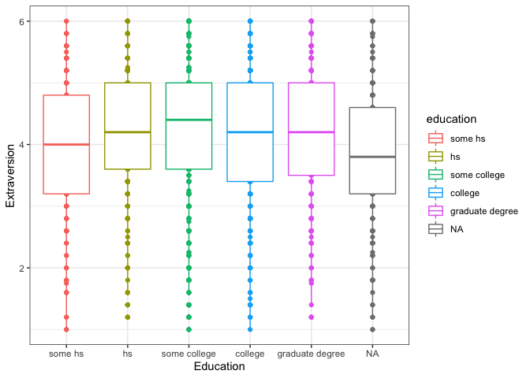<!-- -->

```r
bfi_mean %>%
    ggplot(aes(education, O, col = education)) +
    geom_point()+
    geom_boxplot()+    
    theme_bw() +
    xlab("Education")+
    ylab("Openness")
```

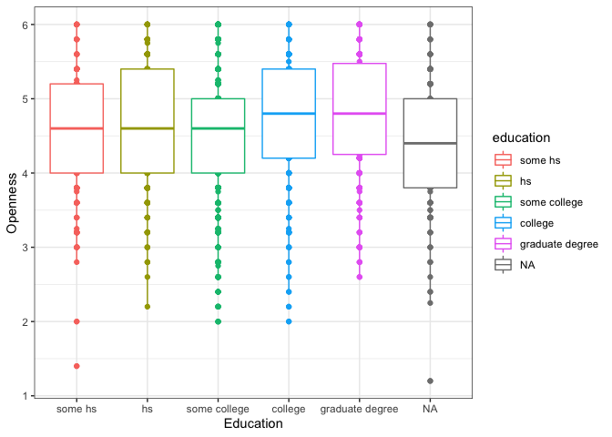<!-- -->

### How well do age and gender together predict the Big Five traits?

#### A: R2 = 0.07, C: R2 = 0.02, E: R2 = 0.01, N: R2 = 0.03, O: AR2 = 0.01


```r
rsq_age_gender <- 
  bfi_mean %>% 
    select(A:O) %>% 
    map_dbl(~ lm(.x ~ age + gender, data = bfi_mean) %>% 
                summary() %>% .$r.squared)
rsq_age_gender
```

```
##          A          C          E          N          O 
## 0.07393324 0.02164965 0.01441908 0.03054057 0.01014196
```

### In your models in part (4), do the residuals appear to be normally distributed? Are they consistent across age ranges and gender groups?

#### Come back to this...


