## Loading Packages


```r
#install.packages("broom")
#install.packages("psychTools")

library(psychTools)
library(tidyverse)
```

```
## ── Attaching packages ───────────────────────────────────────── tidyverse 1.3.0 ──
```

```
## ✓ ggplot2 3.3.0.9000     ✓ purrr   0.3.3     
## ✓ tibble  2.1.3          ✓ dplyr   0.8.4     
## ✓ tidyr   1.0.2          ✓ stringr 1.4.0     
## ✓ readr   1.3.1          ✓ forcats 0.4.0
```

```
## ── Conflicts ──────────────────────────────────────────── tidyverse_conflicts() ──
## x dplyr::filter() masks stats::filter()
## x dplyr::lag()    masks stats::lag()
```

```r
library(gapminder)
library(broom)
library(dplyr)
library(psych)
```

```
## 
## Attaching package: 'psych'
```

```
## The following objects are masked from 'package:ggplot2':
## 
##     %+%, alpha
```

```r
set.seed(1234)
theme_set(theme_minimal())
```

## Examples


```r
ggplot(modelr::sim1, aes(x, y)) + 
  geom_point() +
  geom_smooth(method = "lm") #Adding a best-fit line (least squares)
```

```
## `geom_smooth()` using formula 'y ~ x'
```

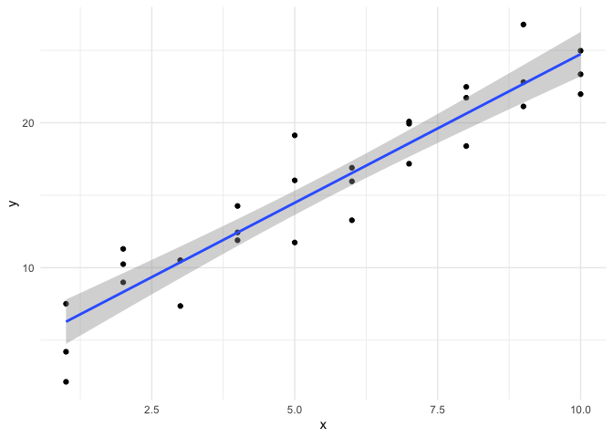<!-- -->

# Model Fitting Elements

## Method
### e.g. linear

## Formula
### e.g. Y ~ X1 + X2

# Trying it out in base R

## Fit a linear regression model to life expectancy (“Y”) from year (“X”) by filling in the formula. Only in Europe


```r
gapminder_europe <- filter(gapminder, continent == "Europe")

mod_europe <- lm(lifeExp ~ year, data = gapminder_europe)
mod_europe
```

```
## 
## Call:
## lm(formula = lifeExp ~ year, data = gapminder_europe)
## 
## Coefficients:
## (Intercept)         year  
##   -367.4110       0.2219
```

### I() lets you make an arithmetic transformation so data is more meaningful


```r
mod_europe <- lm(lifeExp ~ I(year - 1952), data = gapminder_europe)
mod_europe
```

```
## 
## Call:
## lm(formula = lifeExp ~ I(year - 1952), data = gapminder_europe)
## 
## Coefficients:
##    (Intercept)  I(year - 1952)  
##        65.8006          0.2219
```


```r
class(mod_europe)
```

```
## [1] "lm"
```

```r
is.list(mod_europe)
```

```
## [1] TRUE
```

```r
str(mod_europe)
```

```
## List of 12
##  $ coefficients : Named num [1:2] 65.801 0.222
##   ..- attr(*, "names")= chr [1:2] "(Intercept)" "I(year - 1952)"
##  $ residuals    : Named num [1:360] -10.57 -7.63 -3.2 -2.91 -2.55 ...
##   ..- attr(*, "names")= chr [1:360] "1" "2" "3" "4" ...
##  $ effects      : Named num [1:360] -1364.28 72.68 -2.34 -2.15 -1.9 ...
##   ..- attr(*, "names")= chr [1:360] "(Intercept)" "I(year - 1952)" "" "" ...
##  $ rank         : int 2
##  $ fitted.values: Named num [1:360] 65.8 66.9 68 69.1 70.2 ...
##   ..- attr(*, "names")= chr [1:360] "1" "2" "3" "4" ...
##  $ assign       : int [1:2] 0 1
##  $ qr           :List of 5
##   ..$ qr   : num [1:360, 1:2] -18.9737 0.0527 0.0527 0.0527 0.0527 ...
##   .. ..- attr(*, "dimnames")=List of 2
##   .. .. ..$ : chr [1:360] "1" "2" "3" "4" ...
##   .. .. ..$ : chr [1:2] "(Intercept)" "I(year - 1952)"
##   .. ..- attr(*, "assign")= int [1:2] 0 1
##   ..$ qraux: num [1:2] 1.05 1.06
##   ..$ pivot: int [1:2] 1 2
##   ..$ tol  : num 1e-07
##   ..$ rank : int 2
##   ..- attr(*, "class")= chr "qr"
##  $ df.residual  : int 358
##  $ xlevels      : Named list()
##  $ call         : language lm(formula = lifeExp ~ I(year - 1952), data = gapminder_europe)
##  $ terms        :Classes 'terms', 'formula'  language lifeExp ~ I(year - 1952)
##   .. ..- attr(*, "variables")= language list(lifeExp, I(year - 1952))
##   .. ..- attr(*, "factors")= int [1:2, 1] 0 1
##   .. .. ..- attr(*, "dimnames")=List of 2
##   .. .. .. ..$ : chr [1:2] "lifeExp" "I(year - 1952)"
##   .. .. .. ..$ : chr "I(year - 1952)"
##   .. ..- attr(*, "term.labels")= chr "I(year - 1952)"
##   .. ..- attr(*, "order")= int 1
##   .. ..- attr(*, "intercept")= int 1
##   .. ..- attr(*, "response")= int 1
##   .. ..- attr(*, ".Environment")=<environment: R_GlobalEnv> 
##   .. ..- attr(*, "predvars")= language list(lifeExp, I(year - 1952))
##   .. ..- attr(*, "dataClasses")= Named chr [1:2] "numeric" "numeric"
##   .. .. ..- attr(*, "names")= chr [1:2] "lifeExp" "I(year - 1952)"
##  $ model        :'data.frame':	360 obs. of  2 variables:
##   ..$ lifeExp       : num [1:360] 55.2 59.3 64.8 66.2 67.7 ...
##   ..$ I(year - 1952): 'AsIs' num [1:360]  0  5 10 15 20 25 30 35 40 45 ...
##   ..- attr(*, "terms")=Classes 'terms', 'formula'  language lifeExp ~ I(year - 1952)
##   .. .. ..- attr(*, "variables")= language list(lifeExp, I(year - 1952))
##   .. .. ..- attr(*, "factors")= int [1:2, 1] 0 1
##   .. .. .. ..- attr(*, "dimnames")=List of 2
##   .. .. .. .. ..$ : chr [1:2] "lifeExp" "I(year - 1952)"
##   .. .. .. .. ..$ : chr "I(year - 1952)"
##   .. .. ..- attr(*, "term.labels")= chr "I(year - 1952)"
##   .. .. ..- attr(*, "order")= int 1
##   .. .. ..- attr(*, "intercept")= int 1
##   .. .. ..- attr(*, "response")= int 1
##   .. .. ..- attr(*, ".Environment")=<environment: R_GlobalEnv> 
##   .. .. ..- attr(*, "predvars")= language list(lifeExp, I(year - 1952))
##   .. .. ..- attr(*, "dataClasses")= Named chr [1:2] "numeric" "numeric"
##   .. .. .. ..- attr(*, "names")= chr [1:2] "lifeExp" "I(year - 1952)"
##  - attr(*, "class")= chr "lm"
```

```r
names(mod_europe)
```

```
##  [1] "coefficients"  "residuals"     "effects"       "rank"         
##  [5] "fitted.values" "assign"        "qr"            "df.residual"  
##  [9] "xlevels"       "call"          "terms"         "model"
```

```r
summary(mod_europe)
```

```
## 
## Call:
## lm(formula = lifeExp ~ I(year - 1952), data = gapminder_europe)
## 
## Residuals:
##      Min       1Q   Median       3Q      Max 
## -22.2156  -2.0042   0.8928   2.3301   6.8694 
## 
## Coefficients:
##                Estimate Std. Error t value Pr(>|t|)    
## (Intercept)    65.80055    0.38200  172.25   <2e-16 ***
## I(year - 1952)  0.22193    0.01177   18.86   <2e-16 ***
## ---
## Signif. codes:  0 '***' 0.001 '**' 0.01 '*' 0.05 '.' 0.1 ' ' 1
## 
## Residual standard error: 3.853 on 358 degrees of freedom
## Multiple R-squared:  0.4985,	Adjusted R-squared:  0.4971 
## F-statistic: 355.8 on 1 and 358 DF,  p-value: < 2.2e-16
```

```r
names(summary(mod_europe))
```

```
##  [1] "call"          "terms"         "residuals"     "coefficients" 
##  [5] "aliased"       "sigma"         "df"            "r.squared"    
##  [9] "adj.r.squared" "fstatistic"    "cov.unscaled"
```

# Trying it out in Broom

## broom::augment()
## broom::tidy()
## broom::glance()

## Pulling predicted values and CI


```r
predict(mod_europe) #pulls predicted/fitted values for model
```

```
##        1        2        3        4        5        6        7        8 
## 65.80055 66.91021 68.01987 69.12953 70.23920 71.34886 72.45852 73.56818 
##        9       10       11       12       13       14       15       16 
## 74.67784 75.78750 76.89716 78.00682 65.80055 66.91021 68.01987 69.12953 
##       17       18       19       20       21       22       23       24 
## 70.23920 71.34886 72.45852 73.56818 74.67784 75.78750 76.89716 78.00682 
##       25       26       27       28       29       30       31       32 
## 65.80055 66.91021 68.01987 69.12953 70.23920 71.34886 72.45852 73.56818 
##       33       34       35       36       37       38       39       40 
## 74.67784 75.78750 76.89716 78.00682 65.80055 66.91021 68.01987 69.12953 
##       41       42       43       44       45       46       47       48 
## 70.23920 71.34886 72.45852 73.56818 74.67784 75.78750 76.89716 78.00682 
##       49       50       51       52       53       54       55       56 
## 65.80055 66.91021 68.01987 69.12953 70.23920 71.34886 72.45852 73.56818 
##       57       58       59       60       61       62       63       64 
## 74.67784 75.78750 76.89716 78.00682 65.80055 66.91021 68.01987 69.12953 
##       65       66       67       68       69       70       71       72 
## 70.23920 71.34886 72.45852 73.56818 74.67784 75.78750 76.89716 78.00682 
##       73       74       75       76       77       78       79       80 
## 65.80055 66.91021 68.01987 69.12953 70.23920 71.34886 72.45852 73.56818 
##       81       82       83       84       85       86       87       88 
## 74.67784 75.78750 76.89716 78.00682 65.80055 66.91021 68.01987 69.12953 
##       89       90       91       92       93       94       95       96 
## 70.23920 71.34886 72.45852 73.56818 74.67784 75.78750 76.89716 78.00682 
##       97       98       99      100      101      102      103      104 
## 65.80055 66.91021 68.01987 69.12953 70.23920 71.34886 72.45852 73.56818 
##      105      106      107      108      109      110      111      112 
## 74.67784 75.78750 76.89716 78.00682 65.80055 66.91021 68.01987 69.12953 
##      113      114      115      116      117      118      119      120 
## 70.23920 71.34886 72.45852 73.56818 74.67784 75.78750 76.89716 78.00682 
##      121      122      123      124      125      126      127      128 
## 65.80055 66.91021 68.01987 69.12953 70.23920 71.34886 72.45852 73.56818 
##      129      130      131      132      133      134      135      136 
## 74.67784 75.78750 76.89716 78.00682 65.80055 66.91021 68.01987 69.12953 
##      137      138      139      140      141      142      143      144 
## 70.23920 71.34886 72.45852 73.56818 74.67784 75.78750 76.89716 78.00682 
##      145      146      147      148      149      150      151      152 
## 65.80055 66.91021 68.01987 69.12953 70.23920 71.34886 72.45852 73.56818 
##      153      154      155      156      157      158      159      160 
## 74.67784 75.78750 76.89716 78.00682 65.80055 66.91021 68.01987 69.12953 
##      161      162      163      164      165      166      167      168 
## 70.23920 71.34886 72.45852 73.56818 74.67784 75.78750 76.89716 78.00682 
##      169      170      171      172      173      174      175      176 
## 65.80055 66.91021 68.01987 69.12953 70.23920 71.34886 72.45852 73.56818 
##      177      178      179      180      181      182      183      184 
## 74.67784 75.78750 76.89716 78.00682 65.80055 66.91021 68.01987 69.12953 
##      185      186      187      188      189      190      191      192 
## 70.23920 71.34886 72.45852 73.56818 74.67784 75.78750 76.89716 78.00682 
##      193      194      195      196      197      198      199      200 
## 65.80055 66.91021 68.01987 69.12953 70.23920 71.34886 72.45852 73.56818 
##      201      202      203      204      205      206      207      208 
## 74.67784 75.78750 76.89716 78.00682 65.80055 66.91021 68.01987 69.12953 
##      209      210      211      212      213      214      215      216 
## 70.23920 71.34886 72.45852 73.56818 74.67784 75.78750 76.89716 78.00682 
##      217      218      219      220      221      222      223      224 
## 65.80055 66.91021 68.01987 69.12953 70.23920 71.34886 72.45852 73.56818 
##      225      226      227      228      229      230      231      232 
## 74.67784 75.78750 76.89716 78.00682 65.80055 66.91021 68.01987 69.12953 
##      233      234      235      236      237      238      239      240 
## 70.23920 71.34886 72.45852 73.56818 74.67784 75.78750 76.89716 78.00682 
##      241      242      243      244      245      246      247      248 
## 65.80055 66.91021 68.01987 69.12953 70.23920 71.34886 72.45852 73.56818 
##      249      250      251      252      253      254      255      256 
## 74.67784 75.78750 76.89716 78.00682 65.80055 66.91021 68.01987 69.12953 
##      257      258      259      260      261      262      263      264 
## 70.23920 71.34886 72.45852 73.56818 74.67784 75.78750 76.89716 78.00682 
##      265      266      267      268      269      270      271      272 
## 65.80055 66.91021 68.01987 69.12953 70.23920 71.34886 72.45852 73.56818 
##      273      274      275      276      277      278      279      280 
## 74.67784 75.78750 76.89716 78.00682 65.80055 66.91021 68.01987 69.12953 
##      281      282      283      284      285      286      287      288 
## 70.23920 71.34886 72.45852 73.56818 74.67784 75.78750 76.89716 78.00682 
##      289      290      291      292      293      294      295      296 
## 65.80055 66.91021 68.01987 69.12953 70.23920 71.34886 72.45852 73.56818 
##      297      298      299      300      301      302      303      304 
## 74.67784 75.78750 76.89716 78.00682 65.80055 66.91021 68.01987 69.12953 
##      305      306      307      308      309      310      311      312 
## 70.23920 71.34886 72.45852 73.56818 74.67784 75.78750 76.89716 78.00682 
##      313      314      315      316      317      318      319      320 
## 65.80055 66.91021 68.01987 69.12953 70.23920 71.34886 72.45852 73.56818 
##      321      322      323      324      325      326      327      328 
## 74.67784 75.78750 76.89716 78.00682 65.80055 66.91021 68.01987 69.12953 
##      329      330      331      332      333      334      335      336 
## 70.23920 71.34886 72.45852 73.56818 74.67784 75.78750 76.89716 78.00682 
##      337      338      339      340      341      342      343      344 
## 65.80055 66.91021 68.01987 69.12953 70.23920 71.34886 72.45852 73.56818 
##      345      346      347      348      349      350      351      352 
## 74.67784 75.78750 76.89716 78.00682 65.80055 66.91021 68.01987 69.12953 
##      353      354      355      356      357      358      359      360 
## 70.23920 71.34886 72.45852 73.56818 74.67784 75.78750 76.89716 78.00682
```

```r
predict(mod_europe, interval = "confidence") #or "conf"
```

```
##          fit      lwr      upr
## 1   65.80055 65.04930 66.55180
## 2   66.91021 66.25406 67.56636
## 3   68.01987 67.45114 68.58861
## 4   69.12953 68.63643 69.62264
## 5   70.23920 69.80375 70.67464
## 6   71.34886 70.94532 71.75240
## 7   72.45852 72.05498 72.86206
## 8   73.56818 73.13273 74.00362
## 9   74.67784 74.18473 75.17094
## 10  75.78750 75.21877 76.35623
## 11  76.89716 76.24101 77.55331
## 12  78.00682 77.25557 78.75807
## 13  65.80055 65.04930 66.55180
## 14  66.91021 66.25406 67.56636
## 15  68.01987 67.45114 68.58861
## 16  69.12953 68.63643 69.62264
## 17  70.23920 69.80375 70.67464
## 18  71.34886 70.94532 71.75240
## 19  72.45852 72.05498 72.86206
## 20  73.56818 73.13273 74.00362
## 21  74.67784 74.18473 75.17094
## 22  75.78750 75.21877 76.35623
## 23  76.89716 76.24101 77.55331
## 24  78.00682 77.25557 78.75807
## 25  65.80055 65.04930 66.55180
## 26  66.91021 66.25406 67.56636
## 27  68.01987 67.45114 68.58861
## 28  69.12953 68.63643 69.62264
## 29  70.23920 69.80375 70.67464
## 30  71.34886 70.94532 71.75240
## 31  72.45852 72.05498 72.86206
## 32  73.56818 73.13273 74.00362
## 33  74.67784 74.18473 75.17094
## 34  75.78750 75.21877 76.35623
## 35  76.89716 76.24101 77.55331
## 36  78.00682 77.25557 78.75807
## 37  65.80055 65.04930 66.55180
## 38  66.91021 66.25406 67.56636
## 39  68.01987 67.45114 68.58861
## 40  69.12953 68.63643 69.62264
## 41  70.23920 69.80375 70.67464
## 42  71.34886 70.94532 71.75240
## 43  72.45852 72.05498 72.86206
## 44  73.56818 73.13273 74.00362
## 45  74.67784 74.18473 75.17094
## 46  75.78750 75.21877 76.35623
## 47  76.89716 76.24101 77.55331
## 48  78.00682 77.25557 78.75807
## 49  65.80055 65.04930 66.55180
## 50  66.91021 66.25406 67.56636
## 51  68.01987 67.45114 68.58861
## 52  69.12953 68.63643 69.62264
## 53  70.23920 69.80375 70.67464
## 54  71.34886 70.94532 71.75240
## 55  72.45852 72.05498 72.86206
## 56  73.56818 73.13273 74.00362
## 57  74.67784 74.18473 75.17094
## 58  75.78750 75.21877 76.35623
## 59  76.89716 76.24101 77.55331
## 60  78.00682 77.25557 78.75807
## 61  65.80055 65.04930 66.55180
## 62  66.91021 66.25406 67.56636
## 63  68.01987 67.45114 68.58861
## 64  69.12953 68.63643 69.62264
## 65  70.23920 69.80375 70.67464
## 66  71.34886 70.94532 71.75240
## 67  72.45852 72.05498 72.86206
## 68  73.56818 73.13273 74.00362
## 69  74.67784 74.18473 75.17094
## 70  75.78750 75.21877 76.35623
## 71  76.89716 76.24101 77.55331
## 72  78.00682 77.25557 78.75807
## 73  65.80055 65.04930 66.55180
## 74  66.91021 66.25406 67.56636
## 75  68.01987 67.45114 68.58861
## 76  69.12953 68.63643 69.62264
## 77  70.23920 69.80375 70.67464
## 78  71.34886 70.94532 71.75240
## 79  72.45852 72.05498 72.86206
## 80  73.56818 73.13273 74.00362
## 81  74.67784 74.18473 75.17094
## 82  75.78750 75.21877 76.35623
## 83  76.89716 76.24101 77.55331
## 84  78.00682 77.25557 78.75807
## 85  65.80055 65.04930 66.55180
## 86  66.91021 66.25406 67.56636
## 87  68.01987 67.45114 68.58861
## 88  69.12953 68.63643 69.62264
## 89  70.23920 69.80375 70.67464
## 90  71.34886 70.94532 71.75240
## 91  72.45852 72.05498 72.86206
## 92  73.56818 73.13273 74.00362
## 93  74.67784 74.18473 75.17094
## 94  75.78750 75.21877 76.35623
## 95  76.89716 76.24101 77.55331
## 96  78.00682 77.25557 78.75807
## 97  65.80055 65.04930 66.55180
## 98  66.91021 66.25406 67.56636
## 99  68.01987 67.45114 68.58861
## 100 69.12953 68.63643 69.62264
## 101 70.23920 69.80375 70.67464
## 102 71.34886 70.94532 71.75240
## 103 72.45852 72.05498 72.86206
## 104 73.56818 73.13273 74.00362
## 105 74.67784 74.18473 75.17094
## 106 75.78750 75.21877 76.35623
## 107 76.89716 76.24101 77.55331
## 108 78.00682 77.25557 78.75807
## 109 65.80055 65.04930 66.55180
## 110 66.91021 66.25406 67.56636
## 111 68.01987 67.45114 68.58861
## 112 69.12953 68.63643 69.62264
## 113 70.23920 69.80375 70.67464
## 114 71.34886 70.94532 71.75240
## 115 72.45852 72.05498 72.86206
## 116 73.56818 73.13273 74.00362
## 117 74.67784 74.18473 75.17094
## 118 75.78750 75.21877 76.35623
## 119 76.89716 76.24101 77.55331
## 120 78.00682 77.25557 78.75807
## 121 65.80055 65.04930 66.55180
## 122 66.91021 66.25406 67.56636
## 123 68.01987 67.45114 68.58861
## 124 69.12953 68.63643 69.62264
## 125 70.23920 69.80375 70.67464
## 126 71.34886 70.94532 71.75240
## 127 72.45852 72.05498 72.86206
## 128 73.56818 73.13273 74.00362
## 129 74.67784 74.18473 75.17094
## 130 75.78750 75.21877 76.35623
## 131 76.89716 76.24101 77.55331
## 132 78.00682 77.25557 78.75807
## 133 65.80055 65.04930 66.55180
## 134 66.91021 66.25406 67.56636
## 135 68.01987 67.45114 68.58861
## 136 69.12953 68.63643 69.62264
## 137 70.23920 69.80375 70.67464
## 138 71.34886 70.94532 71.75240
## 139 72.45852 72.05498 72.86206
## 140 73.56818 73.13273 74.00362
## 141 74.67784 74.18473 75.17094
## 142 75.78750 75.21877 76.35623
## 143 76.89716 76.24101 77.55331
## 144 78.00682 77.25557 78.75807
## 145 65.80055 65.04930 66.55180
## 146 66.91021 66.25406 67.56636
## 147 68.01987 67.45114 68.58861
## 148 69.12953 68.63643 69.62264
## 149 70.23920 69.80375 70.67464
## 150 71.34886 70.94532 71.75240
## 151 72.45852 72.05498 72.86206
## 152 73.56818 73.13273 74.00362
## 153 74.67784 74.18473 75.17094
## 154 75.78750 75.21877 76.35623
## 155 76.89716 76.24101 77.55331
## 156 78.00682 77.25557 78.75807
## 157 65.80055 65.04930 66.55180
## 158 66.91021 66.25406 67.56636
## 159 68.01987 67.45114 68.58861
## 160 69.12953 68.63643 69.62264
## 161 70.23920 69.80375 70.67464
## 162 71.34886 70.94532 71.75240
## 163 72.45852 72.05498 72.86206
## 164 73.56818 73.13273 74.00362
## 165 74.67784 74.18473 75.17094
## 166 75.78750 75.21877 76.35623
## 167 76.89716 76.24101 77.55331
## 168 78.00682 77.25557 78.75807
## 169 65.80055 65.04930 66.55180
## 170 66.91021 66.25406 67.56636
## 171 68.01987 67.45114 68.58861
## 172 69.12953 68.63643 69.62264
## 173 70.23920 69.80375 70.67464
## 174 71.34886 70.94532 71.75240
## 175 72.45852 72.05498 72.86206
## 176 73.56818 73.13273 74.00362
## 177 74.67784 74.18473 75.17094
## 178 75.78750 75.21877 76.35623
## 179 76.89716 76.24101 77.55331
## 180 78.00682 77.25557 78.75807
## 181 65.80055 65.04930 66.55180
## 182 66.91021 66.25406 67.56636
## 183 68.01987 67.45114 68.58861
## 184 69.12953 68.63643 69.62264
## 185 70.23920 69.80375 70.67464
## 186 71.34886 70.94532 71.75240
## 187 72.45852 72.05498 72.86206
## 188 73.56818 73.13273 74.00362
## 189 74.67784 74.18473 75.17094
## 190 75.78750 75.21877 76.35623
## 191 76.89716 76.24101 77.55331
## 192 78.00682 77.25557 78.75807
## 193 65.80055 65.04930 66.55180
## 194 66.91021 66.25406 67.56636
## 195 68.01987 67.45114 68.58861
## 196 69.12953 68.63643 69.62264
## 197 70.23920 69.80375 70.67464
## 198 71.34886 70.94532 71.75240
## 199 72.45852 72.05498 72.86206
## 200 73.56818 73.13273 74.00362
## 201 74.67784 74.18473 75.17094
## 202 75.78750 75.21877 76.35623
## 203 76.89716 76.24101 77.55331
## 204 78.00682 77.25557 78.75807
## 205 65.80055 65.04930 66.55180
## 206 66.91021 66.25406 67.56636
## 207 68.01987 67.45114 68.58861
## 208 69.12953 68.63643 69.62264
## 209 70.23920 69.80375 70.67464
## 210 71.34886 70.94532 71.75240
## 211 72.45852 72.05498 72.86206
## 212 73.56818 73.13273 74.00362
## 213 74.67784 74.18473 75.17094
## 214 75.78750 75.21877 76.35623
## 215 76.89716 76.24101 77.55331
## 216 78.00682 77.25557 78.75807
## 217 65.80055 65.04930 66.55180
## 218 66.91021 66.25406 67.56636
## 219 68.01987 67.45114 68.58861
## 220 69.12953 68.63643 69.62264
## 221 70.23920 69.80375 70.67464
## 222 71.34886 70.94532 71.75240
## 223 72.45852 72.05498 72.86206
## 224 73.56818 73.13273 74.00362
## 225 74.67784 74.18473 75.17094
## 226 75.78750 75.21877 76.35623
## 227 76.89716 76.24101 77.55331
## 228 78.00682 77.25557 78.75807
## 229 65.80055 65.04930 66.55180
## 230 66.91021 66.25406 67.56636
## 231 68.01987 67.45114 68.58861
## 232 69.12953 68.63643 69.62264
## 233 70.23920 69.80375 70.67464
## 234 71.34886 70.94532 71.75240
## 235 72.45852 72.05498 72.86206
## 236 73.56818 73.13273 74.00362
## 237 74.67784 74.18473 75.17094
## 238 75.78750 75.21877 76.35623
## 239 76.89716 76.24101 77.55331
## 240 78.00682 77.25557 78.75807
## 241 65.80055 65.04930 66.55180
## 242 66.91021 66.25406 67.56636
## 243 68.01987 67.45114 68.58861
## 244 69.12953 68.63643 69.62264
## 245 70.23920 69.80375 70.67464
## 246 71.34886 70.94532 71.75240
## 247 72.45852 72.05498 72.86206
## 248 73.56818 73.13273 74.00362
## 249 74.67784 74.18473 75.17094
## 250 75.78750 75.21877 76.35623
## 251 76.89716 76.24101 77.55331
## 252 78.00682 77.25557 78.75807
## 253 65.80055 65.04930 66.55180
## 254 66.91021 66.25406 67.56636
## 255 68.01987 67.45114 68.58861
## 256 69.12953 68.63643 69.62264
## 257 70.23920 69.80375 70.67464
## 258 71.34886 70.94532 71.75240
## 259 72.45852 72.05498 72.86206
## 260 73.56818 73.13273 74.00362
## 261 74.67784 74.18473 75.17094
## 262 75.78750 75.21877 76.35623
## 263 76.89716 76.24101 77.55331
## 264 78.00682 77.25557 78.75807
## 265 65.80055 65.04930 66.55180
## 266 66.91021 66.25406 67.56636
## 267 68.01987 67.45114 68.58861
## 268 69.12953 68.63643 69.62264
## 269 70.23920 69.80375 70.67464
## 270 71.34886 70.94532 71.75240
## 271 72.45852 72.05498 72.86206
## 272 73.56818 73.13273 74.00362
## 273 74.67784 74.18473 75.17094
## 274 75.78750 75.21877 76.35623
## 275 76.89716 76.24101 77.55331
## 276 78.00682 77.25557 78.75807
## 277 65.80055 65.04930 66.55180
## 278 66.91021 66.25406 67.56636
## 279 68.01987 67.45114 68.58861
## 280 69.12953 68.63643 69.62264
## 281 70.23920 69.80375 70.67464
## 282 71.34886 70.94532 71.75240
## 283 72.45852 72.05498 72.86206
## 284 73.56818 73.13273 74.00362
## 285 74.67784 74.18473 75.17094
## 286 75.78750 75.21877 76.35623
## 287 76.89716 76.24101 77.55331
## 288 78.00682 77.25557 78.75807
## 289 65.80055 65.04930 66.55180
## 290 66.91021 66.25406 67.56636
## 291 68.01987 67.45114 68.58861
## 292 69.12953 68.63643 69.62264
## 293 70.23920 69.80375 70.67464
## 294 71.34886 70.94532 71.75240
## 295 72.45852 72.05498 72.86206
## 296 73.56818 73.13273 74.00362
## 297 74.67784 74.18473 75.17094
## 298 75.78750 75.21877 76.35623
## 299 76.89716 76.24101 77.55331
## 300 78.00682 77.25557 78.75807
## 301 65.80055 65.04930 66.55180
## 302 66.91021 66.25406 67.56636
## 303 68.01987 67.45114 68.58861
## 304 69.12953 68.63643 69.62264
## 305 70.23920 69.80375 70.67464
## 306 71.34886 70.94532 71.75240
## 307 72.45852 72.05498 72.86206
## 308 73.56818 73.13273 74.00362
## 309 74.67784 74.18473 75.17094
## 310 75.78750 75.21877 76.35623
## 311 76.89716 76.24101 77.55331
## 312 78.00682 77.25557 78.75807
## 313 65.80055 65.04930 66.55180
## 314 66.91021 66.25406 67.56636
## 315 68.01987 67.45114 68.58861
## 316 69.12953 68.63643 69.62264
## 317 70.23920 69.80375 70.67464
## 318 71.34886 70.94532 71.75240
## 319 72.45852 72.05498 72.86206
## 320 73.56818 73.13273 74.00362
## 321 74.67784 74.18473 75.17094
## 322 75.78750 75.21877 76.35623
## 323 76.89716 76.24101 77.55331
## 324 78.00682 77.25557 78.75807
## 325 65.80055 65.04930 66.55180
## 326 66.91021 66.25406 67.56636
## 327 68.01987 67.45114 68.58861
## 328 69.12953 68.63643 69.62264
## 329 70.23920 69.80375 70.67464
## 330 71.34886 70.94532 71.75240
## 331 72.45852 72.05498 72.86206
## 332 73.56818 73.13273 74.00362
## 333 74.67784 74.18473 75.17094
## 334 75.78750 75.21877 76.35623
## 335 76.89716 76.24101 77.55331
## 336 78.00682 77.25557 78.75807
## 337 65.80055 65.04930 66.55180
## 338 66.91021 66.25406 67.56636
## 339 68.01987 67.45114 68.58861
## 340 69.12953 68.63643 69.62264
## 341 70.23920 69.80375 70.67464
## 342 71.34886 70.94532 71.75240
## 343 72.45852 72.05498 72.86206
## 344 73.56818 73.13273 74.00362
## 345 74.67784 74.18473 75.17094
## 346 75.78750 75.21877 76.35623
## 347 76.89716 76.24101 77.55331
## 348 78.00682 77.25557 78.75807
## 349 65.80055 65.04930 66.55180
## 350 66.91021 66.25406 67.56636
## 351 68.01987 67.45114 68.58861
## 352 69.12953 68.63643 69.62264
## 353 70.23920 69.80375 70.67464
## 354 71.34886 70.94532 71.75240
## 355 72.45852 72.05498 72.86206
## 356 73.56818 73.13273 74.00362
## 357 74.67784 74.18473 75.17094
## 358 75.78750 75.21877 76.35623
## 359 76.89716 76.24101 77.55331
## 360 78.00682 77.25557 78.75807
```

## Predicting new dataset


```r
new_data_france <- tibble(year = c(1955, 1964, 1971, 1998, 2000, 2006))
predict(mod_europe, newdata = new_data_france, interval = TRUE)
```

```
## Error in match.arg(interval): 'arg' must be NULL or a character vector
```

```r
#Can do interval = "pred" for range of predicted values, rather than just mean

#(remove error by removing interval command)
```

## Residuals

### Difference between model predicted values and actual data for each case (e.g. evaluate model fit)


```r
resid(mod_europe)
```

```
##            1            2            3            4            5            6 
## -10.57055214  -7.63021286  -3.19987358  -2.90953430  -2.54919503  -2.41885575 
##            7            8            9           10           11           12 
##  -2.03851647  -1.56817720  -3.09683792  -2.83749864  -1.24615936  -1.58382009 
##           13           14           15           16           17           18 
##   0.99944786   0.56978714   1.52012642   1.01046570   0.39080497   0.82114425 
##           19           20           21           22           23           24 
##   0.72148353   1.37182280   1.36216208   1.72250136   2.08284064   1.82217991 
##           25           26           27           28           29           30 
##   2.19944786   2.32978714   2.23012642   1.81046570   1.20080497   1.45114425 
##           31           32           33           34           35           36 
##   1.47148353   1.78182280   1.78216208   1.74250136   1.42284064   1.43417991 
##           37           38           39           40           41           42 
## -11.98055214  -8.46021286  -6.08987358  -4.33953430  -2.78919503  -1.48885575 
##           43           44           45           46           47           48 
##  -1.76851647  -2.42817720  -2.49983792  -2.54349864  -2.80715936  -3.15482009 
##           49           50           51           52           53           54 
##  -6.20055214  -0.30021286   1.49012642   1.29046570   0.66080497  -0.53885575 
##           55           56           57           58           59           60 
##  -1.37851647  -2.22817720  -3.48783792  -5.46749864  -4.75715936  -5.00182009 
##           61           62           63           64           65           66 
##  -4.59055214  -2.14021286  -0.88987358  -0.62953430  -0.62919503  -0.70885575 
##           67           68           69           70           71           72 
##  -1.99851647  -2.04817720  -2.15083792  -2.10749864  -2.02115936  -2.25882009 
##           73           74           75           76           77           78 
##   1.06944786   2.11978714   1.88012642   1.25046570   0.05080497  -0.63885575 
##           79           80           81           82           83           84 
##  -1.49851647  -1.98817720  -2.27783792  -1.77749864  -1.38715936  -1.52082009 
##           85           86           87           88           89           90 
##   4.97944786   4.89978714   4.33012642   3.83046570   3.23080497   3.34114425 
##           91           92           93           94           95           96 
##   2.17148353   1.23182280   0.65216208   0.32250136   0.28284064   0.32517991 
##           97           98           99          100          101          102 
##   0.74944786   0.57978714   0.73012642   0.70046570   0.63080497   1.17114425 
##          103          104          105          106          107          108 
##   2.09148353   1.26182280   1.02216208   1.34250136   1.47284064   1.30617991 
##          109          110          111          112          113          114 
##   1.60944786   2.01978714   2.49012642   2.42046570   2.14080497   2.48114425 
##          115          116          117          118          119          120 
##   2.43148353   2.77182280   2.78216208   2.85250136   2.69284064   2.65017991 
##          121          122          123          124          125          126 
##   1.69944786   2.18978714   2.28012642   1.67046570   0.76080497   1.15114425 
##          127          128          129          130          131          132 
##   1.34148353   1.27882280   1.39216208   1.55250136   1.77284064   1.39917991 
##          133          134          135          136          137          138 
##   0.05944786   0.94978714   1.49012642   1.87046570   2.10080497   2.33114425 
##          139          140          141          142          143          144 
##   2.78148353   3.10182280   2.35216208   2.08150136   1.35884064   1.47617991 
##          145          146          147          148          149          150 
##  -1.77055214  -0.50021286  -0.05987358   0.37046570  -0.47919503  -1.39885575 
##          151          152          153          154          155          156 
##  -3.06851647  -3.98817720  -5.50783792  -4.74749864  -4.30715936  -4.66882009 
##          157          158          159          160          161          162 
##   6.68944786   6.55978714   5.66012642   4.60046570   4.22080497   4.76114425 
##          163          164          165          166          167          168 
##   4.53148353   3.66182280   4.09216208   3.16250136   3.60284064   3.75017991 
##          169          170          171          172          173          174 
##   1.10944786   1.98978714   2.27012642   1.95046570   1.04080497   0.68114425 
##          175          176          177          178          179          180 
##   0.64148353   0.79182280   0.78916208   0.33450136   0.88584064   0.87817991 
##          181          182          183          184          185          186 
##   0.13944786   0.89978714   1.22012642   1.93046570   1.95080497   2.13114425 
##          187          188          189          190          191          192 
##   2.52148353   2.85182280   2.76216208   3.03250136   3.34284064   2.53917991 
##          193          194          195          196          197          198 
##  -6.63655214  -5.46221286  -4.29187358  -1.95153430   0.39680497   1.71714425 
##          199          200          201          202          203          204 
##   1.64248353   1.29682280   0.75716208  -0.34249864  -2.91615936  -3.46382009 
##          205          206          207          208          209          210 
##   6.32944786   6.07978714   5.21012642   4.69046570   3.51080497   3.89114425 
##          211          212          213          214          215          216 
##   3.59148353   3.26182280   2.74216208   2.24250136   1.63284064   1.75517991 
##          217          218          219          220          221          222 
##   6.86944786   6.52978714   5.45012642   4.95046570   4.10080497   4.02114425 
##          223          224          225          226          227          228 
##   3.51148353   2.32182280   2.64216208   2.53250136   2.15284064   2.18917991 
##          229          230          231          232          233          234 
##  -4.49055214  -1.14021286  -0.37987358   0.48046570   0.61080497  -0.67885575 
##          235          236          237          238          239          240 
##  -1.13851647  -2.58817720  -3.68783792  -3.03749864  -2.22715936  -2.44382009 
##          241          242          243          244          245          246 
##  -5.98055214  -5.40021286  -3.62987358  -2.52953430  -0.97919503  -0.93885575 
##          247          248          249          250          251          252 
##   0.31148353   0.49182280   0.18216208   0.18250136   0.39284064   0.09117991 
##          253          254          255          256          257          258 
##  -4.75055214  -2.81021286  -1.21987358  -2.32953430  -1.02919503  -1.88885575 
##          259          260          261          262          263          264 
##  -2.79851647  -4.03817720  -5.31783792  -6.06749864  -5.57515936  -5.53082009 
##          265          266          267          268          269          270 
##  -7.80455214  -5.22521286  -3.48887358  -2.21553430  -1.53919503  -1.04885575 
##          271          272          273          274          275          276 
##  -2.29651647  -2.35017720  -3.01883792  -3.55549864  -3.68415936  -4.00482009 
##          277          278          279          280          281          282 
##  -1.44055214   0.53978714   2.31012642   1.85046570   0.11080497  -0.89885575 
##          283          284          285          286          287          288 
##  -1.65851647  -2.48817720  -3.29783792  -3.07749864  -3.09715936  -3.34382009 
##          289          290          291          292          293          294 
##  -0.23055214   0.93978714   1.13012642   0.05046570  -0.41919503  -0.37885575 
##          295          296          297          298          299          300 
##  -1.39551647  -1.31817720  -1.03783792  -0.65749864  -0.23715936  -0.08082009 
##          301          302          303          304          305          306 
##  -0.86055214  -0.25021286   1.67012642   2.31046570   2.82080497   3.04114425 
##          307          308          309          310          311          312 
##   3.84148353   3.33182280   2.89216208   2.98250136   2.88284064   2.93417991 
##          313          314          315          316          317          318 
##   6.05944786   5.57978714   5.35012642   5.03046570   4.48080497   4.09114425 
##          319          320          321          322          323          324 
##   3.96148353   3.62182280   3.48216208   3.60250136   3.14284064   2.87717991 
##          325          326          327          328          329          330 
##   3.81944786   3.64978714   3.30012642   3.64046570   3.54080497   4.04114425 
##          331          332          333          334          335          336 
##   3.75148353   3.84182280   3.35216208   3.58250136   3.72284064   3.69417991 
##          337          338          339          340          341          342 
## -22.21555214 -18.83121286 -15.92187358 -14.79353430 -13.23419503 -11.84185575 
##          343          344          345          346          347          348 
## -11.42251647 -10.46017720  -8.53183792  -6.95249864  -6.05215936  -6.22982009 
##          349          350          351          352          353          354 
##   3.37944786   3.50978714   2.74012642   2.23046570   1.77080497   1.41114425 
##          355          356          357          358          359          360 
##   1.58148353   1.43882280   1.74216208   1.43050136   1.57384064   1.41817991
```

## Augment

### Returns fitted value, SE, residual, cooks, and some other good stuff. Useful for plotting (but can't return CI... sigh)


```r
augment(mod_europe, data = gapminder_europe)
```

```
## # A tibble: 360 x 13
##    country continent  year lifeExp    pop gdpPercap .fitted .se.fit .resid
##    <fct>   <fct>     <int>   <dbl>  <int>     <dbl>   <dbl>   <dbl>  <dbl>
##  1 Albania Europe     1952    55.2 1.28e6     1601.    65.8   0.382 -10.6 
##  2 Albania Europe     1957    59.3 1.48e6     1942.    66.9   0.334  -7.63
##  3 Albania Europe     1962    64.8 1.73e6     2313.    68.0   0.289  -3.20
##  4 Albania Europe     1967    66.2 1.98e6     2760.    69.1   0.251  -2.91
##  5 Albania Europe     1972    67.7 2.26e6     3313.    70.2   0.221  -2.55
##  6 Albania Europe     1977    68.9 2.51e6     3533.    71.3   0.205  -2.42
##  7 Albania Europe     1982    70.4 2.78e6     3631.    72.5   0.205  -2.04
##  8 Albania Europe     1987    72   3.08e6     3739.    73.6   0.221  -1.57
##  9 Albania Europe     1992    71.6 3.33e6     2497.    74.7   0.251  -3.10
## 10 Albania Europe     1997    73.0 3.43e6     3193.    75.8   0.289  -2.84
## # … with 350 more rows, and 4 more variables: .hat <dbl>, .sigma <dbl>,
## #   .cooksd <dbl>, .std.resid <dbl>
```

### Remember, linear model assumes normal dist of resid!!


```r
augment(mod_europe, data = gapminder_europe) %>% 
  ggplot(aes(x = .resid)) +
  geom_histogram() +
  theme_minimal() +
  xlab("Model residuals") +
  ylab("Count")
```

```
## `stat_bin()` using `bins = 30`. Pick better value with `binwidth`.
```

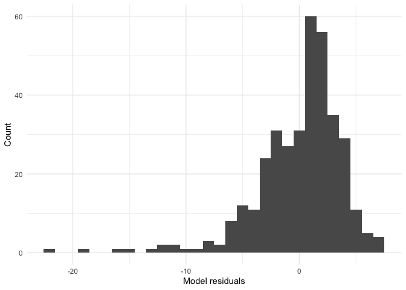<!-- -->

### Aaaand, linear models assumes homoscedasticity!!


```r
augment(mod_europe, data = gapminder_europe) %>% 
  ggplot(aes(x = year, y = .resid)) +
  geom_point() +
  theme_minimal() +
  xlab("Year") +
  ylab("Model residuals")
```

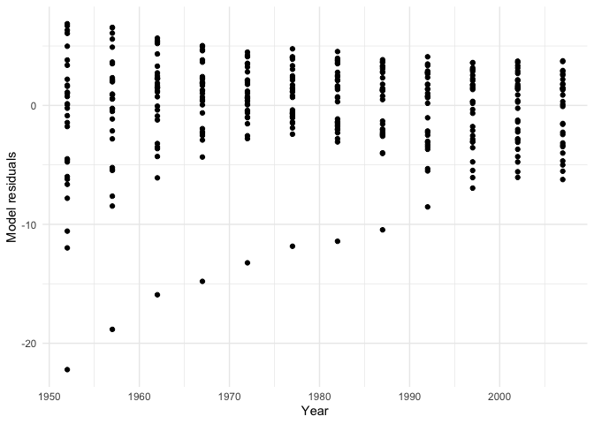<!-- -->

## Model Coefficients


```r
coef(mod_europe)
```

```
##    (Intercept) I(year - 1952) 
##     65.8005521      0.2219321
```

```r
summary(mod_europe)
```

```
## 
## Call:
## lm(formula = lifeExp ~ I(year - 1952), data = gapminder_europe)
## 
## Residuals:
##      Min       1Q   Median       3Q      Max 
## -22.2156  -2.0042   0.8928   2.3301   6.8694 
## 
## Coefficients:
##                Estimate Std. Error t value Pr(>|t|)    
## (Intercept)    65.80055    0.38200  172.25   <2e-16 ***
## I(year - 1952)  0.22193    0.01177   18.86   <2e-16 ***
## ---
## Signif. codes:  0 '***' 0.001 '**' 0.01 '*' 0.05 '.' 0.1 ' ' 1
## 
## Residual standard error: 3.853 on 358 degrees of freedom
## Multiple R-squared:  0.4985,	Adjusted R-squared:  0.4971 
## F-statistic: 355.8 on 1 and 358 DF,  p-value: < 2.2e-16
```

```r
confint(mod_europe) #CI for coefficients!
```

```
##                     2.5 %     97.5 %
## (Intercept)    65.0493018 66.5518024
## I(year - 1952)  0.1987939  0.2450704
```

```r
#Orrrr instead of doing individually...

tidy(mod_europe, conf.int = TRUE)
```

```
## # A tibble: 2 x 7
##   term           estimate std.error statistic  p.value conf.low conf.high
##   <chr>             <dbl>     <dbl>     <dbl>    <dbl>    <dbl>     <dbl>
## 1 (Intercept)      65.8      0.382      172.  0.         65.0      66.6  
## 2 I(year - 1952)    0.222    0.0118      18.9 1.34e-55    0.199     0.245
```

```r
#Yay!!
```

## Model Fit


```r
glance(mod_europe)
```

```
## # A tibble: 1 x 11
##   r.squared adj.r.squared sigma statistic  p.value    df logLik   AIC   BIC
##       <dbl>         <dbl> <dbl>     <dbl>    <dbl> <int>  <dbl> <dbl> <dbl>
## 1     0.498         0.497  3.85      356. 1.34e-55     2  -995. 1997. 2008.
## # … with 2 more variables: deviance <dbl>, df.residual <int>
```

```r
#sigma is left over (residual) SD of Y after accounting for X
#aka unexplained variance? 
#Here, within a single year, countries' life expectancies have a SD of 3.85. Oooooh
```

## ANOVA Table

```r
anova(mod_europe)
```

```
## Analysis of Variance Table
## 
## Response: lifeExp
##                 Df Sum Sq Mean Sq F value    Pr(>F)    
## I(year - 1952)   1 5282.5  5282.5  355.81 < 2.2e-16 ***
## Residuals      358 5315.0    14.8                      
## ---
## Signif. codes:  0 '***' 0.001 '**' 0.01 '*' 0.05 '.' 0.1 ' ' 1
```

## Categorical/Multivariate Models

### Categorical


```r
mod_europe_country <- lm(lifeExp ~ country, data = gapminder_europe)
mod_europe_country
```

```
## 
## Call:
## lm(formula = lifeExp ~ country, data = gapminder_europe)
## 
## Coefficients:
##                   (Intercept)                 countryAustria  
##                       68.4329                         4.6703  
##                countryBelgium  countryBosnia and Herzegovina  
##                        5.2088                        -0.7251  
##               countryBulgaria                 countryCroatia  
##                        1.3108                         1.6230  
##         countryCzech Republic                 countryDenmark  
##                        3.0776                         5.9372  
##                countryFinland                  countryFrance  
##                        4.5590                         5.9160  
##                countryGermany                  countryGreece  
##                        5.0115                         5.3002  
##                countryHungary                 countryIceland  
##                        0.9602                         8.0785  
##                countryIreland                   countryItaly  
##                        4.5843                         5.5809  
##             countryMontenegro             countryNetherlands  
##                        1.8662                         7.2156  
##                 countryNorway                  countryPoland  
##                        7.4101                         1.7440  
##               countryPortugal                 countryRomania  
##                        1.9869                        -0.1423  
##                 countrySerbia         countrySlovak Republic  
##                        0.1181                         2.2632  
##               countrySlovenia                   countrySpain  
##                        3.1678                         5.7705  
##                 countrySweden             countrySwitzerland  
##                        7.7441                         7.1322  
##                 countryTurkey          countryUnited Kingdom  
##                       -8.7365                         5.4897
```

### Multiple Predictors


```r
mod_europe_gdp <- lm(lifeExp ~ year + gdpPercap, data = gapminder_europe)
mod_europe_gdp
```

```
## 
## Call:
## lm(formula = lifeExp ~ year + gdpPercap, data = gapminder_europe)
## 
## Coefficients:
## (Intercept)         year    gdpPercap  
##  -1.609e+02    1.152e-01    3.239e-04
```

```r
summary(mod_europe_gdp)
```

```
## 
## Call:
## lm(formula = lifeExp ~ year + gdpPercap, data = gapminder_europe)
## 
## Residuals:
##      Min       1Q   Median       3Q      Max 
## -21.1017  -1.0555   0.3906   1.6452   6.0873 
## 
## Coefficients:
##               Estimate Std. Error t value Pr(>|t|)    
## (Intercept) -1.609e+02  2.277e+01  -7.065 8.44e-12 ***
## year         1.152e-01  1.160e-02   9.936  < 2e-16 ***
## gdpPercap    3.239e-04  2.142e-05  15.116  < 2e-16 ***
## ---
## Signif. codes:  0 '***' 0.001 '**' 0.01 '*' 0.05 '.' 0.1 ' ' 1
## 
## Residual standard error: 3.013 on 357 degrees of freedom
## Multiple R-squared:  0.6942,	Adjusted R-squared:  0.6925 
## F-statistic: 405.2 on 2 and 357 DF,  p-value: < 2.2e-16
```

## Transform Variables


```r
mod_europe_lgdp <- lm(lifeExp ~ year + log(gdpPercap), data = gapminder_europe)
mod_europe_lgdp
```

```
## 
## Call:
## lm(formula = lifeExp ~ year + log(gdpPercap), data = gapminder_europe)
## 
## Coefficients:
##    (Intercept)            year  log(gdpPercap)  
##     -171.95918         0.09988         4.93974
```

```r
mod_europe_yrsq <- lm(lifeExp ~ year + I(year^2), data = gapminder_europe)
mod_europe_yrsq
```

```
## 
## Call:
## lm(formula = lifeExp ~ year + I(year^2), data = gapminder_europe)
## 
## Coefficients:
## (Intercept)         year    I(year^2)  
##  -6.743e+03    6.664e+00   -1.627e-03
```

```r
summary(mod_europe_yrsq)
```

```
## 
## Call:
## lm(formula = lifeExp ~ year + I(year^2), data = gapminder_europe)
## 
## Residuals:
##      Min       1Q   Median       3Q      Max 
## -21.4697  -2.1037   0.8677   2.4233   7.6153 
## 
## Coefficients:
##               Estimate Std. Error t value Pr(>|t|)  
## (Intercept) -6.743e+03  3.003e+03  -2.245   0.0254 *
## year         6.664e+00  3.035e+00   2.196   0.0287 *
## I(year^2)   -1.627e-03  7.665e-04  -2.123   0.0344 *
## ---
## Signif. codes:  0 '***' 0.001 '**' 0.01 '*' 0.05 '.' 0.1 ' ' 1
## 
## Residual standard error: 3.834 on 357 degrees of freedom
## Multiple R-squared:  0.5047,	Adjusted R-squared:  0.5019 
## F-statistic: 181.9 on 2 and 357 DF,  p-value: < 2.2e-16
```

## Interaction Terms


```r
mod_europe_interaction <- lm(lifeExp ~ year * log(gdpPercap), data = gapminder_europe)
mod_europe_interaction
```

```
## 
## Call:
## lm(formula = lifeExp ~ year * log(gdpPercap), data = gapminder_europe)
## 
## Coefficients:
##         (Intercept)                 year       log(gdpPercap)  
##          -1.164e+03            6.011e-01            1.119e+02  
## year:log(gdpPercap)  
##          -5.404e-02
```

```r
summary(mod_europe_interaction)
```

```
## 
## Call:
## lm(formula = lifeExp ~ year * log(gdpPercap), data = gapminder_europe)
## 
## Residuals:
##      Min       1Q   Median       3Q      Max 
## -14.8157  -1.1125   0.0917   1.4224   5.7335 
## 
## Coefficients:
##                       Estimate Std. Error t value Pr(>|t|)    
## (Intercept)         -1.164e+03  1.819e+02  -6.397 5.00e-10 ***
## year                 6.011e-01  9.201e-02   6.534 2.22e-10 ***
## log(gdpPercap)       1.119e+02  1.954e+01   5.727 2.18e-08 ***
## year:log(gdpPercap) -5.404e-02  9.872e-03  -5.474 8.31e-08 ***
## ---
## Signif. codes:  0 '***' 0.001 '**' 0.01 '*' 0.05 '.' 0.1 ' ' 1
## 
## Residual standard error: 2.382 on 356 degrees of freedom
## Multiple R-squared:  0.8094,	Adjusted R-squared:  0.8077 
## F-statistic: 503.8 on 3 and 356 DF,  p-value: < 2.2e-16
```

## Compare nested models


```r
anova(mod_europe, mod_europe_yrsq)
```

```
## Analysis of Variance Table
## 
## Model 1: lifeExp ~ I(year - 1952)
## Model 2: lifeExp ~ year + I(year^2)
##   Res.Df    RSS Df Sum of Sq      F  Pr(>F)  
## 1    358 5315.0                              
## 2    357 5248.7  1    66.266 4.5072 0.03444 *
## ---
## Signif. codes:  0 '***' 0.001 '**' 0.01 '*' 0.05 '.' 0.1 ' ' 1
```

```r
#Just bc it's sig. doesn't mean you have to go with the "better" model. B says it "only slightly improves the model fit" so it's most likely linear.
```

## Activity

### Filtering/cleaning data


```r
bfi <- psychTools::bfi
keys <- replace_na(psychTools::bfi.dictionary$Keying, 1)

psychbfi_mean <- bfi %>% mutate_at(names(bfi)[keys == -1], ~ 7 - .x) %>% 
  mutate(A = rowMeans(select(., A1:A5), na.rm = TRUE),
         C = rowMeans(select(., C1:C5), na.rm = TRUE),
         E = rowMeans(select(., E1:E5), na.rm = TRUE),
         N = rowMeans(select(., N1:N5), na.rm = TRUE),
         O = rowMeans(select(., O1:O5), na.rm = TRUE),
         gender = recode_factor(gender, `1` = "male", `2` = "female"),
         education = recode_factor(education, `1` = "some hs", 
                                              `2` = "hs", 
                                              `3` = "some college", 
                                              `4` = "college",
                                              `5` = "graduate degree")) %>% 
  select(gender:O)

##What I had tried... 
psychbfi_meanNA <-
  psych::bfi %>% 
  rownames_to_column(var = "ID") %>% 
  as_tibble() %>% 
  rowwise() %>% 
  mutate(A = mean(c(A1, A2, A3, A4, A5), na.rm = TRUE),
        C = mean(c(C1, C2, C3, C4, C5), na.rm = TRUE),
        N = round(mean(c(N1, N2, N3, N4, N5), na.rm = TRUE), 2),
        O = mean(c(O1, O2, O3, O4, O5), na.rm = TRUE),
        E = mean(c(E1, E2, E3, E4, E5), na.rm = TRUE))
```

### Do men and women differ on the Big Five traits? How big are the differences?

#### Yes, women are more agreeable (B = 0.40), conscientious (B = 0.19), and extraverted (B = 0.24) than men. They are also less open (B = -0.10) and neurotic (B = -0.32) than men.


```r
#Agreeableness
pbfi_gender_A <- lm(A ~ gender, data = psychbfi_mean)
summary(pbfi_gender_A)
```

```
## 
## Call:
## lm(formula = A ~ gender, data = psychbfi_mean)
## 
## Residuals:
##     Min      1Q  Median      3Q     Max 
## -3.7823 -0.5823  0.2145  0.6177  1.6145 
## 
## Coefficients:
##              Estimate Std. Error t value Pr(>|t|)    
## (Intercept)   4.38555    0.02900  151.25   <2e-16 ***
## genderfemale  0.39678    0.03538   11.22   <2e-16 ***
## ---
## Signif. codes:  0 '***' 0.001 '**' 0.01 '*' 0.05 '.' 0.1 ' ' 1
## 
## Residual standard error: 0.879 on 2798 degrees of freedom
## Multiple R-squared:  0.04302,	Adjusted R-squared:  0.04268 
## F-statistic: 125.8 on 1 and 2798 DF,  p-value: < 2.2e-16
```

```r
augment(pbfi_gender_A, data = psychbfi_mean)
```

```
## # A tibble: 2,800 x 15
##    gender education   age     A     C     E     N     O .fitted .se.fit .resid
##    <fct>  <fct>     <int> <dbl> <dbl> <dbl> <dbl> <dbl>   <dbl>   <dbl>  <dbl>
##  1 male   <NA>         16   4     2.8  3.8    4.2   3      4.39  0.0290 -0.386
##  2 female <NA>         18   4.2   4    5      3.2   4      4.78  0.0203 -0.582
##  3 female <NA>         17   3.8   4    4.2    3.4   4.8    4.78  0.0203 -0.982
##  4 female <NA>         17   4.6   3    3.6    4.2   3.2    4.78  0.0203 -0.182
##  5 male   <NA>         17   4     4.4  4.8    3.8   3.6    4.39  0.0290 -0.386
##  6 female some col…    21   4.6   5.6  5.6    4     5      4.78  0.0203 -0.182
##  7 male   <NA>         18   4.6   4.4  4.2    5.6   5.4    4.39  0.0290  0.214
##  8 male   hs           19   2.6   3.4  2.4    2.8   4.2    4.39  0.0290 -1.79 
##  9 male   some hs      19   3.6   4    3.25   3.4   5      4.39  0.0290 -0.786
## 10 female <NA>         17   5.4   5.6  4.8    2.8   5.2    4.78  0.0203  0.618
## # … with 2,790 more rows, and 4 more variables: .hat <dbl>, .sigma <dbl>,
## #   .cooksd <dbl>, .std.resid <dbl>
```

```r
tidy(pbfi_gender_A, conf.int = TRUE)
```

```
## # A tibble: 2 x 7
##   term         estimate std.error statistic  p.value conf.low conf.high
##   <chr>           <dbl>     <dbl>     <dbl>    <dbl>    <dbl>     <dbl>
## 1 (Intercept)     4.39     0.0290     151.  0.          4.33      4.44 
## 2 genderfemale    0.397    0.0354      11.2 1.38e-28    0.327     0.466
```

```r
#Conscientiousness
pbfi_gender_C <- lm(C ~ gender, data = psychbfi_mean)
summary(pbfi_gender_C)
```

```
## 
## Call:
## lm(formula = C ~ gender, data = psychbfi_mean)
## 
## Residuals:
##    Min     1Q Median     3Q    Max 
## -3.328 -0.728  0.072  0.672  1.862 
## 
## Coefficients:
##              Estimate Std. Error t value Pr(>|t|)    
## (Intercept)   4.13828    0.03125 132.426  < 2e-16 ***
## genderfemale  0.18971    0.03813   4.976 6.89e-07 ***
## ---
## Signif. codes:  0 '***' 0.001 '**' 0.01 '*' 0.05 '.' 0.1 ' ' 1
## 
## Residual standard error: 0.9473 on 2798 degrees of freedom
## Multiple R-squared:  0.008771,	Adjusted R-squared:  0.008417 
## F-statistic: 24.76 on 1 and 2798 DF,  p-value: 6.888e-07
```

```r
#Extraversion
pbfi_gender_E <- lm(E ~ gender, data = psychbfi_mean)
summary(pbfi_gender_E)
```

```
## 
## Call:
## lm(formula = E ~ gender, data = psychbfi_mean)
## 
## Residuals:
##     Min      1Q  Median      3Q     Max 
## -3.2231 -0.6231  0.0269  0.7769  2.0146 
## 
## Coefficients:
##              Estimate Std. Error t value Pr(>|t|)    
## (Intercept)   3.98542    0.03481 114.497  < 2e-16 ***
## genderfemale  0.23767    0.04247   5.596  2.4e-08 ***
## ---
## Signif. codes:  0 '***' 0.001 '**' 0.01 '*' 0.05 '.' 0.1 ' ' 1
## 
## Residual standard error: 1.055 on 2798 degrees of freedom
## Multiple R-squared:  0.01107,	Adjusted R-squared:  0.01072 
## F-statistic: 31.32 on 1 and 2798 DF,  p-value: 2.4e-08
```

```r
#Openness
pbfi_gender_O <- lm(O ~ gender, data = psychbfi_mean)
summary(pbfi_gender_O)
```

```
## 
## Call:
## lm(formula = O ~ gender, data = psychbfi_mean)
## 
## Residuals:
##     Min      1Q  Median      3Q     Max 
## -3.4545 -0.5535  0.0465  0.6465  1.4465 
## 
## Coefficients:
##              Estimate Std. Error t value Pr(>|t|)    
## (Intercept)   4.65452    0.02662  174.82  < 2e-16 ***
## genderfemale -0.10102    0.03248   -3.11  0.00189 ** 
## ---
## Signif. codes:  0 '***' 0.001 '**' 0.01 '*' 0.05 '.' 0.1 ' ' 1
## 
## Residual standard error: 0.8071 on 2798 degrees of freedom
## Multiple R-squared:  0.003445,	Adjusted R-squared:  0.003089 
## F-statistic: 9.672 on 1 and 2798 DF,  p-value: 0.00189
```

```r
#Neuroticism
pbfi_gender_N <- lm(N ~ gender, data = psychbfi_mean)
summary(pbfi_gender_N)
```

```
## 
## Call:
## lm(formula = N ~ gender, data = psychbfi_mean)
## 
## Residuals:
##      Min       1Q   Median       3Q      Max 
## -3.04971 -0.84971  0.06583  0.95029  2.26583 
## 
## Coefficients:
##              Estimate Std. Error t value Pr(>|t|)    
## (Intercept)   4.04971    0.03917 103.398  < 2e-16 ***
## genderfemale -0.31554    0.04779  -6.603 4.79e-11 ***
## ---
## Signif. codes:  0 '***' 0.001 '**' 0.01 '*' 0.05 '.' 0.1 ' ' 1
## 
## Residual standard error: 1.187 on 2798 degrees of freedom
## Multiple R-squared:  0.01534,	Adjusted R-squared:  0.01499 
## F-statistic:  43.6 on 1 and 2798 DF,  p-value: 4.794e-11
```

#### Graphing

```r
psychbfi_mean %>% 
  group_by(gender) %>% 
  summarize(meanA = mean(A))
```

```
## # A tibble: 2 x 2
##   gender meanA
##   <fct>  <dbl>
## 1 male    4.39
## 2 female  4.78
```

```r
psychbfi_mean %>% 
  group_by(gender) %>% 
  summarize(meanN = mean(N))
```

```
## # A tibble: 2 x 2
##   gender meanN
##   <fct>  <dbl>
## 1 male    4.05
## 2 female  3.73
```

```r
# Bar chart
psychbfi_mean %>%
  ggplot(aes(gender, A, fill = gender)) +
  geom_bar(stat = "summary", fun.data = "mean_cl_normal") +
  geom_errorbar(stat = "summary", fun.data = "mean_cl_normal", width = .2) +
  theme_bw() +
  xlab("Gender")+
  ylab("Agreeableness")
```

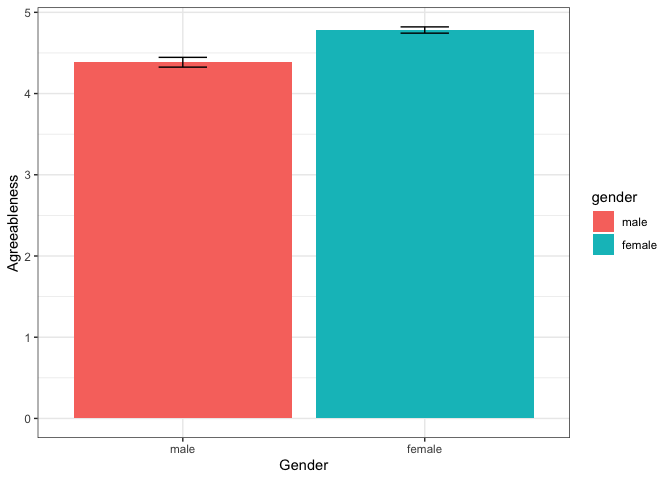<!-- -->

```r
# BoxPlot
psychbfi_mean %>%
    ggplot(aes(gender, A, col = gender)) +
    geom_point()+
    geom_boxplot()+    
    theme_bw() +
    xlab("Gender")+
    ylab("Agreeableness")
```

<!-- -->

```r
# Point with CI
psychbfi_mean %>%
    ggplot(aes(gender, A, col = gender)) +
    stat_summary(fun.data = mean_cl_normal) +
    theme_bw() +
    xlab("Gender")+
    ylab("Agreeableness")
```

<!-- -->

```r
psychbfi_mean %>%
    ggplot(aes(gender, C, col = gender)) +
    stat_summary(fun.data = mean_cl_normal) +
    theme_bw() +
    xlab("Gender")+
    ylab("Conscientiousness")
```

<!-- -->

```r
psychbfi_mean %>%
    ggplot(aes(gender, E, col = gender)) +
    stat_summary(fun.data = mean_cl_normal) +
    theme_bw() +
    xlab("Gender")+
    ylab("Extraversion")
```

<!-- -->

```r
psychbfi_mean %>%
    ggplot(aes(gender, O, col = gender)) +
    stat_summary(fun.data = mean_cl_normal) +
    theme_bw() +
    xlab("Gender")+
    ylab("Openness")
```

<!-- -->

```r
psychbfi_mean %>%
    ggplot(aes(gender, N, col = gender)) +
    stat_summary(fun.data = mean_cl_normal) +
    theme_bw() +
    xlab("Gender")+
    ylab("Neuroticism")
```

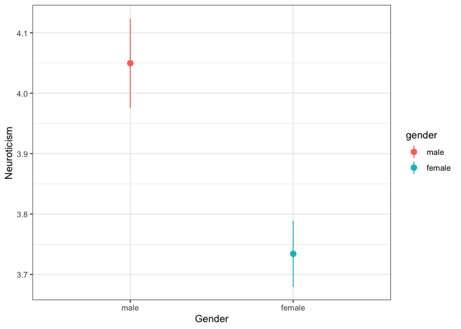<!-- -->

### Do the Big Five traits increase or decrease with Age? Is there a linear or squared trend?

#### Agreeableness increases with age and there seems to be support for a squared trend. Conscientiousness appears to increase with age, squared trend. Extraversion may increase with age, squared trend. Openness appears to increase with age, linear trend. Neuroticism seems to increase with age, linear trend.


```r
psychbfi_mean %>% 
  summarise(min_age = min(age), na.rm = TRUE) #min = 3
```

```
##   min_age na.rm
## 1       3  TRUE
```

```r
#Agreeableness
pbfi_age_A <- lm(A ~ I(age - 3), data = psychbfi_mean)
summary(pbfi_age_A)
```

```
## 
## Call:
## lm(formula = A ~ I(age - 3), data = psychbfi_mean)
## 
## Residuals:
##     Min      1Q  Median      3Q     Max 
## -3.7153 -0.5206  0.1244  0.6645  1.6142 
## 
## Coefficients:
##             Estimate Std. Error t value Pr(>|t|)    
## (Intercept)  4.26595    0.04212 101.291   <2e-16 ***
## I(age - 3)   0.01498    0.00150   9.986   <2e-16 ***
## ---
## Signif. codes:  0 '***' 0.001 '**' 0.01 '*' 0.05 '.' 0.1 ' ' 1
## 
## Residual standard error: 0.883 on 2798 degrees of freedom
## Multiple R-squared:  0.03441,	Adjusted R-squared:  0.03407 
## F-statistic: 99.72 on 1 and 2798 DF,  p-value: < 2.2e-16
```

```r
pbfi_age_A_sq <- lm(A ~ (I(age-3)) + I(I(age-3)^2), data = psychbfi_mean)
summary(pbfi_age_A_sq)
```

```
## 
## Call:
## lm(formula = A ~ (I(age - 3)) + I(I(age - 3)^2), data = psychbfi_mean)
## 
## Residuals:
##     Min      1Q  Median      3Q     Max 
## -3.7843 -0.5227  0.1296  0.6686  1.7913 
## 
## Coefficients:
##                   Estimate Std. Error t value Pr(>|t|)    
## (Intercept)      3.8918579  0.1002760  38.811  < 2e-16 ***
## I(age - 3)       0.0431931  0.0070290   6.145 9.14e-10 ***
## I(I(age - 3)^2) -0.0004482  0.0001091  -4.108 4.10e-05 ***
## ---
## Signif. codes:  0 '***' 0.001 '**' 0.01 '*' 0.05 '.' 0.1 ' ' 1
## 
## Residual standard error: 0.8805 on 2797 degrees of freedom
## Multiple R-squared:  0.04021,	Adjusted R-squared:  0.03952 
## F-statistic: 58.58 on 2 and 2797 DF,  p-value: < 2.2e-16
```

```r
anova(pbfi_age_A, pbfi_age_A_sq)
```

```
## Analysis of Variance Table
## 
## Model 1: A ~ I(age - 3)
## Model 2: A ~ (I(age - 3)) + I(I(age - 3)^2)
##   Res.Df    RSS Df Sum of Sq      F    Pr(>F)    
## 1   2798 2181.4                                  
## 2   2797 2168.3  1    13.084 16.878 4.101e-05 ***
## ---
## Signif. codes:  0 '***' 0.001 '**' 0.01 '*' 0.05 '.' 0.1 ' ' 1
```

```r
#Conscientiousness
pbfi_age_C <- lm(C ~ I(age - 3), data = psychbfi_mean)
summary(pbfi_age_C)
```

```
## 
## Call:
## lm(formula = C ~ I(age - 3), data = psychbfi_mean)
## 
## Residuals:
##     Min      1Q  Median      3Q     Max 
## -3.3787 -0.6276  0.0530  0.6918  1.9033 
## 
## Coefficients:
##             Estimate Std. Error t value Pr(>|t|)    
## (Intercept) 4.006027   0.045069  88.886  < 2e-16 ***
## I(age - 3)  0.010073   0.001605   6.276 4.01e-10 ***
## ---
## Signif. codes:  0 '***' 0.001 '**' 0.01 '*' 0.05 '.' 0.1 ' ' 1
## 
## Residual standard error: 0.9449 on 2798 degrees of freedom
## Multiple R-squared:  0.01388,	Adjusted R-squared:  0.01353 
## F-statistic: 39.39 on 1 and 2798 DF,  p-value: 4.013e-10
```

```r
pbfi_age_C_sq <- lm(C ~ (I(age-3)) + I(I(age-3)^2), data = psychbfi_mean)
summary(pbfi_age_C_sq)
```

```
## 
## Call:
## lm(formula = C ~ (I(age - 3)) + I(I(age - 3)^2), data = psychbfi_mean)
## 
## Residuals:
##     Min      1Q  Median      3Q     Max 
## -3.4574 -0.6426  0.0561  0.6895  2.1216 
## 
## Coefficients:
##                   Estimate Std. Error t value Pr(>|t|)    
## (Intercept)      3.4840596  0.1070816  32.536  < 2e-16 ***
## I(age - 3)       0.0494426  0.0075061   6.587 5.34e-11 ***
## I(I(age - 3)^2) -0.0006253  0.0001165  -5.368 8.62e-08 ***
## ---
## Signif. codes:  0 '***' 0.001 '**' 0.01 '*' 0.05 '.' 0.1 ' ' 1
## 
## Residual standard error: 0.9402 on 2797 degrees of freedom
## Multiple R-squared:  0.02394,	Adjusted R-squared:  0.02324 
## F-statistic:  34.3 on 2 and 2797 DF,  p-value: 1.926e-15
```

```r
anova(pbfi_age_C, pbfi_age_C_sq)
```

```
## Analysis of Variance Table
## 
## Model 1: C ~ I(age - 3)
## Model 2: C ~ (I(age - 3)) + I(I(age - 3)^2)
##   Res.Df    RSS Df Sum of Sq      F    Pr(>F)    
## 1   2798 2498.1                                  
## 2   2797 2472.6  1    25.473 28.815 8.617e-08 ***
## ---
## Signif. codes:  0 '***' 0.001 '**' 0.01 '*' 0.05 '.' 0.1 ' ' 1
```

```r
#Extraversion
pbfi_age_E <- lm(E ~ I(age - 3), data = psychbfi_mean)
summary(pbfi_age_E)
```

```
## 
## Call:
## lm(formula = E ~ I(age - 3), data = psychbfi_mean)
## 
## Residuals:
##     Min      1Q  Median      3Q     Max 
## -3.2542 -0.6805  0.0985  0.7997  1.9554 
## 
## Coefficients:
##             Estimate Std. Error t value Pr(>|t|)    
## (Intercept) 3.990655   0.050512   79.00  < 2e-16 ***
## I(age - 3)  0.005990   0.001799    3.33  0.00088 ***
## ---
## Signif. codes:  0 '***' 0.001 '**' 0.01 '*' 0.05 '.' 0.1 ' ' 1
## 
## Residual standard error: 1.059 on 2798 degrees of freedom
## Multiple R-squared:  0.003947,	Adjusted R-squared:  0.003591 
## F-statistic: 11.09 on 1 and 2798 DF,  p-value: 0.0008805
```

```r
pbfi_age_E_sq <- lm(E ~ (I(age-3)) + I(I(age-3)^2), data = psychbfi_mean)
summary(pbfi_age_E_sq)
```

```
## 
## Call:
## lm(formula = E ~ (I(age - 3)) + I(I(age - 3)^2), data = psychbfi_mean)
## 
## Residuals:
##     Min      1Q  Median      3Q     Max 
## -3.2540 -0.6583  0.1117  0.7843  2.0943 
## 
## Coefficients:
##                   Estimate Std. Error t value Pr(>|t|)    
## (Intercept)      3.6586215  0.1204315  30.379  < 2e-16 ***
## I(age - 3)       0.0310335  0.0084419   3.676 0.000241 ***
## I(I(age - 3)^2) -0.0003978  0.0001310  -3.036 0.002418 ** 
## ---
## Signif. codes:  0 '***' 0.001 '**' 0.01 '*' 0.05 '.' 0.1 ' ' 1
## 
## Residual standard error: 1.057 on 2797 degrees of freedom
## Multiple R-squared:  0.007219,	Adjusted R-squared:  0.006509 
## F-statistic: 10.17 on 2 and 2797 DF,  p-value: 3.978e-05
```

```r
anova(pbfi_age_E, pbfi_age_E_sq)
```

```
## Analysis of Variance Table
## 
## Model 1: E ~ I(age - 3)
## Model 2: E ~ (I(age - 3)) + I(I(age - 3)^2)
##   Res.Df    RSS Df Sum of Sq      F   Pr(>F)   
## 1   2798 3137.9                                
## 2   2797 3127.6  1    10.308 9.2181 0.002418 **
## ---
## Signif. codes:  0 '***' 0.001 '**' 0.01 '*' 0.05 '.' 0.1 ' ' 1
```

```r
#Openness
pbfi_age_O <- lm(O ~ I(age - 3), data = psychbfi_mean)
summary(pbfi_age_O)
```

```
## 
## Call:
## lm(formula = O ~ I(age - 3), data = psychbfi_mean)
## 
## Residuals:
##     Min      1Q  Median      3Q     Max 
## -3.4510 -0.5535  0.0522  0.6408  1.5096 
## 
## Coefficients:
##             Estimate Std. Error t value Pr(>|t|)    
## (Intercept) 4.438791   0.038444 115.461  < 2e-16 ***
## I(age - 3)  0.005735   0.001369   4.189 2.89e-05 ***
## ---
## Signif. codes:  0 '***' 0.001 '**' 0.01 '*' 0.05 '.' 0.1 ' ' 1
## 
## Residual standard error: 0.806 on 2798 degrees of freedom
## Multiple R-squared:  0.006232,	Adjusted R-squared:  0.005877 
## F-statistic: 17.55 on 1 and 2798 DF,  p-value: 2.891e-05
```

```r
pbfi_age_O_sq <- lm(O ~ (I(age-3)) + I(I(age-3)^2), data = psychbfi_mean)
summary(pbfi_age_O_sq)
```

```
## 
## Call:
## lm(formula = O ~ (I(age - 3)) + I(I(age - 3)^2), data = psychbfi_mean)
## 
## Residuals:
##     Min      1Q  Median      3Q     Max 
## -3.4635 -0.5559  0.0522  0.6362  1.5443 
## 
## Coefficients:
##                   Estimate Std. Error t value Pr(>|t|)    
## (Intercept)      4.356e+00  9.179e-02  47.453   <2e-16 ***
## I(age - 3)       1.199e-02  6.434e-03   1.863   0.0626 .  
## I(I(age - 3)^2) -9.931e-05  9.986e-05  -0.994   0.3201    
## ---
## Signif. codes:  0 '***' 0.001 '**' 0.01 '*' 0.05 '.' 0.1 ' ' 1
## 
## Residual standard error: 0.806 on 2797 degrees of freedom
## Multiple R-squared:  0.006583,	Adjusted R-squared:  0.005873 
## F-statistic: 9.268 on 2 and 2797 DF,  p-value: 9.737e-05
```

```r
anova(pbfi_age_O, pbfi_age_O_sq)
```

```
## Analysis of Variance Table
## 
## Model 1: O ~ I(age - 3)
## Model 2: O ~ (I(age - 3)) + I(I(age - 3)^2)
##   Res.Df    RSS Df Sum of Sq      F Pr(>F)
## 1   2798 1817.7                           
## 2   2797 1817.0  1   0.64243 0.9889 0.3201
```

```r
#Neuroticism
pbfi_age_N <- lm(N ~ I(age - 3), data = psychbfi_mean)
summary(pbfi_age_N)
```

```
## 
## Call:
## lm(formula = N ~ I(age - 3), data = psychbfi_mean)
## 
## Residuals:
##     Min      1Q  Median      3Q     Max 
## -3.1177 -0.8657  0.0713  0.9221  2.2982 
## 
## Coefficients:
##             Estimate Std. Error t value Pr(>|t|)    
## (Intercept) 3.512810   0.056679  61.977  < 2e-16 ***
## I(age - 3)  0.012603   0.002018   6.244 4.92e-10 ***
## ---
## Signif. codes:  0 '***' 0.001 '**' 0.01 '*' 0.05 '.' 0.1 ' ' 1
## 
## Residual standard error: 1.188 on 2798 degrees of freedom
## Multiple R-squared:  0.01374,	Adjusted R-squared:  0.01339 
## F-statistic: 38.98 on 1 and 2798 DF,  p-value: 4.925e-10
```

```r
pbfi_age_N_sq <- lm(N ~ (I(age-3)) + I(I(age-3)^2), data = psychbfi_mean)
summary(pbfi_age_N_sq)
```

```
## 
## Call:
## lm(formula = N ~ (I(age - 3)) + I(I(age - 3)^2), data = psychbfi_mean)
## 
## Residuals:
##      Min       1Q   Median       3Q      Max 
## -3.14600 -0.86614  0.06001  0.90056  2.27021 
## 
## Coefficients:
##                   Estimate Std. Error t value Pr(>|t|)    
## (Intercept)      3.7150045  0.1352926  27.459   <2e-16 ***
## I(age - 3)      -0.0026480  0.0094836  -0.279   0.7801    
## I(I(age - 3)^2)  0.0002422  0.0001472   1.646   0.0999 .  
## ---
## Signif. codes:  0 '***' 0.001 '**' 0.01 '*' 0.05 '.' 0.1 ' ' 1
## 
## Residual standard error: 1.188 on 2797 degrees of freedom
## Multiple R-squared:  0.0147,	Adjusted R-squared:  0.01399 
## F-statistic: 20.86 on 2 and 2797 DF,  p-value: 1.02e-09
```

```r
anova(pbfi_age_N, pbfi_age_N_sq)
```

```
## Analysis of Variance Table
## 
## Model 1: N ~ I(age - 3)
## Model 2: N ~ (I(age - 3)) + I(I(age - 3)^2)
##   Res.Df    RSS Df Sum of Sq      F  Pr(>F)  
## 1   2798 3950.9                              
## 2   2797 3947.1  1    3.8224 2.7086 0.09992 .
## ---
## Signif. codes:  0 '***' 0.001 '**' 0.01 '*' 0.05 '.' 0.1 ' ' 1
```

#### Graphing


```r
psychbfi_mean %>%
    ggplot(aes(age, A)) +
    stat_summary(fun.data = mean_cl_normal, geom = "point") +
    theme_bw() +
    xlab("Age")+
    ylab("Agreeableness")+
    geom_smooth(method = "lm") 
```

```
## `geom_smooth()` using formula 'y ~ x'
```

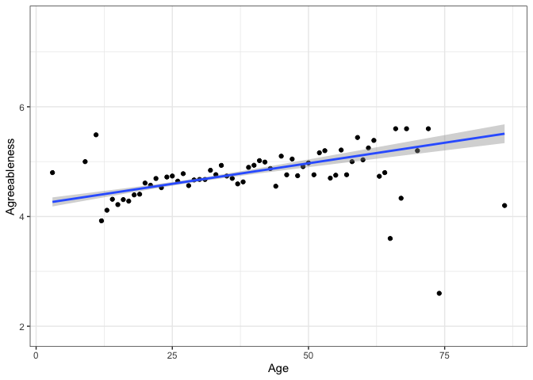<!-- -->

```r
psychbfi_mean %>%
    ggplot(aes(age, C)) +
    stat_summary(fun.data = mean_cl_normal, geom = "point") +
    theme_bw() +
    xlab("Age")+
    ylab("Conscientiousness")+
    geom_smooth(method = "lm") 
```

```
## `geom_smooth()` using formula 'y ~ x'
```

<!-- -->

```r
psychbfi_mean %>%
    ggplot(aes(age, E)) +
    stat_summary(fun.data = mean_cl_normal, geom = "point") +
    theme_bw() +
    xlab("Age")+
    ylab("Extraversion")+
    geom_smooth(method = "lm") 
```

```
## `geom_smooth()` using formula 'y ~ x'
```

<!-- -->

```r
psychbfi_mean %>%
    ggplot(aes(age, O)) +
    stat_summary(fun.data = mean_cl_normal, geom = "point") +
    theme_bw() +
    xlab("Age")+
    ylab("Openness")+
    geom_smooth(method = "lm") 
```

```
## `geom_smooth()` using formula 'y ~ x'
```

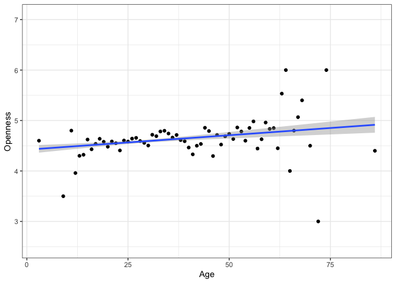<!-- -->

```r
psychbfi_mean %>%
    ggplot(aes(age, N)) +
    stat_summary(fun.data = mean_cl_normal, geom = "point") +
    theme_bw() +
    xlab("Age")+
    ylab("Neuroticism")+
    geom_smooth(method = "lm") 
```

```
## `geom_smooth()` using formula 'y ~ x'
```

<!-- -->

### Do the Big Five traits differ across educational levels? Treat education as a categorical variable.

#### Yes, for agreeableness, conscientiousness, extraversion, and openness, not neuroticism.


```r
#Agreeableness
pbfi_edu_A <- lm(A ~ education, data = psychbfi_mean)
summary(pbfi_edu_A)
```

```
## 
## Call:
## lm(formula = A ~ education, data = psychbfi_mean)
## 
## Residuals:
##     Min      1Q  Median      3Q     Max 
## -3.7591 -0.5591  0.0626  0.6409  1.4780 
## 
## Coefficients:
##                          Estimate Std. Error t value Pr(>|t|)    
## (Intercept)               4.52202    0.05826  77.622  < 2e-16 ***
## educationhs               0.06445    0.07744   0.832 0.405370    
## educationsome college     0.23710    0.06327   3.748 0.000182 ***
## educationcollege          0.09282    0.07296   1.272 0.203409    
## educationgraduate degree  0.21534    0.07220   2.983 0.002885 ** 
## ---
## Signif. codes:  0 '***' 0.001 '**' 0.01 '*' 0.05 '.' 0.1 ' ' 1
## 
## Residual standard error: 0.8719 on 2572 degrees of freedom
##   (223 observations deleted due to missingness)
## Multiple R-squared:  0.009399,	Adjusted R-squared:  0.007858 
## F-statistic: 6.101 on 4 and 2572 DF,  p-value: 6.962e-05
```

```r
#Conscientiousness
pbfi_edu_C <- lm(C ~ education, data = psychbfi_mean)
summary(pbfi_edu_C)
```

```
## 
## Call:
## lm(formula = C ~ education, data = psychbfi_mean)
## 
## Residuals:
##     Min      1Q  Median      3Q     Max 
## -3.3874 -0.6203  0.0793  0.7161  1.8793 
## 
## Coefficients:
##                          Estimate Std. Error t value Pr(>|t|)    
## (Intercept)               4.12068    0.06260  65.826  < 2e-16 ***
## educationhs               0.10843    0.08322   1.303   0.1927    
## educationsome college     0.26676    0.06798   3.924 8.94e-05 ***
## educationcollege          0.09962    0.07840   1.271   0.2040    
## educationgraduate degree  0.16321    0.07758   2.104   0.0355 *  
## ---
## Signif. codes:  0 '***' 0.001 '**' 0.01 '*' 0.05 '.' 0.1 ' ' 1
## 
## Residual standard error: 0.9369 on 2572 degrees of freedom
##   (223 observations deleted due to missingness)
## Multiple R-squared:  0.009125,	Adjusted R-squared:  0.007584 
## F-statistic: 5.921 on 4 and 2572 DF,  p-value: 9.667e-05
```

```r
#Extraversion
pbfi_edu_E <- lm(E ~ education, data = psychbfi_mean)
summary(pbfi_edu_E)
```

```
## 
## Call:
## lm(formula = E ~ education, data = psychbfi_mean)
## 
## Residuals:
##     Min      1Q  Median      3Q     Max 
## -3.2339 -0.6339  0.1435  0.7661  2.0243 
## 
## Coefficients:
##                          Estimate Std. Error t value Pr(>|t|)    
## (Intercept)               3.97567    0.07049  56.400  < 2e-16 ***
## educationhs               0.21919    0.09371   2.339 0.019403 *  
## educationsome college     0.25828    0.07655   3.374 0.000752 ***
## educationcollege          0.08080    0.08828   0.915 0.360142    
## educationgraduate degree  0.17828    0.08736   2.041 0.041381 *  
## ---
## Signif. codes:  0 '***' 0.001 '**' 0.01 '*' 0.05 '.' 0.1 ' ' 1
## 
## Residual standard error: 1.055 on 2572 degrees of freedom
##   (223 observations deleted due to missingness)
## Multiple R-squared:  0.006562,	Adjusted R-squared:  0.005017 
## F-statistic: 4.247 on 4 and 2572 DF,  p-value: 0.001986
```

```r
#Openness
pbfi_edu_O <- lm(O ~ education, data = psychbfi_mean)
summary(pbfi_edu_O)
```

```
## 
## Call:
## lm(formula = O ~ education, data = psychbfi_mean)
## 
## Residuals:
##     Min      1Q  Median      3Q     Max 
## -3.1469 -0.5069  0.0931  0.6531  1.4931 
## 
## Coefficients:
##                          Estimate Std. Error t value Pr(>|t|)    
## (Intercept)               4.54687    0.05320  85.470  < 2e-16 ***
## educationhs               0.06717    0.07072   0.950   0.3423    
## educationsome college    -0.03998    0.05777  -0.692   0.4890    
## educationcollege          0.13815    0.06663   2.074   0.0382 *  
## educationgraduate degree  0.27968    0.06593   4.242 2.29e-05 ***
## ---
## Signif. codes:  0 '***' 0.001 '**' 0.01 '*' 0.05 '.' 0.1 ' ' 1
## 
## Residual standard error: 0.7962 on 2572 degrees of freedom
##   (223 observations deleted due to missingness)
## Multiple R-squared:  0.02149,	Adjusted R-squared:  0.01997 
## F-statistic: 14.12 on 4 and 2572 DF,  p-value: 2.103e-11
```

```r
#Neuroticism
pbfi_edu_N <- lm(N ~ education, data = psychbfi_mean)
summary(pbfi_edu_N)
```

```
## 
## Call:
## lm(formula = N ~ education, data = psychbfi_mean)
## 
## Residuals:
##      Min       1Q   Median       3Q      Max 
## -2.93629 -0.86950  0.06471  0.93050  2.25580 
## 
## Coefficients:
##                          Estimate Std. Error t value Pr(>|t|)    
## (Intercept)               3.74420    0.07961  47.033   <2e-16 ***
## educationhs               0.02104    0.10582   0.199   0.8424    
## educationsome college     0.12530    0.08645   1.449   0.1474    
## educationcollege          0.19210    0.09970   1.927   0.0541 .  
## educationgraduate degree  0.19109    0.09866   1.937   0.0529 .  
## ---
## Signif. codes:  0 '***' 0.001 '**' 0.01 '*' 0.05 '.' 0.1 ' ' 1
## 
## Residual standard error: 1.191 on 2572 degrees of freedom
##   (223 observations deleted due to missingness)
## Multiple R-squared:  0.002799,	Adjusted R-squared:  0.001249 
## F-statistic: 1.805 on 4 and 2572 DF,  p-value: 0.1251
```

#### Plotting


```r
psychbfi_mean %>%
    ggplot(aes(education, A, col = education)) +
    geom_point()+
    geom_boxplot()+
    theme_bw() +
    xlab("Education")+
    ylab("Agreeableness")
```

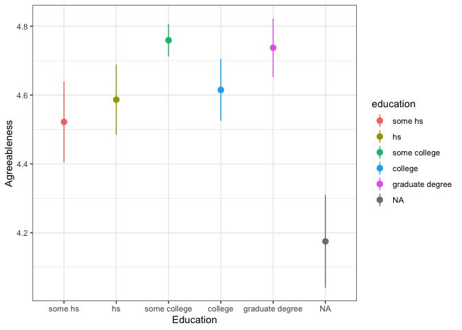<!-- -->

```r
psychbfi_mean %>%
    ggplot(aes(education, C, col = education)) +
     geom_point()+
    geom_boxplot()+    
    theme_bw() +
    xlab("Education")+
    ylab("Conscientiousness")
```

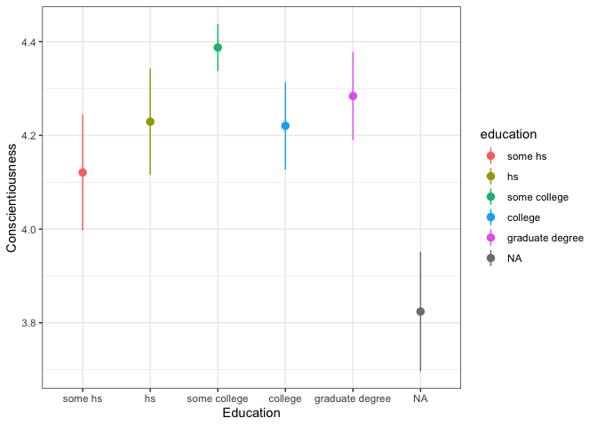<!-- -->

```r
psychbfi_mean %>%
    ggplot(aes(education, E, col = education)) +
    geom_point()+
    geom_boxplot()+
    theme_bw() +
    xlab("Education")+
    ylab("Extraversion")
```

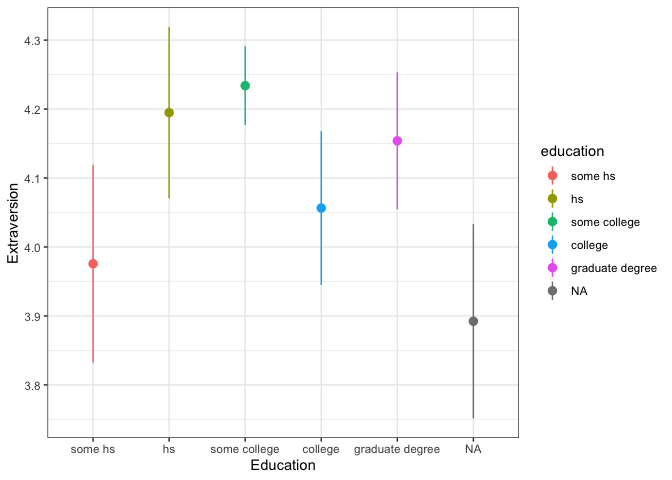<!-- -->

```r
psychbfi_mean %>%
    ggplot(aes(education, O, col = education)) +
    geom_point()+
    geom_boxplot()+    
    theme_bw() +
    xlab("Education")+
    ylab("Openness")
```

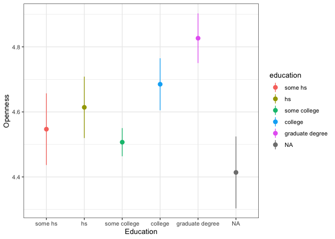<!-- -->

```r
psychbfi_mean %>%
    ggplot(aes(education, N, col = education)) +
    geom_point()+
    geom_boxplot()+    
    theme_bw() +
    xlab("Education")+
    ylab("Neuroticism")
```

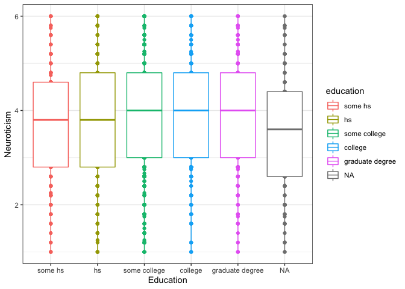<!-- -->

### How well do age and gender together predict the Big Five traits?

#### A: AR2 = 0.07, C: AR2 = 0.02, E: AR2 = 0.01, O: AR2 = 0.01, N: AR2 = 0.03


```r
#Agreeableness
pbfi_a_g_A <- lm(A ~ age + gender, data = psychbfi_mean)
summary(pbfi_a_g_A)
```

```
## 
## Call:
## lm(formula = A ~ age + gender, data = psychbfi_mean)
## 
## Residuals:
##     Min      1Q  Median      3Q     Max 
## -3.8370 -0.5217  0.1193  0.6201  1.7995 
## 
## Coefficients:
##              Estimate Std. Error t value Pr(>|t|)    
## (Intercept)  3.987317   0.050126  79.547   <2e-16 ***
## age          0.014211   0.001471   9.662   <2e-16 ***
## genderfemale 0.380715   0.034847  10.925   <2e-16 ***
## ---
## Signif. codes:  0 '***' 0.001 '**' 0.01 '*' 0.05 '.' 0.1 ' ' 1
## 
## Residual standard error: 0.8649 on 2797 degrees of freedom
## Multiple R-squared:  0.07393,	Adjusted R-squared:  0.07327 
## F-statistic: 111.7 on 2 and 2797 DF,  p-value: < 2.2e-16
```

```r
#Conscientiousness
pbfi_a_g_C <- lm(C ~ age + gender, data = psychbfi_mean)
summary(pbfi_a_g_C)
```

```
## 
## Call:
## lm(formula = C ~ age + gender, data = psychbfi_mean)
## 
## Residuals:
##     Min      1Q  Median      3Q     Max 
## -3.3557 -0.6334  0.0803  0.7105  1.9494 
## 
## Coefficients:
##              Estimate Std. Error t value Pr(>|t|)    
## (Intercept)  3.866093   0.054557  70.863  < 2e-16 ***
## age          0.009713   0.001601   6.068 1.47e-09 ***
## genderfemale 0.178736   0.037928   4.712 2.57e-06 ***
## ---
## Signif. codes:  0 '***' 0.001 '**' 0.01 '*' 0.05 '.' 0.1 ' ' 1
## 
## Residual standard error: 0.9413 on 2797 degrees of freedom
## Multiple R-squared:  0.02165,	Adjusted R-squared:  0.02095 
## F-statistic: 30.95 on 2 and 2797 DF,  p-value: 5.087e-14
```

```r
#Extraversion
pbfi_a_g_E <- lm(E ~ age + gender, data = psychbfi_mean)
summary(pbfi_a_g_E)
```

```
## 
## Call:
## lm(formula = E ~ age + gender, data = psychbfi_mean)
## 
## Residuals:
##      Min       1Q   Median       3Q      Max 
## -3.14491 -0.65596  0.06176  0.80387  2.10309 
## 
## Coefficients:
##              Estimate Std. Error t value Pr(>|t|)    
## (Intercept)  3.830627   0.061065  62.731  < 2e-16 ***
## age          0.005524   0.001792   3.083  0.00207 ** 
## genderfemale 0.231428   0.042452   5.452 5.43e-08 ***
## ---
## Signif. codes:  0 '***' 0.001 '**' 0.01 '*' 0.05 '.' 0.1 ' ' 1
## 
## Residual standard error: 1.054 on 2797 degrees of freedom
## Multiple R-squared:  0.01442,	Adjusted R-squared:  0.01371 
## F-statistic: 20.46 on 2 and 2797 DF,  p-value: 1.509e-09
```

```r
#Openness
pbfi_a_g_O <- lm(O ~ age + gender, data = psychbfi_mean)
summary(pbfi_a_g_O)
```

```
## 
## Call:
## lm(formula = O ~ age + gender, data = psychbfi_mean)
## 
## Residuals:
##     Min      1Q  Median      3Q     Max 
## -3.5258 -0.5466  0.0653  0.6355  1.5486 
## 
## Coefficients:
##               Estimate Std. Error t value Pr(>|t|)    
## (Intercept)   4.487729   0.046630  96.241  < 2e-16 ***
## age           0.005952   0.001368   4.350 1.41e-05 ***
## genderfemale -0.107752   0.032417  -3.324 0.000899 ***
## ---
## Signif. codes:  0 '***' 0.001 '**' 0.01 '*' 0.05 '.' 0.1 ' ' 1
## 
## Residual standard error: 0.8046 on 2797 degrees of freedom
## Multiple R-squared:  0.01014,	Adjusted R-squared:  0.009434 
## F-statistic: 14.33 on 2 and 2797 DF,  p-value: 6.438e-07
```

```r
#Neuroticism
pbfi_a_g_N <- lm(N ~ age + gender, data = psychbfi_mean)
summary(pbfi_a_g_N)
```

```
## 
## Call:
## lm(formula = N ~ age + gender, data = psychbfi_mean)
## 
## Residuals:
##      Min       1Q   Median       3Q      Max 
## -3.02403 -0.83852  0.06787  0.93445  2.41381 
## 
## Coefficients:
##               Estimate Std. Error t value Pr(>|t|)    
## (Intercept)   3.677900   0.068294  53.854  < 2e-16 ***
## age           0.013268   0.002004   6.621 4.25e-11 ***
## genderfemale -0.330540   0.047478  -6.962 4.17e-12 ***
## ---
## Signif. codes:  0 '***' 0.001 '**' 0.01 '*' 0.05 '.' 0.1 ' ' 1
## 
## Residual standard error: 1.178 on 2797 degrees of freedom
## Multiple R-squared:  0.03054,	Adjusted R-squared:  0.02985 
## F-statistic: 44.06 on 2 and 2797 DF,  p-value: < 2.2e-16
```

### In your models in part (4), do the residuals appear to be normally distributed? Are they consistent across age ranges and gender groups?

#### Residuals appear normally distributed, although neuroticism appears platykurtic.


```r
augment(pbfi_a_g_A, data = psychbfi_mean) %>% 
  ggplot(aes(x = .resid)) +
  geom_histogram() +
  theme_minimal() +
  xlab("Model residuals") +
  ylab("Count")
```

```
## `stat_bin()` using `bins = 30`. Pick better value with `binwidth`.
```

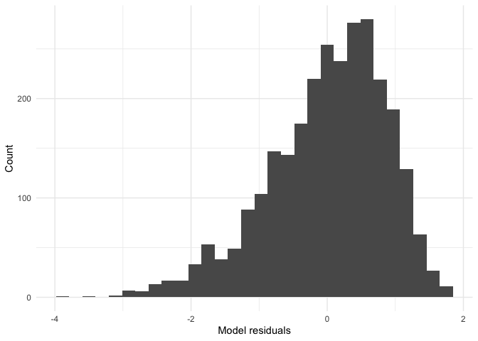<!-- -->

```r
augment(pbfi_a_g_C, data = psychbfi_mean) %>% 
  ggplot(aes(x = .resid)) +
  geom_histogram() +
  theme_minimal() +
  xlab("Model residuals") +
  ylab("Count")
```

```
## `stat_bin()` using `bins = 30`. Pick better value with `binwidth`.
```

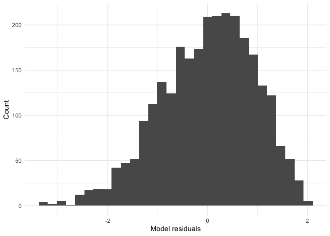<!-- -->

```r
augment(pbfi_a_g_E, data = psychbfi_mean) %>% 
  ggplot(aes(x = .resid)) +
  geom_histogram() +
  theme_minimal() +
  xlab("Model residuals") +
  ylab("Count")
```

```
## `stat_bin()` using `bins = 30`. Pick better value with `binwidth`.
```

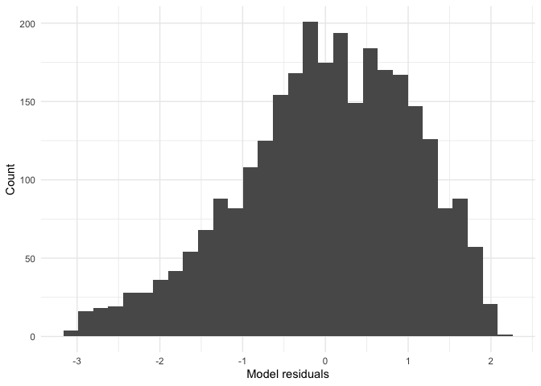<!-- -->

```r
augment(pbfi_a_g_O, data = psychbfi_mean) %>% 
  ggplot(aes(x = .resid)) +
  geom_histogram() +
  theme_minimal() +
  xlab("Model residuals") +
  ylab("Count")
```

```
## `stat_bin()` using `bins = 30`. Pick better value with `binwidth`.
```

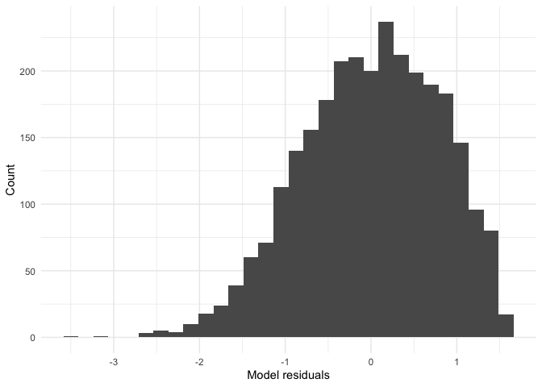<!-- -->

```r
augment(pbfi_a_g_N, data = psychbfi_mean) %>% 
  ggplot(aes(x = .resid)) +
  geom_histogram() +
  theme_minimal() +
  xlab("Model residuals") +
  ylab("Count")
```

```
## `stat_bin()` using `bins = 30`. Pick better value with `binwidth`.
```

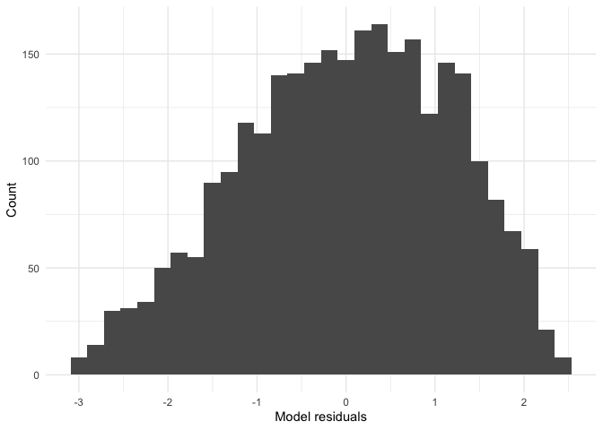<!-- -->


#### Appear to be consistent across age ranges and gender groups. 


```r
augment(pbfi_a_g_A, data = psychbfi_mean) %>% 
  ggplot(aes(x = age, y = .resid)) +
  geom_point() +
  theme_minimal() +
  xlab("Age") +
  ylab("Model residuals")
```

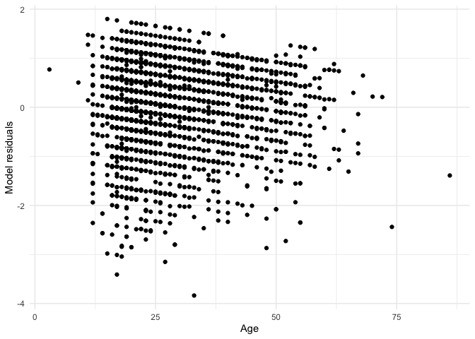<!-- -->

```r
augment(pbfi_a_g_A, data = psychbfi_mean) %>% 
  ggplot(aes(x = gender, y = .resid)) +
  geom_point() +
  theme_minimal() +
  xlab("Gender") +
  ylab("Model residuals")
```

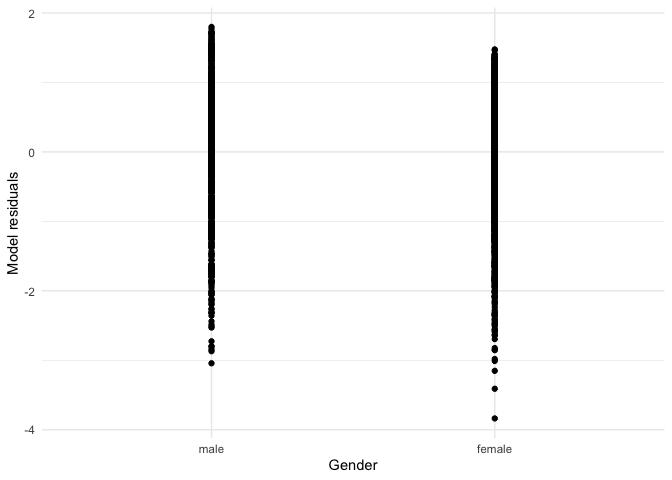<!-- -->

```r
augment(pbfi_a_g_C, data = psychbfi_mean) %>% 
  ggplot(aes(x = age, y = .resid)) +
  geom_point() +
  theme_minimal() +
  xlab("Age") +
  ylab("Model residuals")
```

<!-- -->

```r
augment(pbfi_a_g_C, data = psychbfi_mean) %>% 
  ggplot(aes(x = gender, y = .resid)) +
  geom_point() +
  theme_minimal() +
  xlab("Gender") +
  ylab("Model residuals")
```

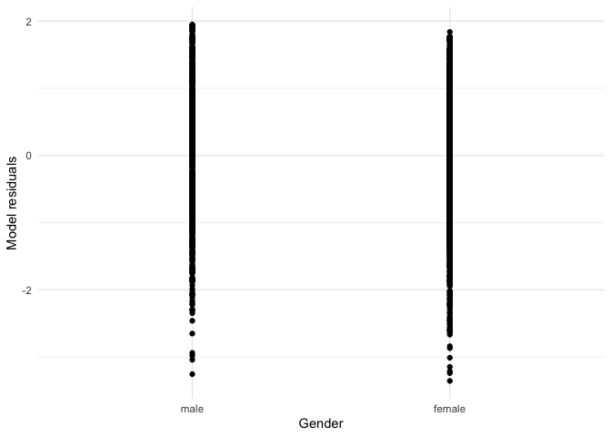<!-- -->

```r
augment(pbfi_a_g_E, data = psychbfi_mean) %>% 
  ggplot(aes(x = age, y = .resid)) +
  geom_point() +
  theme_minimal() +
  xlab("Age") +
  ylab("Model residuals")
```

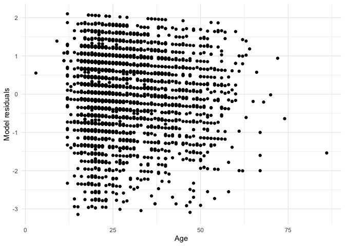<!-- -->

```r
augment(pbfi_a_g_E, data = psychbfi_mean) %>% 
  ggplot(aes(x = gender, y = .resid)) +
  geom_point() +
  theme_minimal() +
  xlab("Gender") +
  ylab("Model residuals")
```

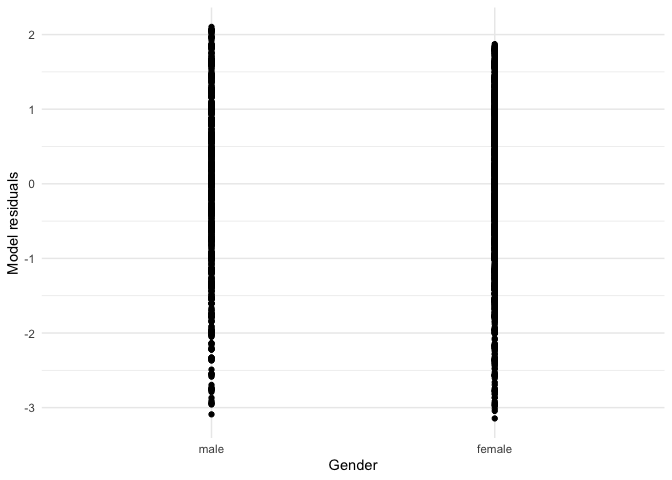<!-- -->

```r
augment(pbfi_a_g_O, data = psychbfi_mean) %>% 
  ggplot(aes(x = age, y = .resid)) +
  geom_point() +
  theme_minimal() +
  xlab("Age") +
  ylab("Model residuals")
```

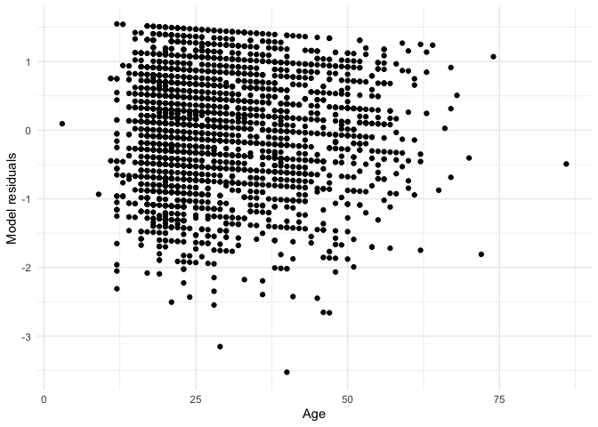<!-- -->

```r
augment(pbfi_a_g_O, data = psychbfi_mean) %>% 
  ggplot(aes(x = gender, y = .resid)) +
  geom_point() +
  theme_minimal() +
  xlab("Gender") +
  ylab("Model residuals")
```

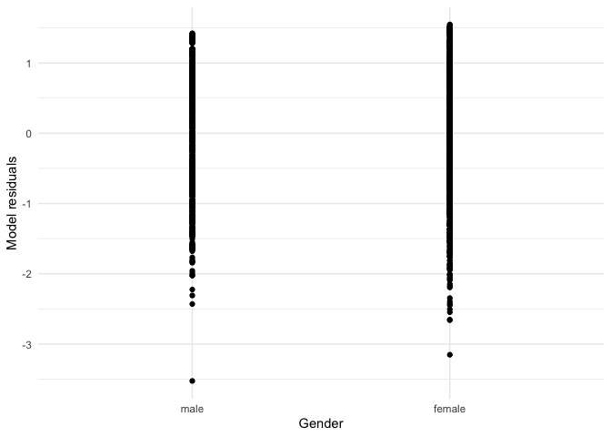<!-- -->

```r
augment(pbfi_a_g_N, data = psychbfi_mean) %>% 
  ggplot(aes(x = age, y = .resid)) +
  geom_point() +
  theme_minimal() +
  xlab("Age") +
  ylab("Model residuals")
```

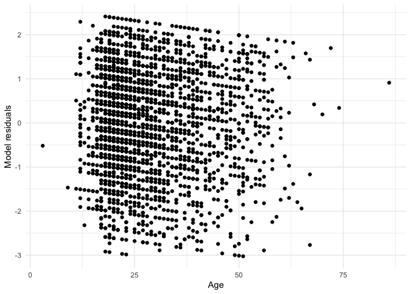<!-- -->

```r
augment(pbfi_a_g_N, data = psychbfi_mean) %>% 
  ggplot(aes(x = gender, y = .resid)) +
  geom_point() +
  theme_minimal() +
  xlab("Gender") +
  ylab("Model residuals")
```

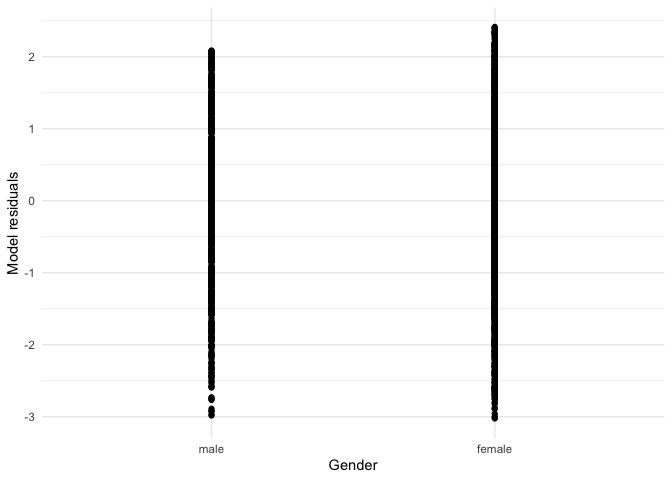<!-- -->

