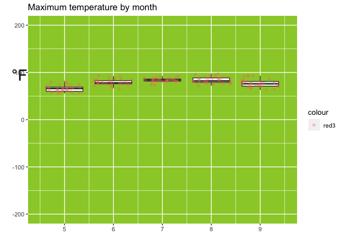
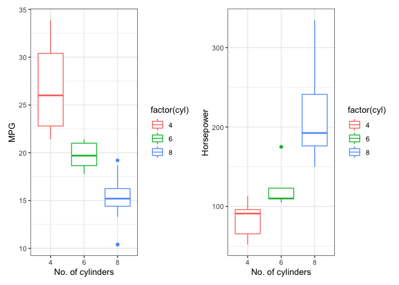
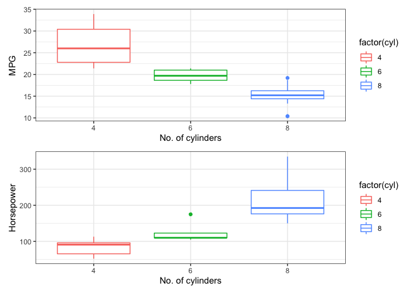
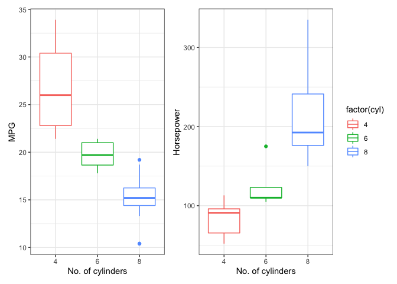
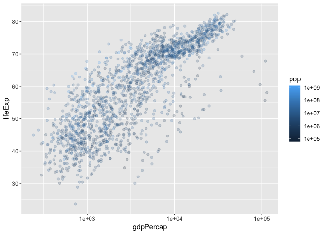
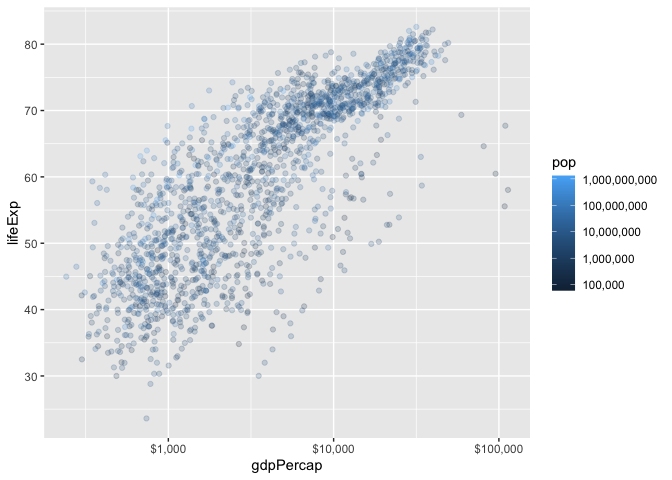
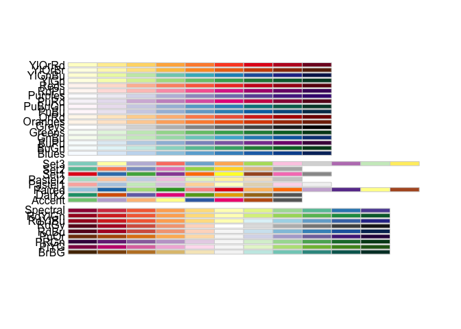
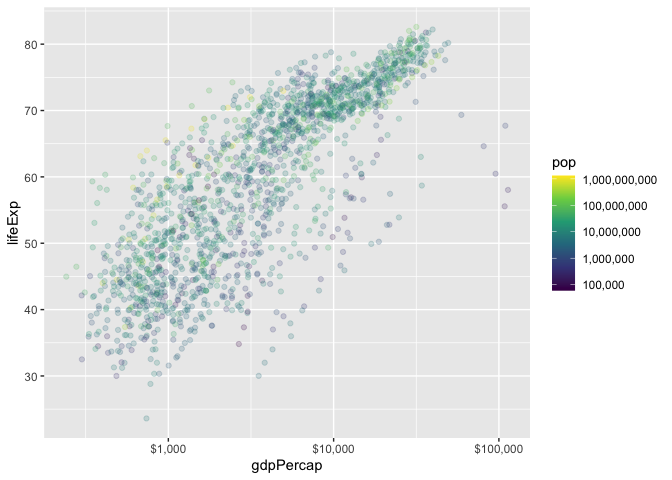
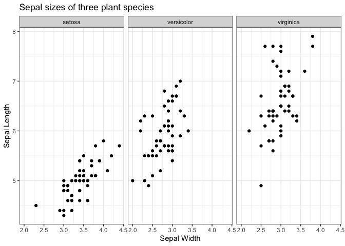
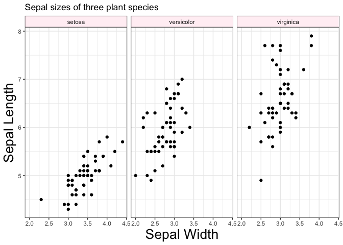

```r
suppressPackageStartupMessages(library(tidyverse))
library(gapminder)
```

# Color Blind Friendly Palettes!

```r
# The palette with grey:
cbPalette <- c("#999999", "#E69F00", "#56B4E9", "#009E73", "#F0E442", "#0072B2", "#D55E00", "#CC79A7")

# The palette with black:
cbbPalette <- c("#000000", "#E69F00", "#56B4E9", "#009E73", "#F0E442", "#0072B2", "#D55E00", "#CC79A7")

# To use for fills, add
  scale_fill_manual(values=cbPalette)
```

```
## <ggproto object: Class ScaleDiscrete, Scale, gg>
##     aesthetics: fill
##     axis_order: function
##     break_info: function
##     break_positions: function
##     breaks: waiver
##     call: call
##     clone: function
##     dimension: function
##     drop: TRUE
##     expand: waiver
##     get_breaks: function
##     get_breaks_minor: function
##     get_labels: function
##     get_limits: function
##     guide: legend
##     is_discrete: function
##     is_empty: function
##     labels: waiver
##     limits: NULL
##     make_sec_title: function
##     make_title: function
##     map: function
##     map_df: function
##     n.breaks.cache: NULL
##     na.translate: TRUE
##     na.value: NA
##     name: waiver
##     palette: function
##     palette.cache: NULL
##     position: left
##     range: <ggproto object: Class RangeDiscrete, Range, gg>
##         range: NULL
##         reset: function
##         train: function
##         super:  <ggproto object: Class RangeDiscrete, Range, gg>
##     rescale: function
##     reset: function
##     scale_name: manual
##     train: function
##     train_df: function
##     transform: function
##     transform_df: function
##     super:  <ggproto object: Class ScaleDiscrete, Scale, gg>
```

```r
# To use for line and point colors, add
  scale_colour_manual(values=cbPalette)
```

```
## <ggproto object: Class ScaleDiscrete, Scale, gg>
##     aesthetics: colour
##     axis_order: function
##     break_info: function
##     break_positions: function
##     breaks: waiver
##     call: call
##     clone: function
##     dimension: function
##     drop: TRUE
##     expand: waiver
##     get_breaks: function
##     get_breaks_minor: function
##     get_labels: function
##     get_limits: function
##     guide: legend
##     is_discrete: function
##     is_empty: function
##     labels: waiver
##     limits: NULL
##     make_sec_title: function
##     make_title: function
##     map: function
##     map_df: function
##     n.breaks.cache: NULL
##     na.translate: TRUE
##     na.value: NA
##     name: waiver
##     palette: function
##     palette.cache: NULL
##     position: left
##     range: <ggproto object: Class RangeDiscrete, Range, gg>
##         range: NULL
##         reset: function
##         train: function
##         super:  <ggproto object: Class RangeDiscrete, Range, gg>
##     rescale: function
##     reset: function
##     scale_name: manual
##     train: function
##     train_df: function
##     transform: function
##     transform_df: function
##     super:  <ggproto object: Class ScaleDiscrete, Scale, gg>
```

# You can also choose your own colors!


```r
ggplot(df, aes(x=cond, y=yval, fill=cond)) + geom_bar(stat="identity") + 
    scale_fill_manual(values=c("red", "blue", "green"))
```

```
## Error:   You're passing a function as global data.
##   Have you misspelled the `data` argument in `ggplot()`
```

```r
ggplot(df, aes(x=cond, y=yval, fill=cond)) + geom_bar(stat="identity") + 
    scale_fill_manual(values=c("#CC6666", "#9999CC", "#66CC99"))
```

```
## Error:   You're passing a function as global data.
##   Have you misspelled the `data` argument in `ggplot()`
```

```r
# Note: use scale_colour_manual() for lines and points
```

# Making an ugly graph

```r
ggplot(airquality, aes(`Month`, `Temp`, group = `Month`)) +
    geom_boxplot(outlier.shape = NA) +
    geom_jitter(alpha = 0.3, aes(color = "red3")) +
    ylim(-200, 200) +
  theme(panel.background = element_rect(fill = "yellowgreen")) +
    labs(x = "",
         y = "",
         title="Maximum temperature by month") +
    annotate("text", x = 4.08, y = 95, label="°F", size = 8) +
    coord_cartesian(xlim = c(4.5, 9.5),
                    clip = 'off') 
```

<!-- -->


# Saving Graphs to File

- Don't use the mouse
- Use `ggsave` for ggplot
    - Practice by saving the following plot to file: 


```r
mtcars_plot <- ggplot(mtcars, aes(hp, wt)) + 
    geom_point() 

ggsave("mtcars_plot.pdf")
```

```
## Saving 7 x 5 in image
```

```r
ggsave("mtcars_plot.svg")
```

```
## Saving 7 x 5 in image
```


```r
?ggthemes()
```

```
## Error in .helpForCall(topicExpr, parent.frame()): no methods for 'ggthemes' and no documentation for it as a function
```

```r
#install.packages("ggthemes")
library(ggthemes)

?theme()
```

# Plotting graphs next to each other!


```r
#install.packages("patchwork")
library(patchwork)
library(gridExtra)
```

```
## 
## Attaching package: 'gridExtra'
```

```
## The following object is masked from 'package:dplyr':
## 
##     combine
```

```r
p_mpg <- ggplot(mtcars, aes(factor(cyl), mpg, color = factor(cyl))) + 
    geom_boxplot() + theme_bw() + xlab("No. of cylinders") + ylab("MPG")

p_hp <- ggplot(mtcars, aes(factor(cyl), hp, color = factor(cyl))) + 
    geom_boxplot() + theme_bw() + xlab("No. of cylinders") + ylab("Horsepower")

p_mpg + p_hp 
```

<!-- -->

# Or on top!


```r
p_mpg / p_hp
```

<!-- -->

# Or this... not sure what this does


```r
p_mpg + p_hp + plot_layout(guides = 'collect')
```

<!-- -->


```r
#remotes::install_github("wilkelab/ggtext")
#remotes::install_github("tidyverse/ggplot2")
#install.packages("ggstatsplot")
library(ggstatsplot)
```

```
## Registered S3 methods overwritten by 'broom.mixed':
##   method         from 
##   augment.lme    broom
##   augment.merMod broom
##   glance.lme     broom
##   glance.merMod  broom
##   glance.stanreg broom
##   tidy.brmsfit   broom
##   tidy.gamlss    broom
##   tidy.lme       broom
##   tidy.merMod    broom
##   tidy.rjags     broom
##   tidy.stanfit   broom
##   tidy.stanreg   broom
```

```
## Registered S3 methods overwritten by 'car':
##   method                          from
##   influence.merMod                lme4
##   cooks.distance.influence.merMod lme4
##   dfbeta.influence.merMod         lme4
##   dfbetas.influence.merMod        lme4
```


- Base R way: print plots "to screen", sandwiched between `pdf()`/`jpeg()`/`png()`... and `dev.off()`. 
- Vector vs. raster: Images are stored on your computer as either _vector_ or _raster_.
    - __Raster__: an `n` by `m` grid of pixels, each with its own colour. `jpeg`, `png`, `gif`, `bmp`.
    - __Vector__: represented as shapes and lines. `pdf`, [`svg`](https://www.w3schools.com/graphics/svg_intro.asp).
    - For tips: ["10 tips for making your R graphics look their best""](http://blog.revolutionanalytics.com/2009/01/10-tips-for-making-your-r-graphics-look-their-best.html).
    
# Scales; Color

Scale functions in `ggplot2` take the form `scale_[aesthetic]_[mapping]()`.

Let's first focus on the following plot:


```r
p_scales <- ggplot(gapminder, aes(gdpPercap, lifeExp)) +
     geom_point(aes(colour=pop), alpha=0.2)
p_scales + 
    scale_x_log10() +
    scale_colour_continuous(trans="log10")
```

<!-- -->

1. Change the y-axis tick mark spacing to 10; change the colour spacing to include all powers of 10.


```r
p_scales +
    scale_x_log10() +
    scale_colour_continuous(
        trans  = "log10", 
        breaks = 10^(1:10)
    ) +
    scale_y_continuous(breaks = c(30, 40, 50, 60, 70, 80))
```

<!-- -->

```r
?scale_colour_continuous()
#install.packages("labeling")
library(labeling)
```

2. Specify `scales::*_format` in the `labels` argument of a scale function to do the following:
    - Change the x-axis labels to dollar format (use `scales::dollar_format()`)
    - Change the colour labels to comma format (use `scales::comma_format()`)


```r
library(scales)
```

```
## 
## Attaching package: 'scales'
```

```
## The following object is masked from 'package:purrr':
## 
##     discard
```

```
## The following object is masked from 'package:readr':
## 
##     col_factor
```

```r
p_scales +
    scale_x_log10(labels=scales::dollar_format()) +
    scale_colour_continuous(
        trans  = "log10", 
        breaks = 10^(1:10),
        labels = scales::comma_format()
    ) +
    scale_y_continuous(breaks=10*(1:10))
```

<!-- -->

3. Use `RColorBrewer` to change the colour scheme.
    - Notice the three different types of scales: sequential, diverging, and continuous.


```r
#Can't get this to work...

## All palettes the come with RColorBrewer:
RColorBrewer::display.brewer.all()
```

<!-- -->

```r
p_scales +
    scale_x_log10(labels=dollar_format()) +
    scale_fill_brewer(
      palette = "Set3",
      trans = "log10", 
        breaks  = 10^(1:10),
        labels  = comma_format()
    ) +
    scale_y_continuous(breaks = 10*(1:10))
```

```
## Error in discrete_scale(aesthetics, "brewer", brewer_pal(type, palette, : unused argument (trans = "log10")
```

```r
?scale_color_brewer()
```

4. Use `viridis` to change the colour to a colour-blind friendly scheme
    - Hint: add `scale_colour_viridis_c` (`c` stands for continuous; `d` discrete).
    - You can choose a palette with `option`.


```r
p_scales +
    scale_x_log10(labels=dollar_format()) +
    scale_colour_viridis_c(
        option = "D",
        trans   = "log10",
        breaks  = 10^(1:10),
        labels  = comma_format(),
    ) +
    scale_y_continuous(breaks=10*(1:10))
```

<!-- -->

```r
?scale_colour_viridis_c()
```

# Theming

Changing the look of a graphic can be achieved through the `theme()` layer.

There are ["complete themes"](http://ggplot2.tidyverse.org/reference/ggtheme.html) that come with `ggplot2`, my favourite being `theme_bw` (I've grown tired of the default gray background, so `theme_bw` is refreshing).

1. Change the theme of the following plot to `theme_bw()`:


```r
ggplot(iris, aes(Sepal.Width, Sepal.Length)) +
     facet_wrap(~ Species) +
     geom_point() +
     labs(x = "Sepal Width",
          y = "Sepal Length",
          title = "Sepal sizes of three plant species") +
  theme_bw()
```

<!-- -->

2. Then, change font size of axis labels, and the strip background colour. Others?


```r
ggplot(iris, aes(Sepal.Width, Sepal.Length)) +
     facet_wrap(~ Species) +
     geom_point() +
     labs(x = "Sepal Width",
          y = "Sepal Length",
          title = "Sepal sizes of three plant species") +
    theme_bw() +
    theme(axis.title = element_text(size = 20),
          strip.background = element_rect(fill = "lavenderblush"))
```

<!-- -->

```r
?theme()
```


# Plotly (optional)

Consider the following plot:


```r
(p <- gapminder %>% 
     filter(continent != "Oceania") %>% 
     ggplot(aes(gdpPercap, lifeExp)) +
     geom_point(aes(colour=pop), alpha=0.2) +
     scale_x_log10(labels=dollar_format()) +
     scale_colour_distiller(
         trans   = "log10",
         breaks  = 10^(1:10),
         labels  = comma_format(),
         palette = "Greens"
     ) +
     facet_wrap(~ continent) +
     scale_y_continuous(breaks=10*(1:10)) +
     theme_bw())
```

<!-- -->

1. Convert it to a `plotly` object by applying the `ggplotly()` function:


```r
FILL_THIS_IN
```

```
## Error in eval(expr, envir, enclos): object 'FILL_THIS_IN' not found
```

2. You can save a plotly graph locally as an html file. Try saving the above:
    - NOTE: plotly graphs don't seem to show up in Rmd _notebooks_, but they do with Rmd _documents_.


```r
p %>% 
    ggplotly() %>% 
    htmlwidgets::saveWidget("LOCATION_GOES_HERE")
```

```
## Error in ggplotly(.): could not find function "ggplotly"
```


3. Run this code to see the json format underneath:


```r
p %>% 
    ggplotly() %>% 
    plotly_json()
```

```
## Error in ggplotly(.): could not find function "ggplotly"
```


4. Check out code to make a plotly object from scratch using `plot_ly()` -- scatterplot of gdpPercap vs lifeExp.
    - Check out the [cheat sheet](https://images.plot.ly/plotly-documentation/images/r_cheat_sheet.pdf).


```r
plot_ly(gapminder, 
        x = ~gdpPercap, 
        y = ~lifeExp, 
        type = "scatter",
        mode = "markers",
        opacity = 0.2) %>% 
    layout(xaxis = list(type = "log"))
```

```
## Error in plot_ly(gapminder, x = ~gdpPercap, y = ~lifeExp, type = "scatter", : could not find function "plot_ly"
```

5. Add population to form a z-axis for a 3D plot:


```r
plot_ly(gapminder, 
        x = ~gdpPercap, 
        y = ~lifeExp, 
        z = FILL_THIS_IN,
        type = "scatter3d",
        mode = "markers",
        opacity = 0.2)
```

```
## Error in plot_ly(gapminder, x = ~gdpPercap, y = ~lifeExp, z = FILL_THIS_IN, : could not find function "plot_ly"
```


