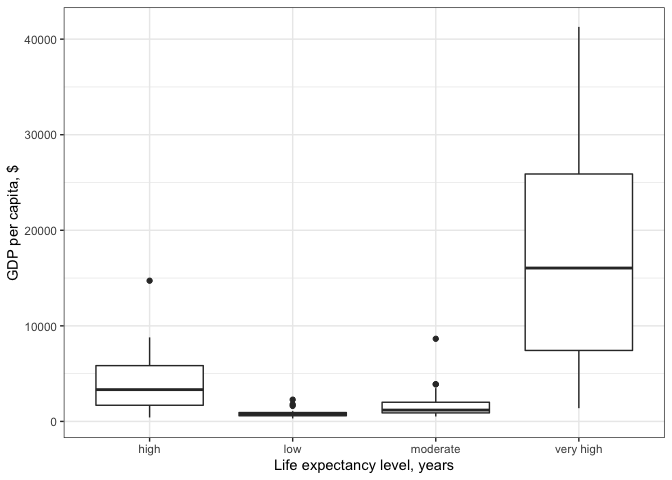
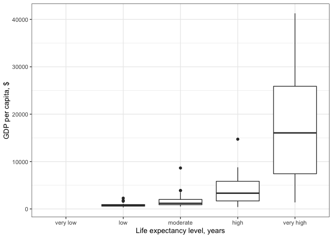
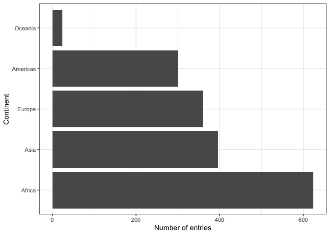
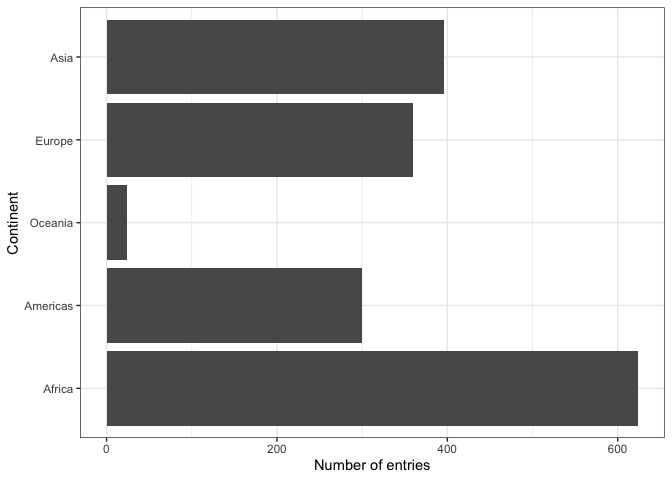
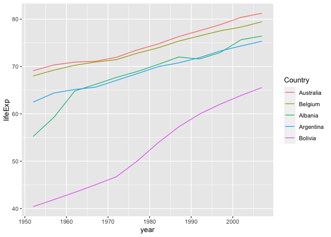
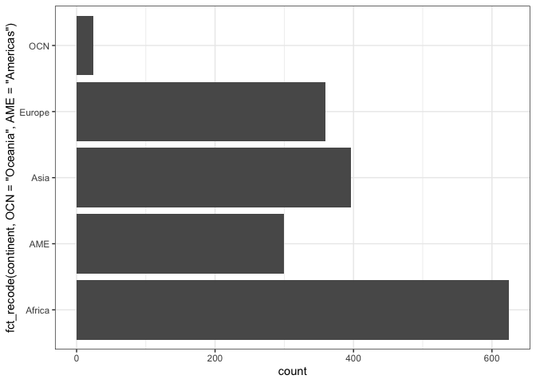

```r
library(gapminder)
library(tidyverse)
```

```
## ── Attaching packages ───────────────────────────────────────────────────────────────── tidyverse 1.3.0 ──
```

```
## ✓ ggplot2 3.3.0.9000     ✓ purrr   0.3.3     
## ✓ tibble  2.1.3          ✓ dplyr   0.8.4     
## ✓ tidyr   1.0.2          ✓ stringr 1.4.0     
## ✓ readr   1.3.1          ✓ forcats 0.4.0
```

```
## ── Conflicts ──────────────────────────────────────────────────────────────────── tidyverse_conflicts() ──
## x dplyr::filter() masks stats::filter()
## x dplyr::lag()    masks stats::lag()
```

# From Class


```r
#Going to look at life expectancy for the row, if it's < 23, then assign it the outcome "Very Low" for the variable we're creating. Can also add more contingencies (e.g. < 23 & "male")
gapminder %>% 
  filter(year == 1997) %>% 
  mutate(life_level = case_when(lifeExp < 23 ~ 'very low',
                                lifeExp < 48 ~ 'low',
                                lifeExp < 59 ~ 'moderate',
                                lifeExp < 70 ~ 'high',
                                # else
                                TRUE ~ 'very high')) %>% 
  ggplot() + 
  geom_boxplot(aes(x = life_level, y = gdpPercap)) +
  labs(y = "GDP per capita, $", x = "Life expectancy level, years") +
  theme_bw() 
```

<!-- -->

```r
#When R makes factors, it sorts. Here, it's sorted alphabetically, which isn't terribly useful.
```


```r
gapminder %>% 
  filter(year == 1997) %>% 
  mutate(life_level = factor(
                        case_when(lifeExp < 23 ~ 'very low',
                                  lifeExp < 48 ~ 'low',
                                  lifeExp < 59 ~ 'moderate',
                                  lifeExp < 70 ~ 'high',
                                  # else
                                  TRUE ~ 'very high'),
                        levels = c("very low", "low", "moderate", "high", "very high")
                        )
         ) %>%  
  ggplot() + 
  geom_boxplot(aes(x = life_level, y = gdpPercap)) +
  labs(y = "GDP per capita, $", x = "Life expectancy level, years") +
  theme_bw() +
  scale_x_discrete(drop = FALSE)
```

<!-- -->


```r
class(gapminder$continent)
```

```
## [1] "factor"
```

```r
levels(gapminder$continent)
```

```
## [1] "Africa"   "Americas" "Asia"     "Europe"   "Oceania"
```

```r
nlevels(gapminder$continent)
```

```
## [1] 5
```

```r
str(gapminder$continent)
```

```
##  Factor w/ 5 levels "Africa","Americas",..: 3 3 3 3 3 3 3 3 3 3 ...
```

```r
#Will tell you the integer corresponding to each country:
gapminder %>% 
  pull(continent) %>% 
  as.numeric()
```

```
##    [1] 3 3 3 3 3 3 3 3 3 3 3 3 4 4 4 4 4 4 4 4 4 4 4 4 1 1 1 1 1 1 1 1 1 1 1 1 1
##   [38] 1 1 1 1 1 1 1 1 1 1 1 2 2 2 2 2 2 2 2 2 2 2 2 5 5 5 5 5 5 5 5 5 5 5 5 4 4
##   [75] 4 4 4 4 4 4 4 4 4 4 3 3 3 3 3 3 3 3 3 3 3 3 3 3 3 3 3 3 3 3 3 3 3 3 4 4 4
##  [112] 4 4 4 4 4 4 4 4 4 1 1 1 1 1 1 1 1 1 1 1 1 2 2 2 2 2 2 2 2 2 2 2 2 4 4 4 4
##  [149] 4 4 4 4 4 4 4 4 1 1 1 1 1 1 1 1 1 1 1 1 2 2 2 2 2 2 2 2 2 2 2 2 4 4 4 4 4
##  [186] 4 4 4 4 4 4 4 1 1 1 1 1 1 1 1 1 1 1 1 1 1 1 1 1 1 1 1 1 1 1 1 3 3 3 3 3 3
##  [223] 3 3 3 3 3 3 1 1 1 1 1 1 1 1 1 1 1 1 2 2 2 2 2 2 2 2 2 2 2 2 1 1 1 1 1 1 1
##  [260] 1 1 1 1 1 1 1 1 1 1 1 1 1 1 1 1 1 2 2 2 2 2 2 2 2 2 2 2 2 3 3 3 3 3 3 3 3
##  [297] 3 3 3 3 2 2 2 2 2 2 2 2 2 2 2 2 1 1 1 1 1 1 1 1 1 1 1 1 1 1 1 1 1 1 1 1 1
##  [334] 1 1 1 1 1 1 1 1 1 1 1 1 1 1 1 2 2 2 2 2 2 2 2 2 2 2 2 1 1 1 1 1 1 1 1 1 1
##  [371] 1 1 4 4 4 4 4 4 4 4 4 4 4 4 2 2 2 2 2 2 2 2 2 2 2 2 4 4 4 4 4 4 4 4 4 4 4
##  [408] 4 4 4 4 4 4 4 4 4 4 4 4 4 1 1 1 1 1 1 1 1 1 1 1 1 2 2 2 2 2 2 2 2 2 2 2 2
##  [445] 2 2 2 2 2 2 2 2 2 2 2 2 1 1 1 1 1 1 1 1 1 1 1 1 2 2 2 2 2 2 2 2 2 2 2 2 1
##  [482] 1 1 1 1 1 1 1 1 1 1 1 1 1 1 1 1 1 1 1 1 1 1 1 1 1 1 1 1 1 1 1 1 1 1 1 4 4
##  [519] 4 4 4 4 4 4 4 4 4 4 4 4 4 4 4 4 4 4 4 4 4 4 1 1 1 1 1 1 1 1 1 1 1 1 1 1 1
##  [556] 1 1 1 1 1 1 1 1 1 4 4 4 4 4 4 4 4 4 4 4 4 1 1 1 1 1 1 1 1 1 1 1 1 4 4 4 4
##  [593] 4 4 4 4 4 4 4 4 2 2 2 2 2 2 2 2 2 2 2 2 1 1 1 1 1 1 1 1 1 1 1 1 1 1 1 1 1
##  [630] 1 1 1 1 1 1 1 2 2 2 2 2 2 2 2 2 2 2 2 2 2 2 2 2 2 2 2 2 2 2 2 3 3 3 3 3 3
##  [667] 3 3 3 3 3 3 4 4 4 4 4 4 4 4 4 4 4 4 4 4 4 4 4 4 4 4 4 4 4 4 3 3 3 3 3 3 3
##  [704] 3 3 3 3 3 3 3 3 3 3 3 3 3 3 3 3 3 3 3 3 3 3 3 3 3 3 3 3 3 3 3 3 3 3 3 3 3
##  [741] 3 3 3 3 4 4 4 4 4 4 4 4 4 4 4 4 3 3 3 3 3 3 3 3 3 3 3 3 4 4 4 4 4 4 4 4 4
##  [778] 4 4 4 2 2 2 2 2 2 2 2 2 2 2 2 3 3 3 3 3 3 3 3 3 3 3 3 3 3 3 3 3 3 3 3 3 3
##  [815] 3 3 1 1 1 1 1 1 1 1 1 1 1 1 3 3 3 3 3 3 3 3 3 3 3 3 3 3 3 3 3 3 3 3 3 3 3
##  [852] 3 3 3 3 3 3 3 3 3 3 3 3 3 3 3 3 3 3 3 3 3 3 3 3 3 1 1 1 1 1 1 1 1 1 1 1 1
##  [889] 1 1 1 1 1 1 1 1 1 1 1 1 1 1 1 1 1 1 1 1 1 1 1 1 1 1 1 1 1 1 1 1 1 1 1 1 1
##  [926] 1 1 1 1 1 1 1 1 1 1 1 3 3 3 3 3 3 3 3 3 3 3 3 1 1 1 1 1 1 1 1 1 1 1 1 1 1
##  [963] 1 1 1 1 1 1 1 1 1 1 1 1 1 1 1 1 1 1 1 1 1 1 2 2 2 2 2 2 2 2 2 2 2 2 3 3 3
## [1000] 3 3 3 3 3 3 3 3 3 4 4 4 4 4 4 4 4 4 4 4 4 1 1 1 1 1 1 1 1 1 1 1 1 1 1 1 1
## [1037] 1 1 1 1 1 1 1 1 3 3 3 3 3 3 3 3 3 3 3 3 1 1 1 1 1 1 1 1 1 1 1 1 3 3 3 3 3
## [1074] 3 3 3 3 3 3 3 4 4 4 4 4 4 4 4 4 4 4 4 5 5 5 5 5 5 5 5 5 5 5 5 2 2 2 2 2 2
## [1111] 2 2 2 2 2 2 1 1 1 1 1 1 1 1 1 1 1 1 1 1 1 1 1 1 1 1 1 1 1 1 4 4 4 4 4 4 4
## [1148] 4 4 4 4 4 3 3 3 3 3 3 3 3 3 3 3 3 3 3 3 3 3 3 3 3 3 3 3 3 2 2 2 2 2 2 2 2
## [1185] 2 2 2 2 2 2 2 2 2 2 2 2 2 2 2 2 2 2 2 2 2 2 2 2 2 2 2 2 3 3 3 3 3 3 3 3 3
## [1222] 3 3 3 4 4 4 4 4 4 4 4 4 4 4 4 4 4 4 4 4 4 4 4 4 4 4 4 2 2 2 2 2 2 2 2 2 2
## [1259] 2 2 1 1 1 1 1 1 1 1 1 1 1 1 4 4 4 4 4 4 4 4 4 4 4 4 1 1 1 1 1 1 1 1 1 1 1
## [1296] 1 1 1 1 1 1 1 1 1 1 1 1 1 3 3 3 3 3 3 3 3 3 3 3 3 1 1 1 1 1 1 1 1 1 1 1 1
## [1333] 4 4 4 4 4 4 4 4 4 4 4 4 1 1 1 1 1 1 1 1 1 1 1 1 3 3 3 3 3 3 3 3 3 3 3 3 4
## [1370] 4 4 4 4 4 4 4 4 4 4 4 4 4 4 4 4 4 4 4 4 4 4 4 1 1 1 1 1 1 1 1 1 1 1 1 1 1
## [1407] 1 1 1 1 1 1 1 1 1 1 4 4 4 4 4 4 4 4 4 4 4 4 3 3 3 3 3 3 3 3 3 3 3 3 1 1 1
## [1444] 1 1 1 1 1 1 1 1 1 1 1 1 1 1 1 1 1 1 1 1 1 4 4 4 4 4 4 4 4 4 4 4 4 4 4 4 4
## [1481] 4 4 4 4 4 4 4 4 3 3 3 3 3 3 3 3 3 3 3 3 3 3 3 3 3 3 3 3 3 3 3 3 1 1 1 1 1
## [1518] 1 1 1 1 1 1 1 3 3 3 3 3 3 3 3 3 3 3 3 1 1 1 1 1 1 1 1 1 1 1 1 2 2 2 2 2 2
## [1555] 2 2 2 2 2 2 1 1 1 1 1 1 1 1 1 1 1 1 4 4 4 4 4 4 4 4 4 4 4 4 1 1 1 1 1 1 1
## [1592] 1 1 1 1 1 4 4 4 4 4 4 4 4 4 4 4 4 2 2 2 2 2 2 2 2 2 2 2 2 2 2 2 2 2 2 2 2
## [1629] 2 2 2 2 2 2 2 2 2 2 2 2 2 2 2 2 3 3 3 3 3 3 3 3 3 3 3 3 3 3 3 3 3 3 3 3 3
## [1666] 3 3 3 3 3 3 3 3 3 3 3 3 3 3 3 1 1 1 1 1 1 1 1 1 1 1 1 1 1 1 1 1 1 1 1 1 1
## [1703] 1 1
```


```r
five_country <- gapminder %>% 
  filter(country %in% c("Albania", "Argentina", "Australia", "Belgium", "Bolivia"))

nlevels(five_country$country) #Still 142- doesn't drop levels just bc no values matching. If you want to drop, use droplevels function
```

```
## [1] 142
```

```r
five_country_drop <- five_country %>% 
  droplevels()

five_country_drop$country %>%
  nlevels()
```

```
## [1] 5
```

```r
#Now just 5! 
```


```r
gapminder %>%
  ggplot() +
  geom_bar(aes(continent)) +
  coord_flip() +
  theme_bw() +
  ylab("Number of entries") + xlab("Continent")
```

<!-- -->


```r
gapminder %>%
  ggplot() +
  geom_bar(aes(fct_infreq(continent))) + #in order of frequency 
  coord_flip() +
  theme_bw() +
  ylab("Number of entries") + xlab("Continent")
```

<!-- -->

```r
#fct_inorder() in order of appearance
#fct_inseq() in order of underlying integers
#fct_rev() in opposite order
```


```r
#Ordering by life expectancy

gapminder %>%
  ggplot() +
  geom_bar(aes(fct_reorder(continent, lifeExp, max))) +
  coord_flip() +
  theme_bw() +
  xlab("Continent") + ylab("Number of entries") 
```

<!-- -->


```r
#Color-coding relationship between two quant variables by country

ggplot(five_country, aes(x = year, y = lifeExp,
                  color = fct_reorder2(country, year, lifeExp))) +
  geom_line() +
  labs(color = "Country")
```

<!-- -->


```r
#You can rename levels specifically for your graph

gapminder %>%
  ggplot() +
  geom_bar(aes(fct_recode(continent, "OCN" = "Oceania", "AME" = "Americas"))) +
  coord_flip() +
  theme_bw()
```

<!-- -->


```r
df1 <- gapminder %>%
  filter(country %in% c("United States", "Mexico"), year > 2000) %>%
  droplevels()
df2 <- gapminder %>%
  filter(country %in% c("France", "Germany"), year > 2000) %>%
  droplevels()
c(df1$country, df2$country)
```

```
## [1] 1 1 2 2 1 1 2 2
```

```r
fct_c(df1$country, df2$country)
```

```
## [1] Mexico        Mexico        United States United States France       
## [6] France        Germany       Germany      
## Levels: Mexico United States France Germany
```
