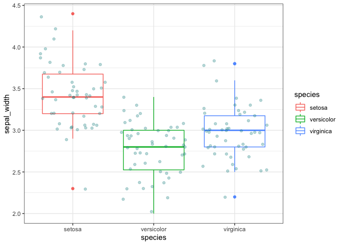
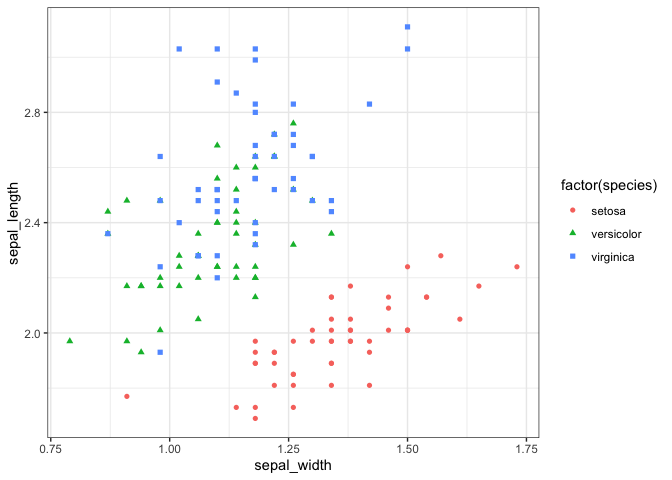
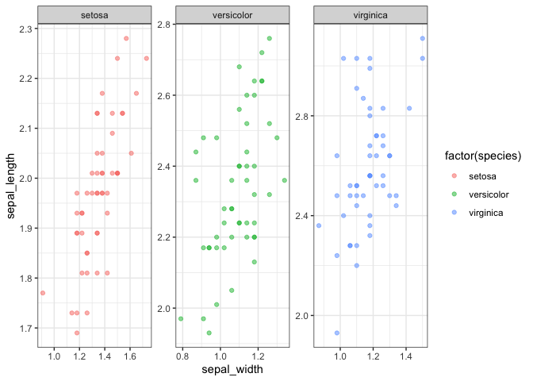
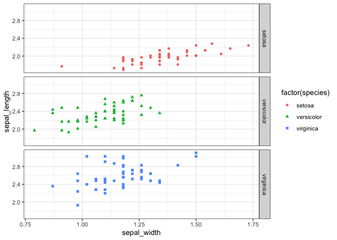

<!---The following chunk allows errors when knitting--->


**When you make an Rmd file for participation or homework, be sure to do this**:

1. Change the file output to both html and md _documents_ (not notebook).
  - See the `keep_md: TRUE` argument above.

2. `knit` the document. 

3. Stage and commit the Rmd and knitted documents.


# Let's review some `dplyr` syntax

Load the `tidyverse` package.
    

```r
# load your packages here:
library(gapminder)
library(tidyverse)
```
    

## `select()`, `rename()`, `filter()`, `mutate()`, and a little plotting

Let's use the `mtcars` dataset. Complete the following tasks. Chain together
all of the commands in a task using the pipe `%>%`.

1. Show the miles per gallon and horsepower for cars with 6 cylinders. Also
   convert the data frame to a tibble (keep the rownames and store them in the
   tibble with a descriptive variable name). Store this result as a new object
   with a descriptive object name.


```r
mtcars6cyl <- mtcars %>% 
  rownames_to_column(var = "CarType") %>% 
  as_tibble() %>% 
  select(CarType, mpg, hp, cyl) %>% 
  filter(cyl == 6)
DT::datatable(mtcars6cyl)
```

<!--html_preserve--><div id="htmlwidget-81e7d23a575b7a6419df" style="width:100%;height:auto;" class="datatables html-widget"></div>
<script type="application/json" data-for="htmlwidget-81e7d23a575b7a6419df">{"x":{"filter":"none","data":[["1","2","3","4","5","6","7"],["Mazda RX4","Mazda RX4 Wag","Hornet 4 Drive","Valiant","Merc 280","Merc 280C","Ferrari Dino"],[21,21,21.4,18.1,19.2,17.8,19.7],[110,110,110,105,123,123,175],[6,6,6,6,6,6,6]],"container":"<table class=\"display\">\n  <thead>\n    <tr>\n      <th> <\/th>\n      <th>CarType<\/th>\n      <th>mpg<\/th>\n      <th>hp<\/th>\n      <th>cyl<\/th>\n    <\/tr>\n  <\/thead>\n<\/table>","options":{"columnDefs":[{"className":"dt-right","targets":[2,3,4]},{"orderable":false,"targets":0}],"order":[],"autoWidth":false,"orderClasses":false}},"evals":[],"jsHooks":[]}</script><!--/html_preserve-->

2. Print the results from Task 1 in an appealing way by using `knitr::kable()`.


```r
knitr::kable(mtcars6cyl)
```


CarType            mpg    hp   cyl
---------------  -----  ----  ----
Mazda RX4         21.0   110     6
Mazda RX4 Wag     21.0   110     6
Hornet 4 Drive    21.4   110     6
Valiant           18.1   105     6
Merc 280          19.2   123     6
Merc 280C         17.8   123     6
Ferrari Dino      19.7   175     6

Let's use the `iris` dataset. Complete the following tasks. Chain together
all of the commands in a task using the pipe `%>%`.

3. Rename the variables to be all lowercase and to separate words with "_"
   instead of ".". Put the species name variable first. Store this result as 
   a new object.


```r
names(iris) <- c("sepal_length", "sepal_width", "petal_length", "petal_width", "species")
iris_lower<-rename_all(iris, tolower) %>% 
  select(species, everything()) 

#Or can do

iris_lower1<-iris %>% 
  select(species = Species,
         sepal.length = Sepal_Length,
         sepal.width = Sepal_Width,
         petal.length = Petal_Length,
         petal.width = Petal_Width) %>% 
  select(Species, everything())
```

```
## Error in .f(.x[[i]], ...): object 'Species' not found
```

4. Using the data from Task 3, plot the sepal width for each species. Perhaps 
   use a boxplot or a jitter plot (or both overlaid!). Be sure to format the
   axis labels nicely.


```r
iris_lower %>% 
  ggplot(aes(species, sepal_width, col = species)) +
  geom_boxplot() +
  geom_jitter(alpha = 0.3, color = "cyan4")+
  theme_bw()
```

<!-- -->

5. `iris` expresses all of the measurements in centimeters. Convert them to 
   inches (1 in = 2.54 cm). Store this dataset as a new object.


```r
iris_in <- iris_lower %>% 
  mutate(sepal_length = round(sepal_length/2.54, 2),
         sepal_width = round(sepal_width/2.54, 2),
         petal_length = round(petal_length/2.54, 2),
         petal_width = round(petal_width/2.54, 2))
```

6. Using the data from Task 5, plot the relationship between sepal width and
   sepal length. Indicate species using color and point shape.


```r
iris_in %>% 
  ggplot(aes(sepal_width, sepal_length)) + #If color is in ggplot, if you have other plots the argument will apply to all plots. If you just want it for one plot, include it in geom_point
  geom_point(aes(color = factor(species), shape = factor(species)))+
  theme_bw()
```

<!-- -->

7. Using the data from Task 5, plot the relationship between sepal width and
   sepal length. This time, separate each species into a different subplot 
   (facet).


```r
iris_in %>% 
  ggplot(aes(sepal_width, sepal_length)) +
  facet_wrap(~ species, nrow = 1, scale = "free") +
  geom_point(aes(color = factor(species)),alpha = 0.5) +
  theme_bw()
```

<!-- -->

```r
#Can also do

iris_in %>% 
  ggplot(aes(sepal_width, sepal_length)) +
    geom_point(aes(color = factor(species), shape = factor(species)))+
    facet_grid(rows = vars(species))+
    theme_bw()
```

<!-- -->


# Back to Guide Again

Let's head back to the guide at the section on `summarize()`.


# Exercises for grouped data frames

Let's do some practice with grouping (and ungrouping) and summarizing data frames!

1. (a) What's the minimum life expectancy for each continent and each year? 
   (b) Add the corresponding country to the tibble, too. 
   (c) Arrange by min life expectancy.


```r
gapminder %>% 
  group_by(FILL_THIS_IN) %>% 
  FILL_THIS_IN(min_life = min(lifeExp))
```

```
## Error: Column `FILL_THIS_IN` is unknown
```


2. Let's compute the mean Agreeableness score across items for each participant 
in the `psych::bfi` dataset. Be sure to handle `NA`!


```r
psych::bfi %>%
  as_tibble() %>% 
  select(A1:A5) %>% 
  rowwise() %>% 
  mutate(A_mean = mean(c(A1, A2, A3, A4, A5), na.rm = TRUE)) %>% 
  ungroup()
```

```
## # A tibble: 2,800 x 6
##       A1    A2    A3    A4    A5 A_mean
##    <int> <int> <int> <int> <int>  <dbl>
##  1     2     4     3     4     4    3.4
##  2     2     4     5     2     5    3.6
##  3     5     4     5     4     4    4.4
##  4     4     4     6     5     5    4.8
##  5     2     3     3     4     5    3.4
##  6     6     6     5     6     5    5.6
##  7     2     5     5     3     5    4  
##  8     4     3     1     5     1    2.8
##  9     4     3     6     3     3    3.8
## 10     2     5     6     6     5    4.8
## # … with 2,790 more rows
```

Now compute mean scores for Conscientiousness, as well as `sd` and `min` scores 
for reach person.


Some functions are **vectorized**, so you don't need `rowwise()`. 
For example, `pmin()` computes the "parallel min" across the vectors it receives:


```r
psych::bfi %>% 
  as_tibble() %>% 
  select(A1:A5) %>% 
  mutate(A_min = pmin(A1, A2, A3, A4, A5))
```

```
## # A tibble: 2,800 x 6
##       A1    A2    A3    A4    A5 A_min
##    <int> <int> <int> <int> <int> <int>
##  1     2     4     3     4     4     2
##  2     2     4     5     2     5     2
##  3     5     4     5     4     4     4
##  4     4     4     6     5     5     4
##  5     2     3     3     4     5     2
##  6     6     6     5     6     5     5
##  7     2     5     5     3     5     2
##  8     4     3     1     5     1     1
##  9     4     3     6     3     3     3
## 10     2     5     6     6     5     2
## # … with 2,790 more rows
```

**There are a few other ways to do this sort of computation.**

`rowMeans()` computes the mean of each row of a data frame. We can use it by
putting `select()` inside of `mutate()`:


```r
psych::bfi %>% 
  as_tibble() %>% 
  select(A1:A5) %>% 
  mutate(A_mn = rowMeans(select(., A1:A5)),
         A_mn2 = rowMeans(select(., starts_with("A", ignore.case = FALSE))))
```

```
## # A tibble: 2,800 x 7
##       A1    A2    A3    A4    A5  A_mn A_mn2
##    <int> <int> <int> <int> <int> <dbl> <dbl>
##  1     2     4     3     4     4   3.4   3.4
##  2     2     4     5     2     5   3.6   3.6
##  3     5     4     5     4     4   4.4   4.4
##  4     4     4     6     5     5   4.8   4.8
##  5     2     3     3     4     5   3.4   3.4
##  6     6     6     5     6     5   5.6   5.6
##  7     2     5     5     3     5   4     4  
##  8     4     3     1     5     1   2.8   2.8
##  9     4     3     6     3     3   3.8   3.8
## 10     2     5     6     6     5   4.8   4.8
## # … with 2,790 more rows
```

**In the development version of `dplyr`, there are some functions to make**
**this approach easier.**

```
remotes::install_github("tidyverse/dplyr")
```


```r
psych::bfi %>% 
  as_tibble() %>% 
  select(A1:A5) %>% 
  mutate(A_mn = rowMeans(across(A1:A5)),
         A_mn2 = rowMeans(across(starts_with("A", ignore.case = FALSE))))
```

3. Let's use `psych::bfi` and make a new data frame that has
   (1) each participant's educational level (convert it to a categorical variable
   using `factor*()`) and the mean score for each of the Big Five scales for each 
   participant. Store this data frame as a new object.
   

```r
FILL_THIS_IN <-
  psych::bfi %>% 
  FILL_THIS_IN(FILL_THIS_IN)
```

```
## Error in FILL_THIS_IN(., FILL_THIS_IN): could not find function "FILL_THIS_IN"
```

4. Use the data from Task 3 to summarize the distributions of Big Five scores 
   for each educational level (e.g., report the mean, sd, min, and max for
   each score in each group). Also report the sample size within each group.
   

```r
FILL_THIS_IN %>% 
  FILL_THIS_IN(FILL_THIS_IN) %>% 
  FILL_THIS_IN(FILL_THIS_IN)
```

```
## Error in eval(lhs, parent, parent): object 'FILL_THIS_IN' not found
```


# Bonus Exercises

1. In `gapminder`, take all countries in Europe that have a GDP per capita 
   greater than 10000, and select all variables except `gdpPercap`. 
   (Hint: use `-`).

2. Take the first three columns of `gapminder` and extract the names.

3. In `gapminder`, convert the population to a number in billions.

4. Take the `iris` data frame and extract all columns that start with 
   the word "Petal". 
    - Hint: take a look at the "Select helpers" documentation by running the 
      following code: `?tidyselect::select_helpers`.

5. Filter the rows of `iris` for Sepal.Length >= 4.6 and Petal.Width >= 0.5.

6. Calculate the growth in population since the first year on record 
_for each country_ by rearranging the following lines, and filling in the 
`FILL_THIS_IN`. Here's another convenience function for you: `dplyr::first()`. 

```
mutate(rel_growth = FILL_THIS_IN) %>% 
arrange(FILL_THIS_IN) %>% 
gapminder %>% 
knitr::kable()
group_by(country) %>% 
```


7. Determine the country, on each continent, that experienced the 
**sharpest 5-year drop in life expectancy**, sorted by the drop, by rearranging 
the following lines of code. Ensure there are no `NA`'s. A helpful function to 
compute changes in a variable across rows of data (e.g., for time-series data) 
is `tsibble::difference()`:

```
drop_na() %>% 
ungroup() %>% 
arrange(year) %>% 
filter(inc_life_exp == min(inc_life_exp)) %>% 
gapminder %>% 
mutate(inc_life_exp = FILL_THIS_IN) %>% # Compute the changes in life expectancy
arrange(inc_life_exp) %>% 
group_by(country) %>% 
group_by(continent) %>% 
knitr::kable()
```


Exercises 4. and 5. are from 
[r-exercises](https://www.r-exercises.com/2017/10/19/dplyr-basic-functions-exercises/).
